# lalmax-nvr

[](https://github.com/lalmax-pro/lalmax-nvr/releases)
[](https://github.com/lalmax-pro/lalmax-nvr/actions/workflows/ci.yml)
[](https://go.dev/)
[](https://svelte.dev/)
[](https://www.sqlite.org/)
[](https://www.docker.com/)
[](LICENSE)

A lightweight Network Video Recorder built on [lalmax](https://github.com/q191201771/lal) media engine. Single binary, zero dependencies.

This project was inspired by MiBeeNVR, and has since been developed into a dedicated NVR focused on the `lal` / `lalmax` media stack.

[**Product website**](https://lalmax-pro.github.io/lalmax-nvr/) · [**API docs**](https://lalmax-pro.github.io/lalmax-nvr/docs/) (`/docs/` on a running NVR)

[**中文**](README.zh.md)

## Screenshots

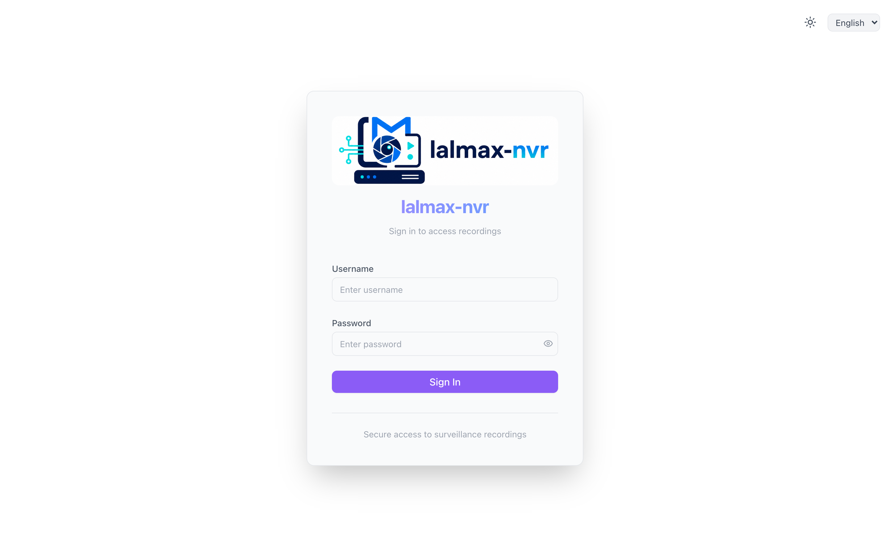
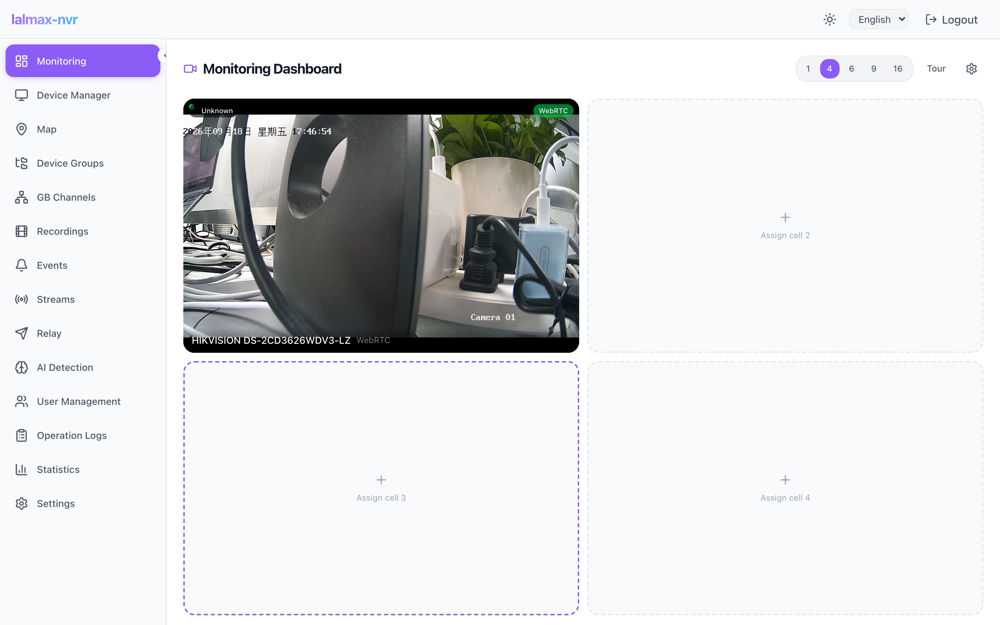
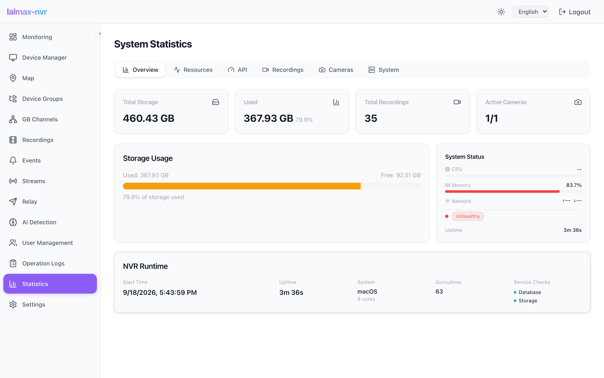
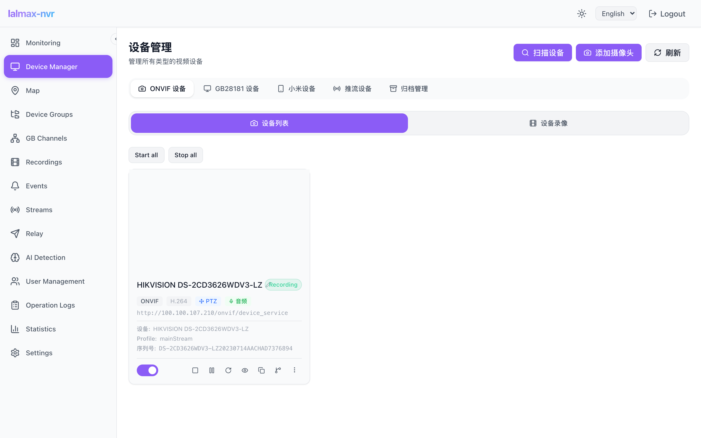
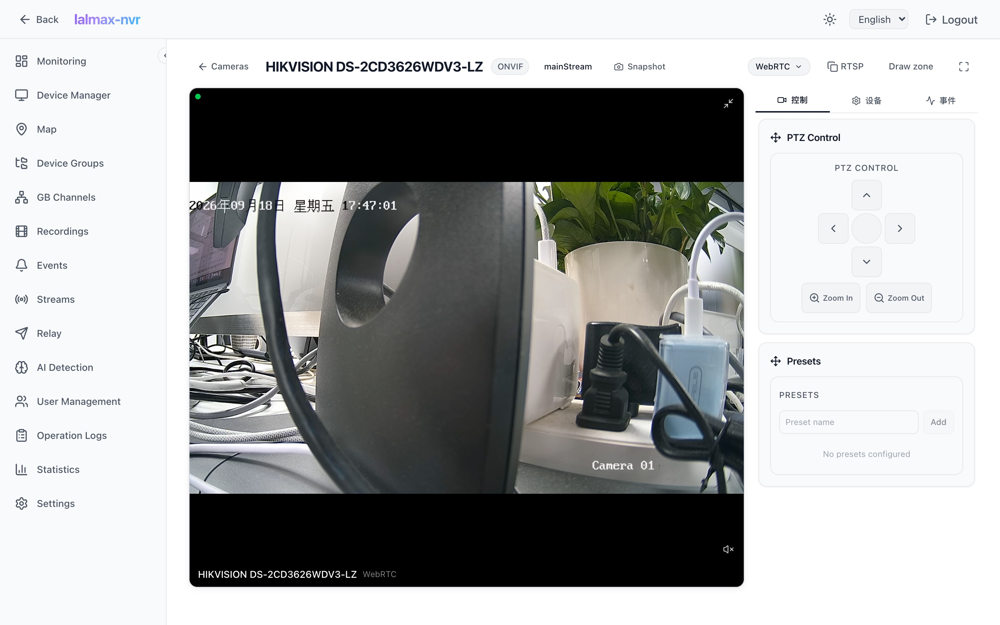
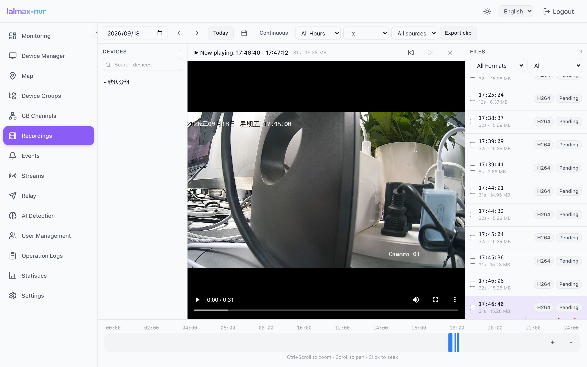
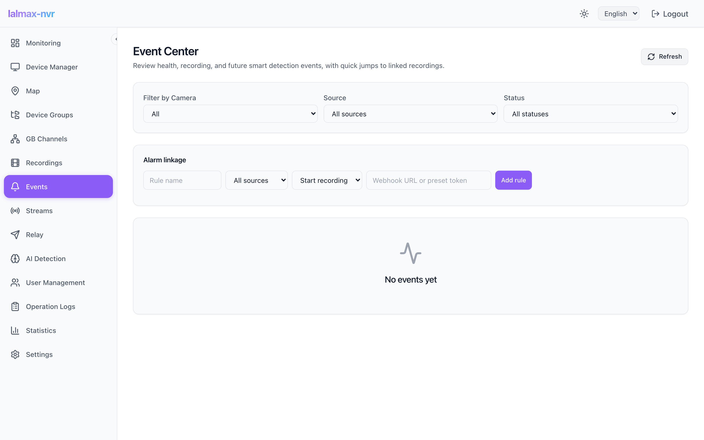
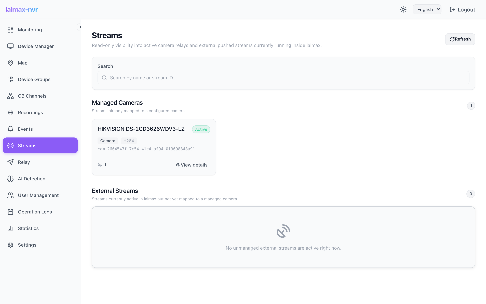
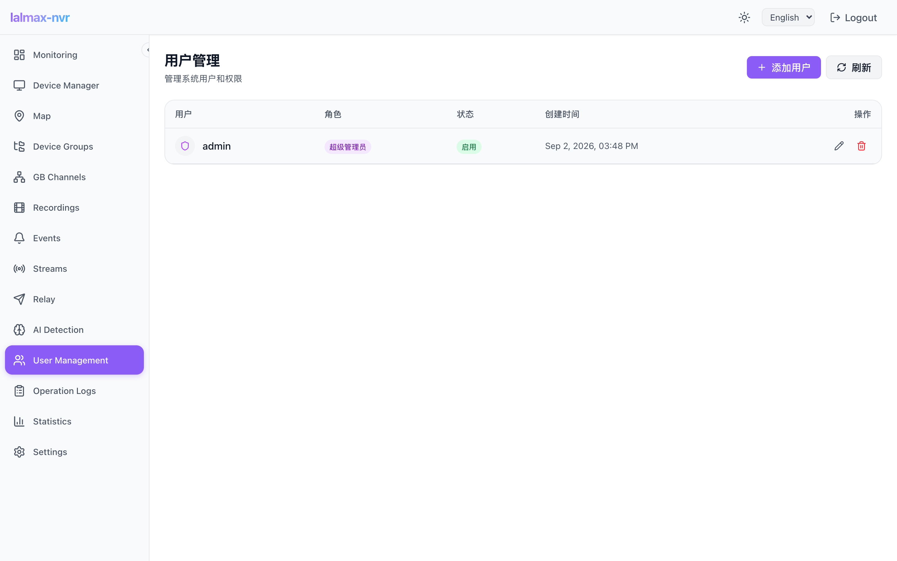
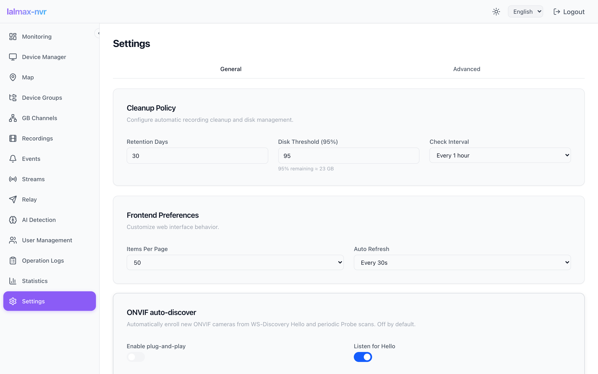

## Architecture

lalmax-nvr is a business NVR on top of an embedded [lalmax](https://github.com/q191201771/lal) engine. Each camera is ingested **once**.

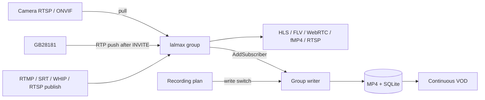
```mermaid
flowchart LR
  Cam[Camera RTSP / ONVIF] -->|pull| Group[lalmax group]
  GB[GB28181] -->|RTP push after INVITE| Group
  Push[RTMP / SRT / WHIP / RTSP publish] --> Group
  Group --> Live[HLS / FLV / WebRTC / fMP4 / RTSP]
  Group -->|AddSubscriber| Rec[Group writer]
  Plan[Recording plan] -->|write switch| Rec
  Rec --> Disk[(MP4 + SQLite)]
  Disk --> VOD[Continuous VOD]
```

- **lalmax** — ingest, protocol conversion, live fan-out (including `rtsp://host:15544/live/{id}`)
- **NVR** — cameras, ONVIF/GB28181, a **group subscriber** whose disk writing follows the stream plan, rolling hour merge, health, Web UI
- **`media.mode: embedded`** — engine in-process, so recording can `AddSubscriber` on the lalmax group. `http` talks to an external lalmax and keeps a record task
- MJPEG / HTTP JPEG / timelapse still write through their own collectors (lalmax limitation)

Full diagrams, ports, and module map: **[Architecture](docs/en/architecture.md)**. Documentation index: **[docs/en](docs/en/README.md)**.

## Streaming Protocols

| Protocol | Backend | Video | Audio |
|----------|---------|-------|-------|
| **WebCodecs** (WebSocket) | Builtin WS | H.264, H.265 | AAC, G.711 |
| **fMP4** (MSE) | lalmax | H.264, H.265 | AAC |
| **WebRTC** (WHEP) | lalmax | H.264, H.265 | G.711, Opus |
| **HTTP-FLV** | lal (`:18080`) | H.264, H.265 | AAC, G.711, Opus |
| **WS-FLV** | lal (`:18080`) | H.264, H.265 | AAC, G.711, Opus |
| **HLS** (MPEG-TS) | lal (`:18080`) | H.264, H.265 | AAC, Opus |
| **LL-HLS** (fMP4) | lalmax | H.264, H.265 | AAC, Opus |
| **RTSP** | lal (`:15544`) | H.264, H.265 | AAC, G.711, Opus |
| **RTMP** | lal (`:11935`) | H.264, H.265 | AAC, G.711, Opus |

G.711 covers both A-law (PCMA) and µ-law (PCMU). Audio codecs not listed for a protocol are not muxed into that output.

## Core Features

- **Media Engine**: lalmax-powered relay — unified ingest, no duplicate camera pulls
- **Camera Protocols**: RTSP (H.264/H.265/MJPEG), HTTP JPEG, ONVIF discovery & management
- **GB28181**: SIP platform (上级); devices REGISTER then **push PS/RTP** after INVITE; cascade, recording query & playback with timeline, multi-protocol streaming (ws-flv, flv, hls, webrtc, etc.), playback control (pause/resume/speed/seek), batch download, platform event history, voice broadcast/intercom (SIP INVITE, UDP/TCP)
- **Recording**: embedded H.264/H.265 subscribes to the lalmax group. A plan (`continuous` / `scheduled` / `event` / `off`) only turns disk writing on or off; the pull or push stays up. `adaptive` and `media.mode: http` still use a record task. Promoting a stream to a device does not start recording. Retention, AAC + G.711 audio. Details: [Recording flow](docs/en/recording-flow.md)
- **Recording Playback**: 24h timeline, hour zoom, single-file player, or **continuous VOD** (HLS fMP4 across a day, seek across gaps)
- **Live View**: WebCodecs, fMP4, WebRTC, HTTP-FLV, WS-FLV, HLS, LL-HLS, copyable **RTSP** (`:15544`) and **RTMP** (`:11935`)
- **RTMP / SRT / WHIP Ingest**: Accept pushed streams from cameras or encoders (WHIP: `http://host:12090/webrtc/whip?streamid={id}`)
- **Segment Merge**: Periodic backfill plus **rolling merge** into the current UTC hour file
- **ONVIF**: WS-Discovery / Hello, PTZ, imaging, stream URI, encoding detect, IP self-heal, optional sub-stream
- **Stream Management**: Runtime stream inventory, camera binding, optional **register as device** (does not start recording)
- **IPTV**: Import and validate M3U playlists, play channels in the browser through the same-origin HLS proxy, or publish channels to NVR for protocol playback and recording ([guide](docs/en/iptv.md))
- **DLNA**: Optional UPnP MediaServer — discover the NVR on the LAN and browse live streams and recordings on TVs or other DLNA players; configure `dlna.enabled` and the dedicated HTTP port (default `8200`) in `lalmax-nvr.yaml`
- **Web UI**: Dark/light theme, responsive, i18n (EN/ZH), Chart.js dashboards
- **Smart home and file access**: MQTT recording triggers and WebDAV storage browsing; FTP currently has a [hash-password authentication limitation](docs/en/ftp-integration.md)
- **Health Monitoring**: Multi-layer camera health detection, auto-remediation, connection quality metrics (uptime, MTBF)
- **Single Binary**: Zero dependencies, embedded SPA, `CGO_ENABLED=0`
- **Xiaomi Support**: CS2 P2P protocol, cloud auth (community-driven)

## Quick Start

### Option 1: Docker

```bash
docker compose up -d
```

Open `http://localhost:9090` and complete the setup wizard in the browser.

See [`docker-compose.yml`](docker-compose.yml) for volume mounts and environment variables.

### Option 2: Build from Source

```bash
git clone https://github.com/lalmax-pro/lalmax-nvr.git
cd lalmax-nvr
./scripts/unix/build.sh
./scripts/unix/start.sh
```

Open `http://localhost:9090`.

Other scripts:

```bash
./scripts/unix/stop.sh        # Stop background process
./scripts/unix/restart.sh     # Restart
./scripts/unix/status.sh      # Show PID and health check
./scripts/unix/logs.sh        # Follow logs
./scripts/unix/run.sh         # Run in foreground
./scripts/unix/test.sh        # Run all Go tests
```

See [`scripts/README.md`](scripts/README.md) for environment variable overrides.

## Configuration

Key config section for the media engine:

```yaml
media:
  mode: embedded    # Use lalmax media engine (recommended); "http" for external lalmax
```

With `media.mode: embedded` (or `http`):
- H.264/H.265 RTSP/ONVIF cameras are pulled through lalmax
- GB28181 devices **push** PS/RTP after SIP INVITE (the NVR is the SIP platform, not an RTSP client)
- HLS/FLV/WebRTC/fMP4 playback is served by lalmax
- Embedded recording subscribes to that same lalmax group. The plan flips the write switch. `http` mode falls back to a record task
- Set `media.lalmax_public_url` to a hostname clients can reach (RTSP URLs otherwise show `127.0.0.1`)
- MJPEG and HTTP/JPEG cameras still pull directly (lalmax limitation)

See [Configuration](docs/en/configuration.md) for full reference.

## Documentation

Full catalog: **[docs/en/README.md](docs/en/README.md)**.

| Document | Description |
|----------|-------------|
| [Architecture](docs/en/architecture.md) | Layers, ingest (pull vs GB push), VOD, ports, modules |
| [Recording plans](docs/en/recording-plans.md) · [Recording flow](docs/en/recording-flow.md) | When a stream is written, and how the group writer subscribes |
| [Getting Started](docs/en/getting-started.md) | Install, first camera |
| [Configuration](docs/en/configuration.md) | YAML reference |
| [API Reference](docs/en/api-reference.md) | REST API |
| [GB28181](docs/en/gb28181-guide.md) | National-standard devices, playback, talk |
| [ONVIF](docs/en/onvif-guide.md) | Discovery, PTZ |
| [Camera Guide](docs/en/camera-guide.md) | RTSP / HTTP setup |
| [Deployment](docs/en/deployment.md) | Reverse proxy, cross-compile |
| [MQTT](docs/en/mqtt-integration.md) · [WebDAV](docs/en/webdav-integration.md) · [FTP](docs/en/ftp-integration.md) | Integrations |
| [Troubleshooting](docs/en/troubleshooting.md) | Common issues |

## Project Structure

```
cmd/lalmax-nvr/        # Entry point
internal/              # Core packages
  ai/                  # AI inference
  api/                 # REST API handlers + stream proxy
  autodiscover/        # ONVIF WS-Discovery / Hello
  ban/                 # Stream ban management
  camera/              # Camera lifecycle manager
  cleanup/             # Data cleanup tasks
  civilcode/           # GB28181 administrative-division / industry codes
  config/              # YAML config
  dlna/                # UPnP MediaServer (LAN discovery, live streams, recordings)
  docsportal/          # Embedded API docs (`/docs/`)
  event/               # Event bus
  ftp/                 # FTP server
  gb28181/             # GB28181 SIP server (device mgmt, cascade, playback, intercom)
  health/              # Camera health monitoring
  iptv/                # M3U import, HLS proxy, and channel publish
  linkage/             # Alarm-rule actions (record, PTZ preset, webhook)
  media/               # lalmax engine adapter
  relay/               # Stream relay
  merge/               # Periodic + rolling segment merge
  metrics/             # Prometheus metrics
  middleware/          # HTTP middleware
  model/               # Data models
  mqtt/                # MQTT client
  muxer/               # MP4 muxer
  observability/       # OpenTelemetry traces and metrics
  onvif/               # ONVIF client adapter (NVR-side)
  recorder/            # lalmax group writer; record tasks; MJPEG/HTTP-JPEG collectors
  rediscovery/         # Rediscover ONVIF device IPs by serial
  storage/             # SQLite DB + file manager
  streamhistory/       # Stream history tracking
  ui/                  # Embedded SPA static files
  upload/              # File upload handling
  vod/                 # Continuous VOD (HLS fMP4)
  webdav/              # WebDAV server
  wsstream/            # WebSocket stream manager (WebCodecs)
  xiaomi/              # Xiaomi camera support
onvif/                 # Standalone ONVIF library (SOAP, discovery, PTZ, imaging, events)
third/
  lal/                 # Vendored lal media library
  lalmax/              # Vendored lalmax (lal + extensions)
web/                   # Svelte 5 frontend
site/                  # Product website
config/                # config.example.yaml (copy to lalmax-nvr.yaml)
scripts/               # Build and management scripts
docker/                # Docker build assets
tests/                 # Integration tests
docs/                  # Documentation (EN/ZH)
```

> Playback (HLS, LL-HLS, HTTP-FLV, WS-FLV, WebRTC, fMP4, RTSP, RTMP) and
> RTMP/SRT/WHIP ingest are served by the embedded lalmax engine, not by
> separate `internal/` packages. WebCodecs lives in `internal/wsstream`.

## Contributing

1. Run `go vet ./...` before submitting
2. Add tests for new features
3. Write clear commit messages

## License

[MIT License](LICENSE)
