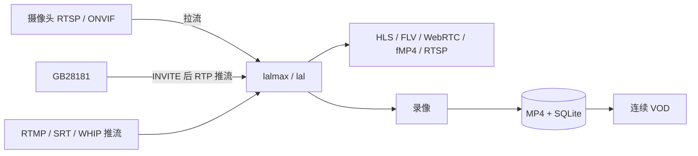

# lalmax-nvr

[](https://github.com/lalmax-pro/lalmax-nvr/releases)
[](https://github.com/lalmax-pro/lalmax-nvr/actions/workflows/ci.yml)
[](https://go.dev/)
[](https://svelte.dev/)
[](https://www.sqlite.org/)
[](https://www.docker.com/)
[](LICENSE)

基于 [lalmax](https://github.com/q191201771/lal) 媒体引擎构建的轻量级网络视频录像机。单文件部署，零依赖。

这个项目最初受到 MiBeeNVR 的启发，后续已经演进为一个面向 `lal` / `lalmax` 媒体体系的专属 NVR 项目。

[**产品官网**](https://lalmax-pro.github.io/lalmax-nvr/)

[**English**](README.md)

## 截图


## 架构

lalmax-nvr 是叠在内嵌 [lalmax](https://github.com/q191201771/lal) 引擎上的业务 NVR。每路摄像头只收 **一次**。



- **lalmax** — 收流、转协议、直播分发（含 `rtsp://host:15544/live/{id}`）
- **NVR** — 相机、ONVIF/GB28181、录像模式、滚动小时合并、健康、Web UI
- **`media.mode: embedded`** — 引擎同进程；`http` 则连外部 lalmax
- MJPEG / HTTP JPEG 仍直拉（lalmax 限制）

完整图、端口与模块表见 **[架构](docs/zh/architecture.md)**。文档目录：**[docs/zh](docs/zh/README.md)**。

## 流媒体协议

| 协议 | 延迟 | 后端 | 编码支持 |
|------|------|------|----------|
| **WebCodecs**（WebSocket） | <100ms | 内置 WS | H.264, H.265 |
| **fMP4**（MSE） | ~200ms | lalmax | H.264, H.265 |
| **WebRTC**（WHEP） | ~300ms | lalmax | H.264 |
| **HTTP-FLV** | ~500ms | lalmax | H.264, H.265 |
| **HLS** / **LL-HLS** | 1-3s | lalmax | H.264, H.265 |
| **RTSP** | ~1 GOP | lal（`:15544`） | H.264, H.265 |

## 核心功能

- **媒体引擎**：基于 lalmax 的统一中继——摄录分离，无重复拉流
- **摄像头协议**：RTSP（H.264/H.265/MJPEG）、HTTP JPEG、ONVIF 设备发现与管理
- **国标 GB28181**：作为 SIP **上级平台**；设备 REGISTER，INVITE 后 **推送 PS/RTP**；级联、录像查询与回放（带时间轴）、多协议流媒体（ws-flv、flv、hls、webrtc 等）、播放控制（暂停/恢复/倍速/拖动）、批量下载、平台事件历史、语音对讲（SIP INVITE，UDP/TCP）
- **视频录像**：MP4 切片、多路并发、模式（连续 / 计划 / 事件 / 自适应 / 关闭）、按相机保留天数、AAC + G.711 音频
- **录像回放**：24 小时时间轴、小时缩放、单文件播放，或 **连续 VOD**（按天 HLS fMP4，缺口可 seek）
- **实时直播**：WebCodecs、fMP4、WebRTC、HTTP-FLV、HLS、LL-HLS，可复制 **RTSP**（`:15544`）
- **RTMP / SRT / WHIP 接入**：接收摄像头或编码器推送的流（WHIP：`http://host:12090/webrtc/whip?streamid={id}`）
- **片段合并**：周期补齐，加上 **滚动合并** 写入当前 UTC 小时文件
- **ONVIF**：WS-Discovery / Hello、云台、成像、流地址、编码检测、IP 自愈、可选子码流
- **流管理**：运行时流清单、摄像头绑定、流提升
- **Web 界面**：深色/浅色主题、响应式、中英文切换、Chart.js 图表
- **智能家居**：MQTT 触发录像、WebDAV/FTP 文件访问
- **健康监控**：多层摄像头健康检测、自动修复、质量评分
- **单文件部署**：零依赖、内嵌前端、`CGO_ENABLED=0`
- **小米摄像头**：CS2 P2P 协议、云端认证（社区驱动）

## 快速开始

### 方式 1：Docker

```bash
docker compose up -d
```

打开 `http://localhost:9090`，在浏览器中完成设置向导。

详见 [`docker-compose.yml`](docker-compose.yml)。

### 方式 2：源码编译

```bash
git clone https://github.com/lalmax-pro/lalmax-nvr.git
cd lalmax-nvr
./scripts/unix/build.sh
./scripts/unix/start.sh
```

打开 `http://localhost:9090`。

其他脚本：

```bash
./scripts/unix/stop.sh        # 停止后台进程
./scripts/unix/restart.sh     # 重启
./scripts/unix/status.sh      # 查看 PID 和健康检查
./scripts/unix/logs.sh        # 查看日志
./scripts/unix/run.sh         # 前台运行
./scripts/unix/test.sh        # 运行所有 Go 测试
```

详见 [`scripts/README.md`](scripts/README.md) 了解环境变量覆盖。

## 配置

媒体引擎关键配置：

```yaml
media:
  mode: embedded    # 启用 lalmax 媒体引擎（推荐）；外部 lalmax 用 "http"
```

`media.mode: embedded`（或 `http`）时：
- H.264/H.265 的 RTSP/ONVIF 摄像头经 lalmax 拉流
- GB28181 设备在 SIP INVITE 之后 **推送** PS/RTP（NVR 是 SIP 上级平台，不是 RTSP 拉流端）
- HLS/FLV/WebRTC/fMP4 播放由 lalmax 提供
- 录像消费 lalmax 统一流
- 把 `media.lalmax_public_url` 设成客户端能访问的 hostname，否则 RTSP URL 会是 `127.0.0.1`
- MJPEG 和 HTTP/JPEG 摄像头仍直连（lalmax 限制）

完整配置参考请见 [配置说明](docs/zh/configuration.md)。

## 文档

完整目录：**[docs/zh/README.md](docs/zh/README.md)**。

| 文档 | 说明 |
|------|------|
| [架构](docs/zh/architecture.md) | 分层、接入（拉流 vs 国标推流）、VOD、端口、模块 |
| [快速入门](docs/zh/getting-started.md) | 安装、第一个摄像头 |
| [配置说明](docs/zh/configuration.md) | YAML 参考 |
| [API 文档](docs/zh/api-reference.md) | REST API |
| [GB28181](docs/zh/gb28181-guide.md) | 国标设备、回放、对讲 |
| [ONVIF](docs/zh/onvif-guide.md) | 发现、云台 |
| [摄像头指南](docs/zh/camera-guide.md) | RTSP / HTTP 接入 |
| [部署指南](docs/zh/deployment.md) | 反向代理、交叉编译 |
| [MQTT](docs/zh/mqtt-integration.md) · [WebDAV](docs/zh/webdav-integration.md) · [FTP](docs/zh/ftp-integration.md) | 集成 |
| [故障排除](docs/zh/troubleshooting.md) | 常见问题 |

## 项目结构

```
cmd/lalmax-nvr/        # 程序入口
internal/              # 核心模块
  ai/                  # AI 推理
  api/                 # REST API + 流代理
  autodiscover/        # ONVIF WS-Discovery / Hello
  ban/                 # 流封禁管理
  camera/              # 摄像头生命周期管理
  cleanup/             # 数据清理任务
  civilcode/           # GB28181 行政区划/行业代码
  config/              # YAML 配置
  event/               # 事件总线
  ftp/                 # FTP 服务
  gb28181/             # GB28181 SIP 服务（设备管理、级联、回放、对讲）
  health/              # 摄像头健康监控
  media/               # lalmax 引擎适配器
  relay/               # 流中继
  merge/               # 周期合并 + 滚动小时桶
  metrics/             # Prometheus 指标
  middleware/          # HTTP 中间件
  model/               # 数据模型
  mqtt/                # MQTT 客户端
  muxer/               # MP4 封装器
  onvif/               # ONVIF 客户端适配器（NVR 侧）
  recorder/            # H264/H265/MJPEG/HTTP-JPEG 录像引擎
  storage/             # SQLite 数据库 + 文件管理
  streamhistory/       # 流历史记录
  ui/                  # 内嵌 SPA 静态文件
  upload/              # 文件上传处理
  vod/                 # 连续 VOD（HLS fMP4）
  webdav/              # WebDAV 服务
  wsstream/            # WebSocket 流管理器（WebCodecs）
  xiaomi/              # 小米摄像头支持
onvif/                 # 独立 ONVIF 库（SOAP、发现、云台、成像、事件）
third/
  lal/                 # lal 媒体库（vendored）
  lalmax/              # lalmax 扩展（vendored）
web/                   # Svelte 5 前端
config/                # config.example.yaml（复制为 lalmax-nvr.yaml）
scripts/               # 构建和管理脚本
docker/                # Docker 构建资源
tests/                 # 集成测试
docs/                  # 文档（中文/英文）
```

> HLS、HTTP-FLV、WebRTC、fMP4 等播放协议以及 RTMP/SRT 接入均由内嵌的 lalmax 引擎提供，不单独存在于 `internal/` 包中。

## 贡献

1. 提交前运行 `go vet ./...`
2. 新功能附带测试
3. 清晰的提交信息

## 许可证

[MIT License](LICENSE)
