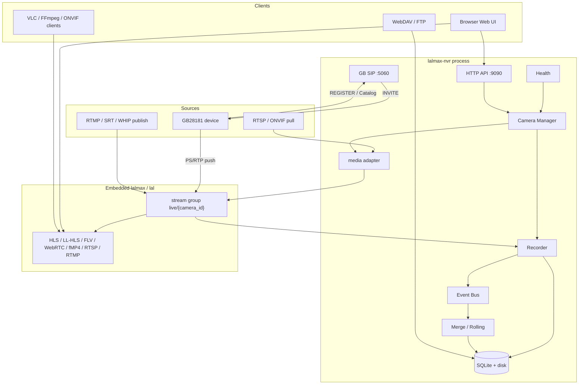
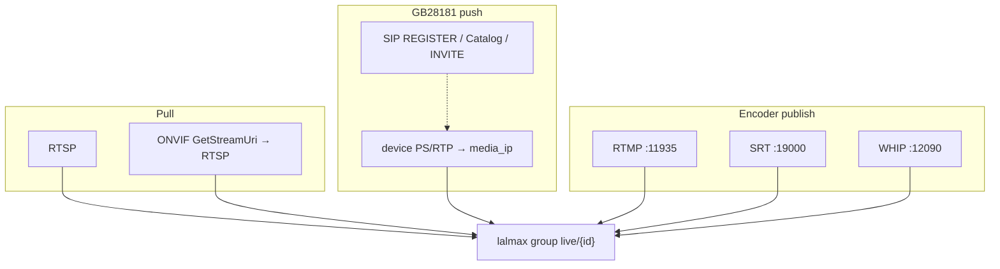
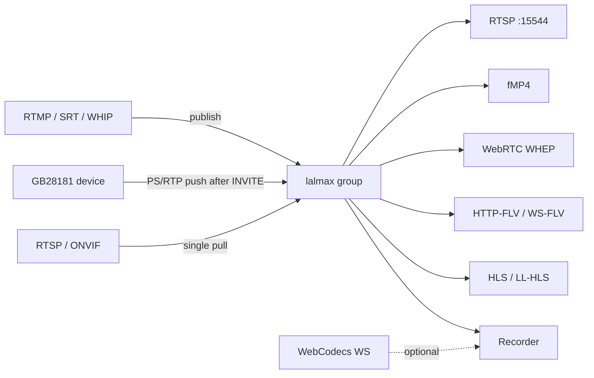
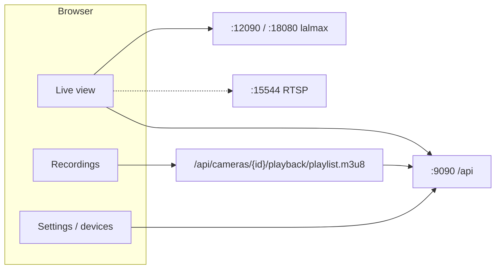
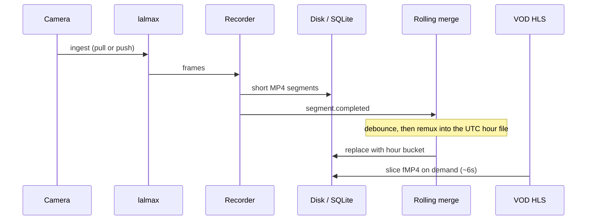
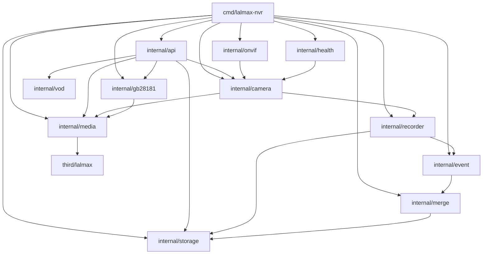
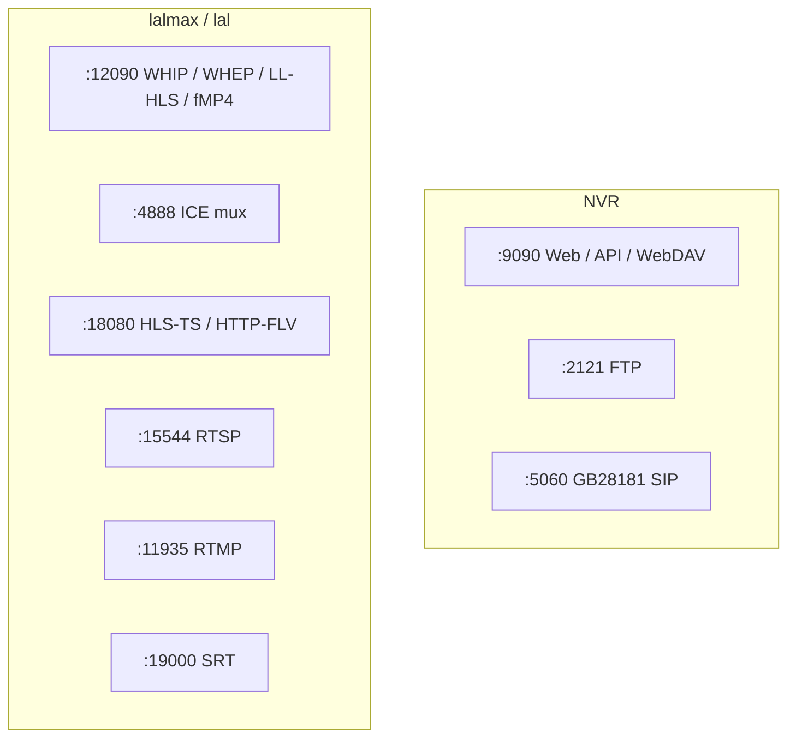

# lalmax-nvr Architecture

lalmax-nvr is a **business NVR layer** on top of an embedded **lal / lalmax media engine**. Each camera is ingested once: lalmax relays and transcodes for viewers; the NVR owns devices, recording, storage, and the web UI.

See also: [Getting Started](getting-started.md) · [Configuration](configuration.md) · [Deployment](deployment.md) · [ONVIF](onvif-guide.md) · [GB28181](gb28181-guide.md)

## Layers



- **lalmax / lal** is the only media plane. H.264 / H.265 pull, push, and protocol conversion go through it.
- **NVR layer** owns camera lifecycle, ONVIF discovery, GB28181 SIP platform, recording policy, hour merge, health repair, SQLite/files, and the Svelte UI.
- **`media.mode: embedded` (recommended)** runs the engine in-process. `http` talks to an external lalmax.
- **Exception:** MJPEG / HTTP JPEG are still pulled by the NVR (lalmax does not ingest them).

## Ingest paths: pull vs push

How a stream enters the group differs by protocol. GB28181 is not RTSP pull.

| Source | Signaling | Media direction | Details |
|--------|-----------|-----------------|---------|
| RTSP | none (URL) | NVR **pulls** RTSP | [Camera Guide](camera-guide.md) |
| ONVIF | SOAP: discovery / `GetStreamUri` | resolve RTSP, then **pull** | [ONVIF Guide](onvif-guide.md) |
| GB28181 | SIP: device REGISTER, platform INVITE | device **pushes** PS/RTP to `media_ip` | [GB28181 Guide](gb28181-guide.md) |
| RTMP / SRT / WHIP | encoder connects in | encoder **publishes** | `rtmp` / `srt` / `whip` in config |
| Xiaomi CS2 | cloud auth + P2P | NVR fetches frames, injects lalmax | [Xiaomi](xiaomi-setup.md) |



## Live ingest and fan-out

One camera maps to one lalmax group, usually `live/{camera_id}`. The sub-stream is `{camera_id}_sub`.



The browser uses API proxies or lalmax play URLs. You can also copy RTSP for VLC: `rtsp://{public-host}:15544/live/{camera_id}`. Set `media.lalmax_public_url` to a hostname clients can reach, otherwise the URL will be `127.0.0.1`.



The browser usually talks only to **`:9090`** (the API proxies HLS/FLV/WebRTC/fMP4). Expose **15544 / 11935 / 19000 / 12090 / 4888** when you need RTSP for VLC or RTMP/SRT/WHIP ingest. `docker-compose.yml` maps 9090, 12090, 4888, 15544, 5060, and 2121 by default.

## Recording and continuous VOD



- Recording modes: `continuous` / `scheduled` / `event` / `adaptive` / `off`.
- **Rolling merge** appends a closed segment into the hour bucket after a short debounce (default 5s). Periodic merge still backfills history.
- **Continuous VOD** loads a day playlist (`playlist.m3u8`); gaps use `#EXT-X-DISCONTINUITY`. MJPEG stays on the single-file player.

## In-process modules



| Package | Role |
|---------|------|
| `camera` | Start/stop ingest, recording, sub-stream, IP self-heal |
| `media` | lalmax pull / RTP receive / GetStream / BuildPlayURL |
| `recorder` | Write frames to MP4 / MJPEG directories |
| `merge` | Periodic merge + rolling hour buckets |
| `vod` | On-demand init + fMP4, HLS VOD playlists |
| `health` | Multi-layer probes and auto-remediation |
| `autodiscover` / `onvif` | WS-Discovery, Hello, PTZ |
| `gb28181` | SIP platform, catalog, RTP receive after INVITE, playback, talk |
| `storage` | SQLite + segment files |

## Default ports

| Port | Use |
|------|-----|
| **9090** | Web UI and NVR API |
| **12090** | lalmax HTTP (LL-HLS, WHIP/WHEP, fMP4, WS-FLV) |
| **4888** | WebRTC ICE mux (WHIP/WHEP) |
| **15544** | lal RTSP playback |
| **18080** | lal HTTP (HLS-TS, HTTP-FLV) |
| **11935** | RTMP ingest |
| **19000** | SRT ingest |
| **2121** | FTP |
| **5060** | GB28181 SIP |



Map these ports in Docker bridge mode. ONVIF multicast discovery does not work in bridge mode; use `network_mode: host`.

## On-disk layout

```
{storage.root_dir}/
  lalmax-nvr.db          # SQLite: cameras, recording index, events
  recordings/{camera_id}/  # MP4 segments and merged hour files
  config/                  # generated lalmax config, etc.
```

The web UI is compiled into the binary (`internal/ui`). `CGO_ENABLED=0`; no external runtime deps.
