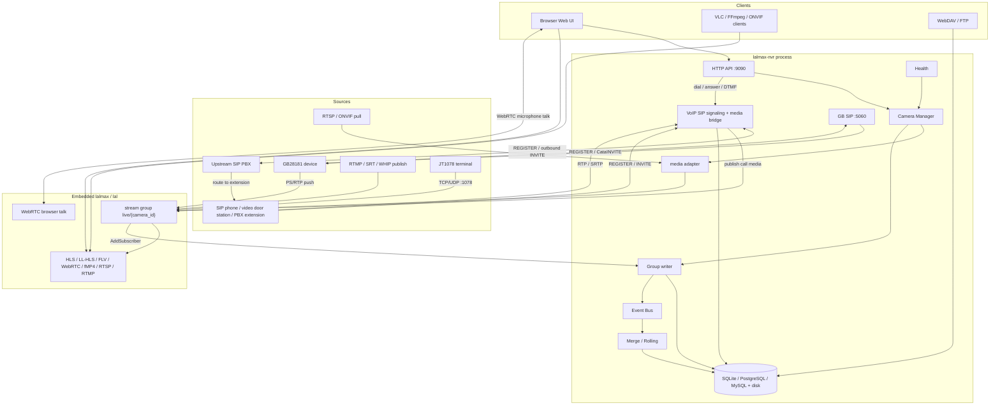
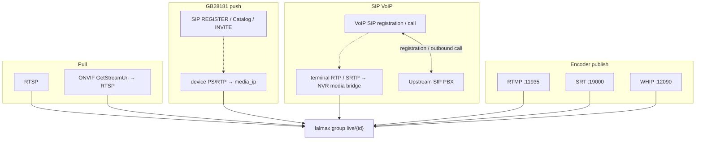
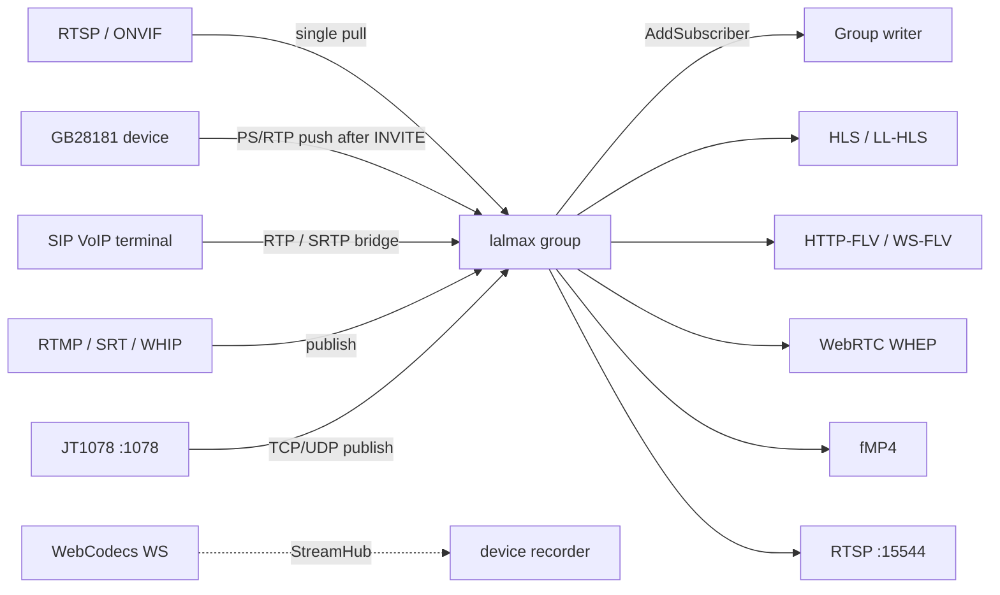
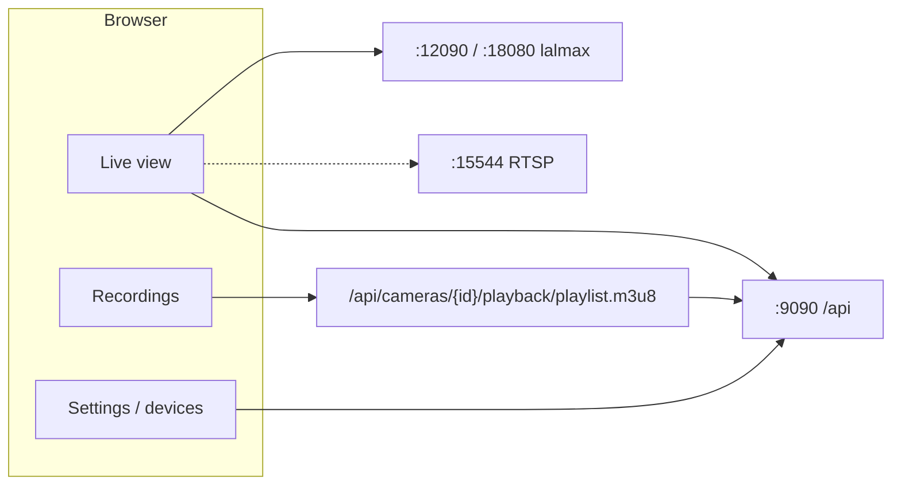
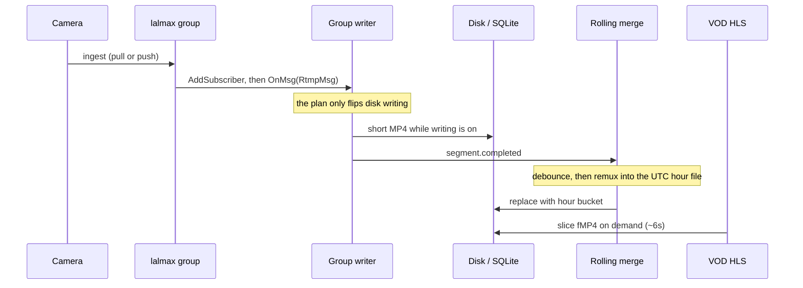
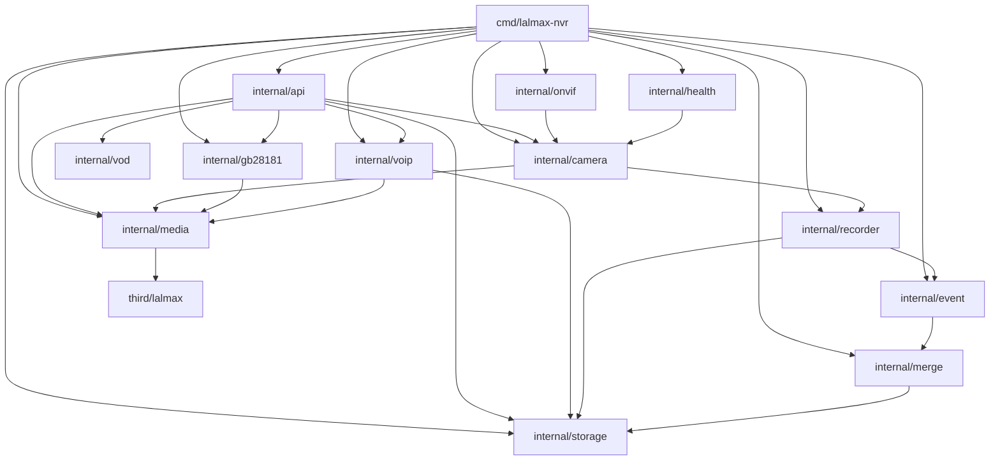
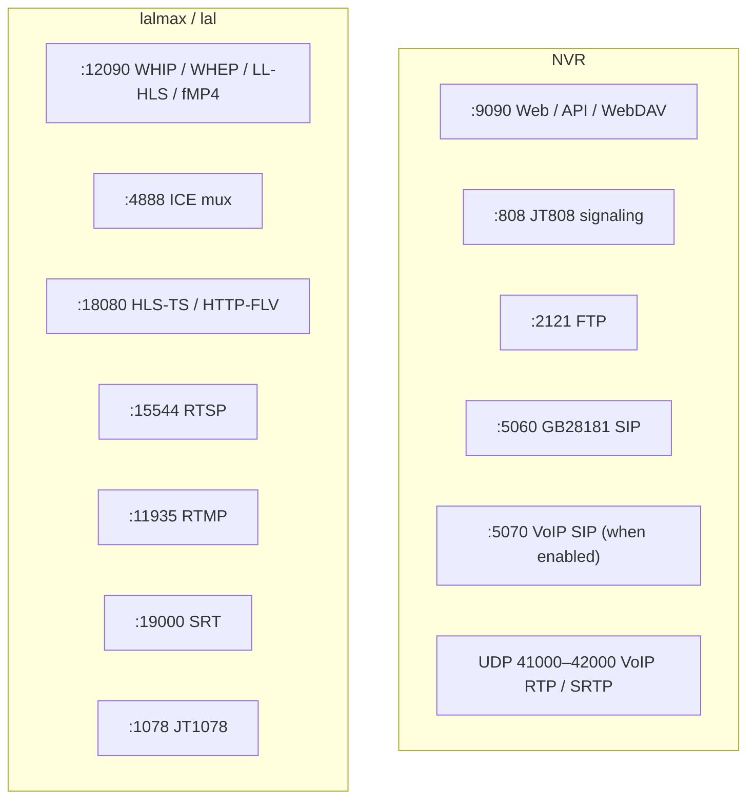

# lalmax-nvr Architecture

lalmax-nvr is a **business NVR layer** on top of an embedded **lal / lalmax media engine**. Each camera is ingested once: lalmax relays and transcodes for viewers; the NVR owns devices, recording, storage, and the web UI.

See also: [Getting Started](getting-started.md) · [Configuration](configuration.md) · [Deployment](deployment.md) · [ONVIF](onvif-guide.md) · [GB28181](gb28181-guide.md) · [VoIP](../zh/voip.md) *(Chinese)*

## Layers


```mermaid
flowchart TB
  subgraph clients [Clients]
    Browser[Browser Web UI]
    Player[VLC / FFmpeg / ONVIF clients]
    Files[WebDAV / FTP]
  end

  subgraph nvr [lalmax-nvr process]
    API[HTTP API :9090]
    CamMgr[Camera Manager]
    Rec[Group writer]
    Merge[Merge / Rolling]
    Health[Health]
    Bus[Event Bus]
    Store[(SQLite / PostgreSQL / MySQL + disk)]
    GBSIP[GB SIP :5060]
    VoIP[VoIP SIP signaling + media bridge]
    MediaAdp[media adapter]
  end

  subgraph engine [Embedded lalmax / lal]
    Group["stream group live/{camera_id}"]
    Out[HLS / LL-HLS / FLV / WebRTC / fMP4 / RTSP / RTMP]
    Talk[WebRTC browser talk]
  end

  subgraph sources [Sources]
    RTSP[RTSP / ONVIF pull]
    GB[GB28181 device]
    Phone[SIP phone / video door station / PBX extension]
    PBX[Upstream SIP PBX]
    Push[RTMP / SRT / WHIP publish]
    JT[JT1078 terminal]
  end

  RTSP --> MediaAdp
  GB -->|REGISTER / Catalog| GBSIP
  GBSIP -->|INVITE| GB
  GB -->|PS/RTP push| Group
  Phone -->|REGISTER / INVITE| VoIP
  Phone -->|RTP / SRTP| VoIP
  VoIP <-->|REGISTER / outbound INVITE| PBX
  PBX -->|route to extension| Phone
  VoIP -->|publish call media| Group
  JT -->|TCP/UDP :1078| Group
  Push --> Group
  MediaAdp --> Group
  Group --> Out
  Group -->|AddSubscriber| Rec
  Rec --> Store
  Rec --> Bus
  Bus --> Merge
  Merge --> Store
  CamMgr --> MediaAdp
  CamMgr --> Rec
  Health --> CamMgr
  API --> CamMgr
  Browser --> API
  Browser --> Out
  Browser <-->|WebRTC microphone talk| Talk
  API -->|dial / answer / DTMF| VoIP
  VoIP --> Store
  Player --> Out
  Files --> Store
```

- **lalmax / lal** distributes NVR streams and converts playback protocols. IPTV browser playback uses a separate same-origin HLS proxy; a channel enters the media engine when publication or recording needs it.
- **NVR layer** owns camera lifecycle, ONVIF discovery, the GB28181 SIP platform, a separate VoIP SIP service, recording policy, hour merge, health repair, database/files, and the Svelte UI.
- **`media.mode: embedded` (recommended)** runs the engine in-process. `http` talks to an external lalmax.
- **Exception:** MJPEG / HTTP JPEG are still pulled by the NVR (lalmax does not ingest them).

## Ingest paths: pull vs push

How a stream enters the group differs by protocol. GB28181 is not RTSP pull.

| Source | Signaling | Media direction | Details |
|--------|-----------|-----------------|---------|
| RTSP | none (URL) | NVR **pulls** RTSP | [Camera Guide](camera-guide.md) |
| ONVIF | SOAP: discovery / `GetStreamUri` | resolve RTSP, then **pull** | [ONVIF Guide](onvif-guide.md) |
| GB28181 | SIP: device REGISTER, platform INVITE | device **pushes** PS/RTP to `media_ip` | [GB28181 Guide](gb28181-guide.md) |
| SIP VoIP | SIP: terminal registration and inbound call; NVR can also call through a PBX | terminal sends RTP/SRTP, bridged by NVR into a live stream; Web talk uses WebRTC | [VoIP guide (Chinese)](../zh/voip.md) |
| RTMP / SRT / WHIP | encoder connects in | encoder **publishes** | `rtmp` / `srt` / `whip` in config |
| JT1078 | optional JT808: after register/auth, 0x9101 live or 0x9201 playback | terminal **publishes** TCP/UDP frames to `:1078`. With signaling enabled, ungranted channels are rejected | [configuration](configuration.md) |
| Xiaomi CS2 | cloud auth + P2P | NVR fetches frames, injects lalmax | [Xiaomi](xiaomi-setup.md) |


```mermaid
flowchart TB
  subgraph pull [Pull]
    RTSP[RTSP]
    ONVIF["ONVIF GetStreamUri → RTSP"]
  end
  subgraph gb [GB28181 push]
    GBSIP["SIP REGISTER / Catalog / INVITE"]
    RTP["device PS/RTP → media_ip"]
  end
  subgraph voip [SIP VoIP]
    VoIPSIP["VoIP SIP registration / call"]
    VoIPMedia["terminal RTP / SRTP → NVR media bridge"]
    PBX[Upstream SIP PBX]
  end
  subgraph pub [Encoder publish]
    RTMP[RTMP :11935]
    SRT[SRT :19000]
    WHIP["WHIP :12090"]
  end
  Group["lalmax group live/{id}"]
  RTSP --> Group
  ONVIF --> Group
  GBSIP -.-> RTP
  RTP --> Group
  VoIPSIP -.-> VoIPMedia
  VoIPSIP <-->|registration / outbound call| PBX
  VoIPMedia --> Group
  RTMP --> Group
  SRT --> Group
  WHIP --> Group
```

## Live ingest and fan-out

One camera maps to one lalmax group, usually `live/{camera_id}`. The sub-stream is `{camera_id}_sub`.


```mermaid
flowchart LR
  RTSP[RTSP / ONVIF] -->|single pull| G["lalmax group"]
  GB[GB28181 device] -->|PS/RTP push after INVITE| G
  VoIP[SIP VoIP terminal] -->|RTP / SRTP bridge| G
  Push[RTMP / SRT / WHIP] -->|publish| G
  JT[JT1078 :1078] -->|TCP/UDP publish| G
  G -->|AddSubscriber| Rec[Group writer]
  G --> HLS[HLS / LL-HLS]
  G --> FLV[HTTP-FLV / WS-FLV]
  G --> RTC[WebRTC WHEP]
  G --> FMP4[fMP4]
  G --> RTSPOut["RTSP :15544"]
  WS[WebCodecs WS] -.->|StreamHub| Dev[device recorder]
```

The browser uses API proxies or lalmax play URLs. You can also copy RTSP for VLC: `rtsp://{public-host}:15544/live/{camera_id}`. Set `media.lalmax_public_url` to a hostname clients can reach, otherwise the URL will be `127.0.0.1`.


```mermaid
flowchart LR
  subgraph browser [Browser]
    LiveUI[Live view]
    RecUI[Recordings]
    SetUI[Settings / devices]
  end
  API[":9090 /api"]
  LalHTTP[":12090 / :18080 lalmax"]
  RTSP[":15544 RTSP"]
  VOD["/api/cameras/{id}/playback/playlist.m3u8"]

  LiveUI --> API
  LiveUI --> LalHTTP
  LiveUI -.-> RTSP
  RecUI --> VOD
  VOD --> API
  SetUI --> API
```

The browser usually talks only to **`:9090`** (the API proxies HLS/FLV/WebRTC/fMP4). Web VoIP talk also uses the WebRTC ICE port `4888/udp`; SIP terminals need access to the enabled SIP listener and configured RTP UDP range. Expose other ports only for the protocols you use. `docker-compose.yml` maps 9090, 12090, 4888, 15544, 5060, and 2121 by default.

## Recording and continuous VOD


```mermaid
sequenceDiagram
  participant Cam as Camera
  participant Group as lalmax group
  participant Rec as Group writer
  participant Disk as Disk / SQLite
  participant Roll as Rolling merge
  participant VOD as VOD HLS

  Cam->>Group: ingest (pull or push)
  Group->>Rec: AddSubscriber, then OnMsg(RtmpMsg)
  Note over Rec: the plan only flips disk writing
  Rec->>Disk: short MP4 while writing is on
  Rec->>Roll: segment.completed
  Note over Roll: debounce, then remux into the UTC hour file
  Roll->>Disk: replace with hour bucket
  VOD->>Disk: slice fMP4 on demand (~6s)
```

- On the embedded engine, H.264/H.265 recording subscribes to the lalmax group. A plan on `stream_id` (`continuous` / `scheduled` / `event` / `off`) only turns disk writing on or off. `adaptive` and `media.mode: http` still use a record task. No plan means no recording; registering a stream as a device does not start recording. See [Recording plans](recording-plans.md) and [Recording flow](recording-flow.md).
- **Rolling merge** appends a closed segment into the hour bucket after a short debounce (default 5s). Periodic merge still backfills history.
- **Continuous VOD** loads a day playlist (`playlist.m3u8`); gaps use `#EXT-X-DISCONTINUITY`. MJPEG stays on the single-file player.

## In-process modules


```mermaid
flowchart TB
  Main[cmd/lalmax-nvr] --> API[internal/api]
  Main --> Cam[internal/camera]
  Main --> Media[internal/media]
  Main --> Rec[internal/recorder]
  Main --> Merge[internal/merge]
  Main --> Health[internal/health]
  Main --> Store[internal/storage]
  Main --> Bus[internal/event]
  Main --> GB[internal/gb28181]
  Main --> VoIP[internal/voip]
  Main --> ONVIF[internal/onvif]
  API --> Cam
  API --> Media
  API --> Store
  API --> VOD[internal/vod]
  API --> GB
  API --> VoIP
  Cam --> Media
  Cam --> Rec
  GB --> Media
  VoIP --> Media
  VoIP --> Store
  ONVIF --> Cam
  Rec --> Store
  Rec --> Bus
  Bus --> Merge
  Merge --> Store
  Health --> Cam
  Media --> Lalmax[third/lalmax]
```

| Package | Role |
|---------|------|
| `camera` | Start/stop ingest, sub-stream, IP self-heal. Group-covered cameras do not open a second recorder |
| `media` | lalmax pull / RTP receive / GetStream / BuildPlayURL / stream events |
| `recorder` | Group writer subscribes to the lalmax group; plans flip `SetWriting`. Record tasks cover `adaptive` and HTTP mode. MJPEG / HTTP JPEG / timelapse stay on their collectors |
| `merge` | Periodic merge + rolling hour buckets |
| `vod` | On-demand init + fMP4, HLS VOD playlists |
| `health` | Multi-layer probes and auto-remediation |
| `autodiscover` / `onvif` | WS-Discovery, Hello, PTZ |
| `gb28181` | SIP platform, catalog, RTP receive after INVITE, playback, talk |
| `voip` | Separate SIP endpoint / PBX registration and calls, Web outbound dialing, call history; browser talk uses WebRTC |
| `jt808` | JT/T 808 signaling: register, live, playback, query, upload, PTZ. Media stays on lalmax `:1078` |
| `storage` | SQLite, PostgreSQL, or MySQL + segment files |

## Default ports

| Port | Use |
|------|-----|
| **9090** | Web UI and NVR API |
| **12090** | lalmax HTTP (LL-HLS, WHIP/WHEP, fMP4, WS-FLV) |
| **4888** | WebRTC ICE mux (WHIP/WHEP) |
| **15544** | lal RTSP playback |
| **18080** | lal HTTP (HLS-TS, HTTP-FLV) |
| **11935** | RTMP ingest (when enabled) |
| **19000** | SRT ingest (when enabled) |
| **1078/tcp, 1078/udp** | JT1078 single-port ingest (enabled by default in embedded mode) |
| **808/tcp** | JT808 signaling (when configured) |
| **2121** | FTP |
| **5060** | GB28181 SIP |
| **5070/udp** | VoIP SIP (default listener; enable VoIP and map it for deployment) |
| **41000–42000/udp** | VoIP RTP/SRTP media range (default, configurable) |
| **8200** | DLNA HTTP (when enabled; discovery also needs UDP 1900 multicast; see [DLNA](dlna.md)) |


```mermaid
flowchart TB
  subgraph nvrPort [NVR]
    P9090[":9090 Web / API / WebDAV"]
    P808[":808 JT808 signaling"]
    P2121[":2121 FTP"]
    P5060[":5060 GB28181 SIP"]
    P5070[":5070 VoIP SIP (when enabled)"]
    PVoIPRTP["UDP 41000–42000 VoIP RTP / SRTP"]
  end
  subgraph lalPort [lalmax / lal]
    P12090[":12090 WHIP / WHEP / LL-HLS / fMP4"]
    P4888[":4888 ICE mux"]
    P18080[":18080 HLS-TS / HTTP-FLV"]
    P15544[":15544 RTSP"]
    P11935[":11935 RTMP"]
    P19000[":19000 SRT"]
    P1078[":1078 JT1078"]
  end
```

Map these ports in Docker bridge mode. ONVIF multicast discovery does not work in bridge mode; use `network_mode: host`.

## On-disk layout

```
{storage.root_dir}/
  lalmax-nvr.db          # SQLite: cameras, recording index, events
  recordings/{camera_id}/  # MP4 segments and merged hour files
  config/                  # generated lalmax config, etc.
```

The web UI is compiled into the binary (`internal/ui`). `CGO_ENABLED=0`; no external runtime deps.
