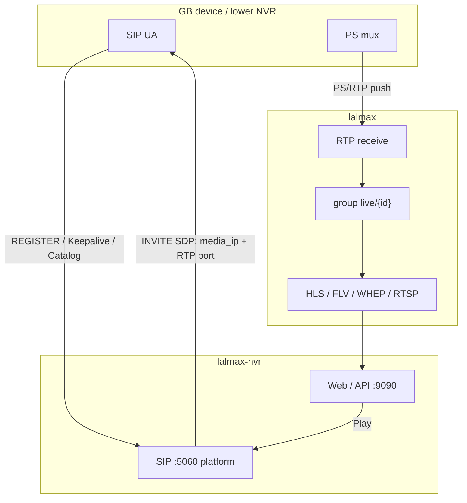
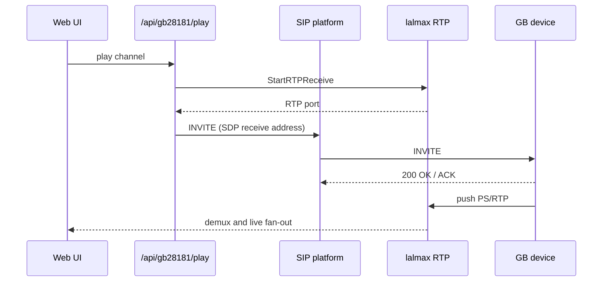
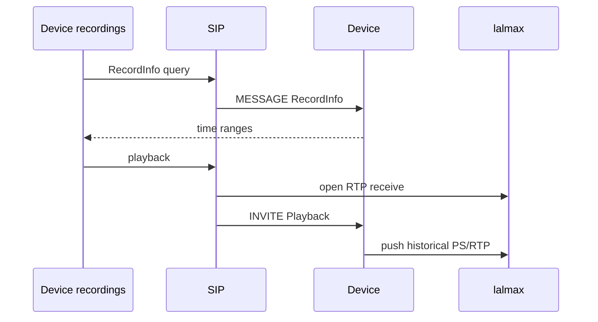
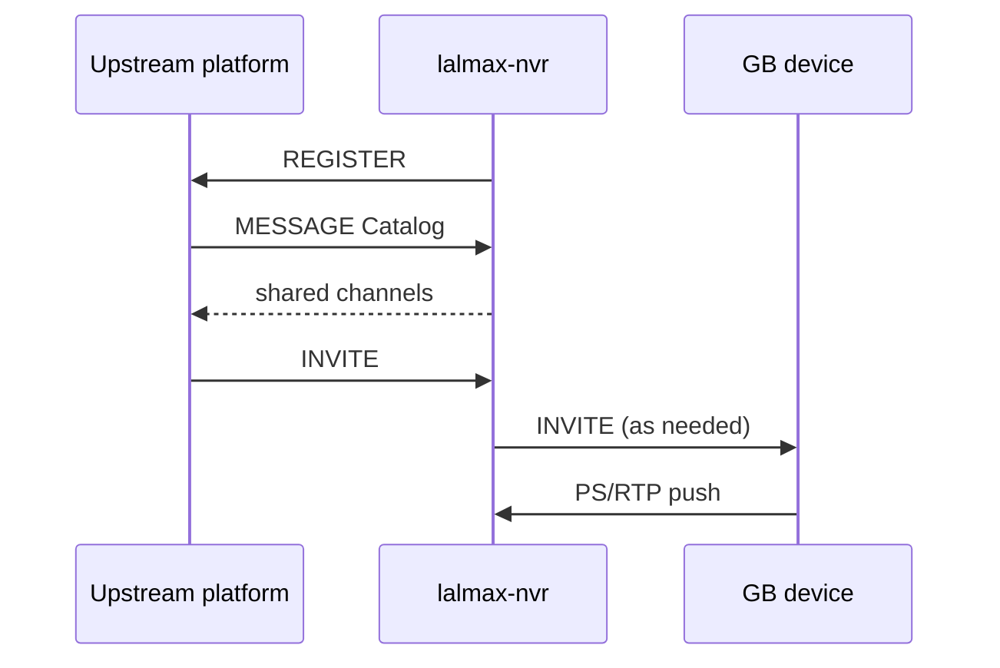

# GB28181 Device Guide

## Overview

lalmax-nvr acts as a GB/T 28181 **SIP platform** (上级). Devices **REGISTER** to `:5060`. For live view the platform sends **INVITE**, opens an RTP socket, and the device **pushes PS/RTP to `media_ip`**. That is GB28181 publish, not RTSP pull.

lalmax demuxes PS into `live/{camera_id}`; HLS / FLV / WebRTC / fMP4 / RTSP fan-out is the same as other cameras.

Registration, recording query, playback, talk, and cascade to an upstream platform are supported. Layers: [Architecture](architecture.md).

## Architecture and flows



### Register and catalog

```mermaid
sequenceDiagram
  participant Dev as GB device
  participant SIP as NVR SIP :5060
  participant Store as Device store

  Dev->>SIP: REGISTER (auth)
  SIP-->>Dev: 200 OK
  SIP->>Store: online
  SIP->>Dev: MESSAGE Catalog
  Dev-->>SIP: channel list
  Note over Dev,SIP: Keepalive; timeout → offline
```

Devices show up under **Devices → GB28181**. You do not write per-camera RTSP URLs in YAML.

### Live view (push after INVITE)

Play **first** opens an RTP receive port on lalmax, then sends SIP INVITE. SDP `c=` / `m=` point at this host's `media_ip` and RTP port. The device **pushes** PS/RTP to that address.



`media_ip` must be reachable from the device (not `127.0.0.1`). `media_port: 0` allocates a port per session; a positive value is single-port mode.

### Playback and download

Playback is also INVITE, with `Playback` and a time range in SDP; the device still **pushes** historical PS/RTP. Pause / speed / seek use SIP INFO. Download uses a separate INVITE (`Download`).



### Cascade (this NVR as lower platform)

The NVR **REGISTERs** to an upstream platform and answers Catalog for shared channels. When the upstream INVITEs, this NVR may INVITE the device; the device still pushes RTP here.



## Features

- **Device Management**: Auto-registration, heartbeat, online status monitoring
- **Recording Query**: Query device recordings by time range with visual timeline
- **Recording Playback**: Multi-protocol streaming (ws-flv, flv, hls, webrtc, etc.)
- **Playback Control**: Pause/resume, speed control (0.5x/1x/2x/4x), seek
- **Recording Download**: Single/batch download of device recordings
- **Voice Intercom**: SIP INVITE based, supports UDP/TCP transport
- **Cascade Platform**: Configure upstream platforms for cascading
- **Platform History**: Record register/unregister events

## Quick Start

### 1. Enable GB28181

Enable GB28181 in the configuration file:

```yaml
gb28181:
  enabled: true
  id: "34020000002000000001"  # 20-digit platform SIP ID
  host: "192.168.1.100"       # SIP listen (empty = derive from media_ip)
  port: 5060                  # SIP port
  media_ip: "192.168.1.100"   # IP devices push PS/RTP to (must be reachable)
  media_port: 30000           # RTP port; 0 = per-session random
  password: "12345678"        # Device REGISTER password
  standard_version: "2016"    # 2016 or 2022
```

### 2. Add Device

In the web interface:

1. Go to **Devices** page
2. Switch to **GB28181** tab
3. Devices will appear automatically after registration

### 3. Configure Device

Configure SIP parameters on the device side:

| Parameter | Value |
|-----------|-------|
| SIP Server IP | lalmax-nvr machine IP |
| SIP Port | 5060 (default) |
| Device ID | 20-digit national standard ID |
| Password | Same as configuration file |

## Usage

### Device List

Go to **Devices** → **GB28181** → **Device List** to:

- View device online status
- Play live video
- View device info (manufacturer, model, heartbeat time, etc.)

### Device Recording

#### Query Recordings

1. Switch to **Device Recording** tab
2. Select device and channel
3. Set start/end time
4. Click **Query Recordings**

#### Timeline

Query results display a 24-hour timeline with blue blocks indicating recording segments. Click a block to play the corresponding recording.

#### Playback Control

| Control | Description |
|---------|-------------|
| Pause/Resume | Pause or resume recording playback |
| Speed | Support 0.5x, 1x, 2x, 4x speed |
| Seek | Jump to specific time (start, 30s, 1min, 5min, 10min) |

#### Multi-Protocol Playback

Supports multiple playback protocols. After clicking play, use the protocol switch button to select:

| Protocol | Description |
|----------|-------------|
| ws-flv | WebSocket FLV (recommended) |
| flv | HTTP-FLV |
| hls | HLS |
| webrtc | WebRTC |
| fmp4 | Fragmented MP4 |

#### Download Recordings

- **Single Download**: Click the download button in the recording list
- **Batch Download**: Click "Batch Download", select multiple recordings, then click "Download Selected"

### Cascade Management

Switch to **Cascade Management** tab to:

- Add upstream platforms
- View platform status
- Delete platforms

#### Add Platform

1. Click **Add Platform**
2. Fill in platform info:
   - Platform name
   - Upstream SIP ID
   - Upstream IP and port
   - Transport protocol (UDP/TCP)
   - Username/password (optional)

### Platform History

Switch to **Platform History** tab to:

- View platform status overview
- View register/unregister events
- Filter by platform or event type

### Voice Intercom

In the device list, you can initiate voice intercom with online devices:

1. Click the device's intercom button
2. Allow browser microphone access
3. Start talking

## API Reference

### Device Management

```
GET  /api/gb28181/devices          # List devices
POST /api/gb28181/play             # Start live play
POST /api/gb28181/stop             # Stop play
```

### Recording Query & Playback

```
POST /api/gb28181/record_info      # Query recordings
POST /api/gb28181/playback         # Start playback
POST /api/gb28181/playback/pause   # Pause playback
POST /api/gb28181/playback/resume  # Resume playback
POST /api/gb28181/playback/speed   # Speed control
POST /api/gb28181/playback/seek    # Seek control
```

### Recording Download

```
POST /api/gb28181/download/start   # Start download
POST /api/gb28181/download/batch   # Batch download
POST /api/gb28181/download/stop    # Stop download
GET  /api/gb28181/downloads        # List downloads
```

### Cascade Platform

```
GET    /api/gb28181/platforms       # List platforms
POST   /api/gb28181/platforms       # Add platform
DELETE /api/gb28181/platforms       # Delete platform
GET    /api/gb28181/platform/events # Platform events
GET    /api/gb28181/platform/status # Platform status
```

### Voice Intercom

```
POST /api/gb28181/broadcast/start   # Start intercom
POST /api/gb28181/broadcast/stop    # Stop intercom
```

### Alarms

```
GET /api/gb28181/alarms             # List alarms
```

## Troubleshooting

### Device Cannot Register

1. Check device SIP settings (platform ID, domain, password)
2. Check network path; UDP/TCP **5060** must be reachable
3. Check if the SIP port is already in use
4. Check SIP messages in logs

### Registered but no video

GB28181 is **device push**. If INVITE succeeds but there is no picture, RTP is usually not arriving.

1. `media_ip` must be a NIC IP the device can route to — not `127.0.0.1`
2. Allow `media_port` (or the ephemeral RTP port) UDP/TCP through the firewall
3. Map the port in Docker bridge mode; check NAT across subnets
4. Logs should show RTP receive **then** INVITE; 200 OK without RTP means the media path is blocked

### Recording Query Failed

1. Confirm device is online
2. Confirm device supports recording query
3. Check time format is correct
4. Check RecordInfo messages in logs

### Playback 415 Error

415 error indicates device doesn't support the SDP format. Possible causes:

1. Device doesn't support playback
2. SDP format incompatible
3. Timestamp format incorrect

### Speed Control Failed

1. Confirm device supports SIP INFO commands
2. Confirm device supports speed playback
3. Check SIP INFO messages in logs

### Intercom No Audio

1. Check browser microphone permission
2. Check if device supports intercom
3. Check audio codec compatibility
4. Check Broadcast messages in logs

## Configuration Reference

```yaml
gb28181:
  enabled: false                   # Enable GB28181
  id: ""                           # Platform SIP ID (20 digits)
  host: ""                         # SIP listen address (optional)
  port: 5060                       # SIP listen port
  media_ip: ""                     # IP devices push PS/RTP to
  media_port: 30000                # RTP port (0 = per-session random)
  password: ""                     # Device REGISTER password
  standard_version: "2016"         # 2016 or 2022
```
