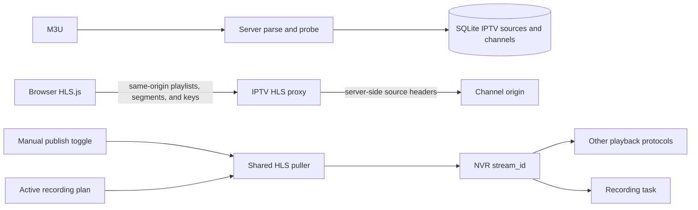

# IPTV

IPTV is an independent module for importing M3U playlists, probing channels, managing channel lists, and resolving playback URLs. Channels are not cameras and are not stored in `created_streams`.

Web UI: **IPTV** in the sidebar (`#/iptv`). REST API: `/api/iptv`.

## How it works

1. Import an M3U URL or pasted text. The server parses and probes its channels.
2. Enroll selected channels. This only stores the source and channel records; it does not start media pulls.
3. Click a channel to let browser HLS.js use the same-origin IPTV HLS proxy. The NVR fetches upstream playlists and media resources, then rewrites segment, child-playlist, and key URIs in each manifest.
4. Enable **Publish** on a channel to start a server-side HLS pull and expose it to other NVR playback protocols. Recording plans use the same pull; it stops only after both publication and recording no longer need it.

Every channel keeps a stable `stream_id` for publication, recording plans, and historical recordings. Browser playback uses the HLS proxy, so the origin does not need CORS enabled and playback does not depend on lal. Publication and recording share one upstream HLS pull.



## Playback requirements

Playlists, segments, child playlists, and keys are fetched through a same-origin proxy, so browser playback does not depend on upstream CORS settings. The server applies saved source headers; credentials are sent only to the channel's source origin and are not forwarded to other CDN hosts referenced by a playlist. Upstream URLs are restricted to HTTP/HTTPS and loopback/link-local addresses are blocked.

M3U URLs and headers are encrypted at rest when `NVR_ENCRYPTION_KEY` is configured. The playback-details endpoint returns only the local proxy URL and sets `Cache-Control: no-store`. NVR Basic Auth credentials are used only for the local proxy and are never sent to third-party origins.

## Recording

Enable **Publish** on the channel card to publish it continuously. After NVR has registered the stream, `GET /api/streams/{stream_id}` returns `play_urls` for supported protocols such as RTSP, HTTP-FLV, HLS, and WebRTC. Turning publication off keeps the shared pull running if a recording plan still needs it.

Create a recording plan for the channel's stable `stream_id`. Continuous plans, active schedule windows, and event windows start the same HLS pull on demand. Both publication and recording require `media.mode: embedded`, which is the default. Supported source video codecs are H.264/H.265, with AAC audio. `iptv.max_concurrent_pulls` caps shared publication and recording pulls (default 32).

```bash
curl -u admin:password -X POST http://localhost:9090/api/recording-plans \
  -H 'Content-Type: application/json' \
  -d '{"stream_id":"iptv_…","name":"IPTV channel","mode":"continuous","enabled":true}'
```

Use a separate disk budget for IPTV recordings, and avoid continuous plans for large channel lists.

## Web UI

1. Open **IPTV** and import an M3U URL or paste `#EXTM3U` text.
2. Wait for probe results: `pending` → `probing` → `playable` / `warning` / `unsupported` / `failed`.
3. Select channels to keep and enroll them. Enrollment does not start HLS pulls.
4. Click a channel to play it through the browser proxy. Enable **Publish** for playback over NVR protocols, and create a recording plan for its `stream_id` when recording is needed. Browser proxy playback is independent of NVR; publication and recording share the same upstream pull.

Recordable codecs are H.264/H.265 + AAC. DRM / SAMPLE-AES and unsupported codecs are rejected during probing. H.265 browser support depends on the client.

## REST API

Protected by HTTP Basic Auth. Write operations require operate permission.

```
POST   /api/iptv/imports
GET    /api/iptv/imports/{id}
GET    /api/iptv/imports/{id}/items
POST   /api/iptv/imports/{id}/items/{item_id}/probe
POST   /api/iptv/imports/{id}/commit
GET    /api/iptv/sources
DELETE /api/iptv/sources/{id}
GET    /api/iptv/groups
GET    /api/iptv/channels
GET    /api/iptv/channels/{id}
GET    /api/iptv/channels/{id}/playback
GET    /api/iptv/channels/{id}/hls[?url=<upstream-url>]
PUT    /api/iptv/channels/{id}
DELETE /api/iptv/channels/{id}
```

Enable publication with `PUT /api/iptv/channels/{id}` and body `{"publish_enabled":true}`; set it to `false` to turn publication off. Disabled channels do not pull. Once published, retrieve protocol URLs from `/api/streams/{stream_id}` in `play_urls`.

Playback details:

```bash
curl -u admin:password http://localhost:9090/api/iptv/channels/{id}/playback
```

The response contains the authenticated same-origin proxy `url`. HLS resource URIs in the playlist are rewritten to use this proxy.

## Import API example

```bash
curl -u admin:password -X POST http://localhost:9090/api/iptv/imports \
  -H 'Content-Type: application/json' \
  -d '{"name":"science","playlist_url":"https://iptv-org.github.io/iptv/categories/science.m3u"}'
```

The `202` response contains an import job. Its status is `probing` and then `ready`. You can instead submit `playlist_text`; commit selected item IDs at `/imports/{id}/commit`.

Import URLs are restricted to HTTP/HTTPS and loopback/link-local addresses are blocked. Each import is capped at 2000 channels, probe concurrency is 4, and playlist bodies are capped at 2 MiB.
