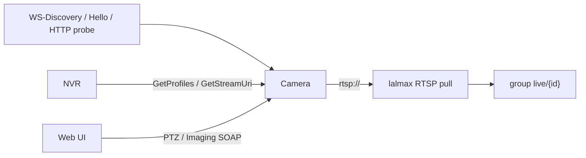
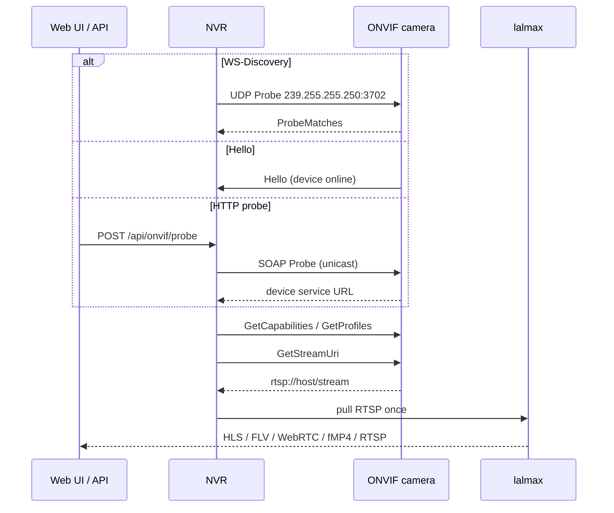
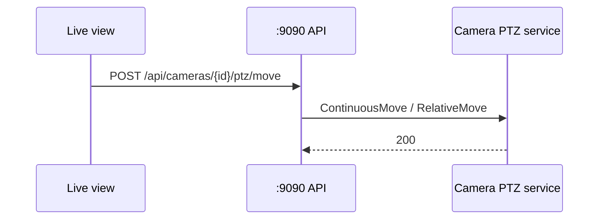

# ONVIF Guide for lalmax-nvr

This guide covers ONVIF (Open Network Video Interface Forum) integration with lalmax-nvr, including camera discovery, management, PTZ control, and troubleshooting.

## What is ONVIF and Profile S Overview

ONVIF is an open industry standard for network video products, enabling different manufacturers' IP cameras to work together. lalmax-nvr implements ONVIF Profile S, which focuses on core video streaming functionality:

- **Profile S**: Video streaming, PTZ control, device management
- **Profile T**: Security enhancements (access control events)
- **Profile G**: Analytics and metadata
- **Profile Q**: Advanced PTZ control

lalmax-nvr primarily supports Profile S capabilities with optional support for device management and event monitoring depending on camera firmware.

## Architecture and flows

ONVIF is **discovery and control**. Video still uses **RTSP pull** into lalmax (once per camera). That is not GB28181: national-standard devices **push** PS/RTP after a SIP INVITE.





Docker **bridge mode blocks multicast**, so WS-Discovery fails. Use HTTP probe, enter `onvif/device_service` by hand, or set `network_mode: host`.

PTZ and imaging use a separate SOAP path; they do not go through lalmax:



Layers and ports: [Architecture](architecture.md).

## Supported ONVIF Services

lalmax-nvr provides the following ONVIF service integrations:

### Device Service
- Device information and capabilities
- Network interface configuration
- User management
- System reboot

### Media Service  
- Video streaming profiles
- Resolution and codec support
- Frame rate and bitrate settings
- Audio stream configuration

### PTZ Service
- Pan, tilt, zoom control
- Preset management
- Position movement
- Continuous movement

### Imaging Service
- Image settings (brightness, contrast, saturation)
- Exposure control
- Focus adjustment
- White balance

### Events Service (Limited)
- Motion detection events
- Device status changes
- **Note**: Event service support varies by camera model

### Device Management Service (Limited)
- Network configuration
- System settings
- User management
- **Note**: Device management support varies by camera model

## Camera Discovery

lalmax-nvr supports two camera discovery methods:

### WS-Discovery (Multicast)

**Method**: UDP multicast to `239.255.255.250:3702`
```bash
# Test WS-Discovery manually
nmap -p 3702 --open 192.168.1.0/24
```

**Status**: 
- ✅ Works on bare metal/Raspberry Pi
- ❌ **Blocked in Docker containers** (multicast not supported)

### HTTP Probe

**Method**: Direct HTTP request to ONVIF endpoint
```bash
# Probe specific IP address
curl -X POST http://localhost:9090/api/onvif/probe \
  -H "Content-Type: application/json" \
  -d '{"ip": "192.168.1.100", "port": 80}'
```

**Status**:
- ✅ Works in all environments including Docker
- ✅ More reliable for network troubleshooting

### Manual Camera Addition

When discovery fails, you can add cameras manually:

```yaml
cameras:
  - id: "manual_onvif"
    name: "Manual ONVIF Camera"
    protocol: "onvif"
    url: "http://192.168.1.100:80/onvif/device_service"
    username: "admin"
    password: "password"
    enabled: true
```

## Adding ONVIF Camera Step-by-Step

### Method 1: Web UI Discovery (Recommended)

1. Open lalmax-nvr Web UI
2. Navigate to **Cameras** → **Add Camera**
3. Select **ONVIF** from protocol dropdown
4. Click **Discover Cameras**
5. If automatic discovery fails:
   - Use **Manual Probe** section
   - Enter camera IP address directly
6. Select discovered camera from list
7. Configure settings:
   - Camera name
   - Recording schedule
   - Stream preferences
8. Click **Add Camera**

### Method 2: Manual Configuration

For cameras that cannot be discovered automatically:

1. Get camera ONVIF endpoint URL:
   ```bash
   # Find ONVIF device service
   nmap -p 80 --open 192.168.1.0/24 | grep 80/open
   curl http://192.168.1.100/onvif/device_service
   ```

2. Add to configuration:
   ```yaml
   cameras:
     - id: "camera_ip"
       name: "Camera Location"
       protocol: "onvif"
       url: "http://192.168.1.100:80/onvif/device_service"  
       username: "admin"
       password: "password"
       encoding: "h264"  # or h265, mjpeg
       enabled: true
   ```

### Method 3: API Configuration

```bash
# Add camera via API
curl -X POST http://localhost:9090/api/cameras \
  -H "Content-Type: application/json" \
  -H "Authorization: Bearer your-token" \
  -d '{
    "id": "api_camera",
    "name": "API Camera", 
    "protocol": "onvif",
    "url": "http://192.168.1.100/onvif/device_service",
    "username": "admin",
    "password": "password",
    "encoding": "h264",
    "enabled": true
  }'
```

## PTZ Control and Presets

### PTZ Control API Endpoints

All PTZ operations are available via REST API:

#### Move Camera
```bash
curl -X POST http://localhost:9090/api/cameras/{id}/ptz/move \
  -H "Content-Type: application/json" \
  -H "Authorization: Bearer your-token" \
  -d '{
    "pan": 0.5,
    "tilt": 0.3,
    "zoom": 1.0,
    "relative": true
  }'
```

#### Stop PTZ Movement
```bash
curl -X POST http://localhost:9090/api/cameras/{id}/ptz/stop \
  -H "Authorization: Bearer your-token"
```

#### Get PTZ Status
```bash
curl -X GET http://localhost:9090/api/cameras/{id}/ptz/status \
  -H "Authorization: Bearer your-token"
```

### Preset Management

#### List Presets
```bash
curl -X GET http://localhost:9090/api/cameras/{id}/ptz/presets \
  -H "Authorization: Bearer your-token"
```

#### Create Preset
```bash
curl -X POST http://localhost:9090/api/cameras/{id}/ptz/presets \
  -H "Content-Type: application/json" \
  -H "Authorization: Bearer your-token" \
  -d '{
    "name": "Main Entrance",
    "position": {
      "pan": 0.0,
      "tilt": 0.0,
      "zoom": 1.0
    }
  }'
```

#### Go to Preset
```bash
curl -X POST http://localhost:9090/api/cameras/{id}/ptz/presets/{token}/goto \
  -H "Authorization: Bearer your-token"
```

#### Delete Preset
```bash
curl -X DELETE http://localhost:9090/api/cameras/{id}/ptz/presets/{token} \
  -H "Authorization: Bearer your-token"
```

### Web UI PTZ Control

1. Open camera live view
2. Click **PTZ Control** button
3. Use directional pad for pan/tilt
4. Use +/- buttons for zoom
5. Save positions as presets
6. Access presets from dropdown menu

## Imaging Settings Configuration

### Available Imaging Settings

#### Get Current Settings
```bash
curl -X GET http://localhost:9090/api/cameras/{id}/imaging/settings \
  -H "Authorization: Bearer your-token"
```

**Response example**:
```json
{
  "brightness": 50,
  "contrast": 50, 
  "saturation": 50,
  "sharpness": 50,
  "exposure_mode": "auto",
  "exposure_priority": "normal",
  "backlight_compensation": false,
  "wide_dynamic_range": false
}
```

#### Update Imaging Settings
```bash
curl -X PUT http://localhost:9090/api/cameras/{id}/imaging/settings \
  -H "Content-Type: application/json" \
  -H "Authorization: Bearer your-token" \
  -d '{
    "brightness": 70,
    "contrast": 60,
    "saturation": 55,
    "sharpness": 65,
    "exposure_mode": "auto",
    "exposure_priority": "normal",
    "backlight_compensation": true
  }'
```

### Get Supported Options
```bash
curl -X GET http://localhost:9090/api/cameras/{id}/imaging/options \
  -H "Authorization: Bearer your-token"
```

**Response example**:
```json
{
  "brightness": {
    "min": 0,
    "max": 100,
    "step": 1
  },
  "exposure_mode": ["auto", "manual", "aperture_priority"],
  "wide_dynamic_range": [false, true]
}
```

### Imaging Settings Notes

- **OV5647 Raspberry Pi Camera**: Settings changes may not persist
- **Camera Differences**: Supported settings vary by manufacturer
- **Persistence**: Some cameras require reboot for changes to take effect
- **Reset**: Use camera web interface to reset to factory defaults if needed

## Snapshot Support

### Get Snapshot URI

```bash
curl -X GET http://localhost:9090/api/cameras/{id}/snapshot/uri \
  -H "Authorization: Bearer your-token"
```

**Response example**:
```json
{
  "uri": "http://192.168.1.100/snapshot.jpg",
  "expires": "2024-01-01T12:00:00Z"
}
```

### Get Direct Snapshot

```bash
curl -X GET http://localhost:9090/api/cameras/{id}/snapshot \
  -H "Authorization: Bearer your-token" \
  -o camera_snapshot.jpg
```

### Snapshot Usage

- **Format**: Camera-native format (usually JPEG)
- **Browser Compatibility**: Most browsers support JPEG snapshots
- **Resolution**: Native camera resolution (may not be viewable in all browsers)
- **Caching**: lalmax-nvr caches snapshots for 5 seconds to reduce load
- **Alternatives**: Use RTSP/HTTP JPEG stream for consistent format

### Web UI Snapshots

1. Open camera live view
2. Click **Snapshot** button
3. Download the captured image
4. Snapshots are cached for immediate access

## Event Monitoring (Motion Detection)

### ONVIF Event Service Support

**Note**: Event service support varies significantly by camera model.

#### Check Event Service Support
```bash
curl -X GET http://localhost:9090/api/cameras/{id}/onvif/capabilities \
  -H "Authorization: Bearer your-token"
```

Look for `Events` in capabilities response:
```json
{
  "capabilities": {
    "Events": true,
    "Media": true,
    "PTZ": true
  }
}
```

### Alternative Motion Detection

For cameras without ONVIF event support:
- Use camera's built-in motion detection
- Configure external motion detection in lalmax-nvr
- Use third-party motion detection solutions

## Device Management

### Reboot Device

```bash
curl -X POST http://localhost:9090/api/cameras/{id}/onvif/reboot \
  -H "Authorization: Bearer your-token"
```

### Network Configuration

#### Get Network Interfaces
```bash
curl -X GET http://localhost:9090/api/cameras/{id}/onvif/network \
  -H "Authorization: Bearer your-token"
```

#### Set Network Configuration
```bash
curl -X PUT http://localhost:9090/api/cameras/{id}/onvif/network \
  -H "Content-Type: application/json" \
  -H "Authorization: Bearer your-token" \
  -d '{
    "interface": "eth0",
    "mode": "static",
    "ip_address": "192.168.1.100",
    "subnet_mask": "255.255.255.0",
    "default_gateway": "192.168.1.1"
  }'
```

### User Management

#### List Users
```bash
curl -X GET http://localhost:9090/api/cameras/{id}/onvif/users \
  -H "Authorization: Bearer your-token"
```

#### Create Users
```bash
curl -X POST http://localhost:9090/api/cameras/{id}/onvif/users \
  -H "Content-Type: application/json" \
  -H "Authorization: Bearer your-token" \
  -d '{
    "username": "viewer",
    "password": "password123",
    "user_level": "operator"
  }'
```

#### Delete Users
```bash
curl -X DELETE http://localhost:9090/api/cameras/{id}/onvif/users/username \
  -H "Authorization: Bearer your-token"
```

### Device Management Notes

- **Camera Support**: Device management varies by camera model
- **OV5647 Test Camera**: Limited device management capabilities
- **Network Changes**: May require camera reboot
- **User Levels**: Standard: `admin`, `operator`, `viewer`, `user`

## Troubleshooting

### Common ONVIF Issues

#### Authentication Failures

**Symptom**: `401 Unauthorized` error when accessing ONVIF endpoints

**Solutions**:
```bash
# Test basic ONVIF connectivity
curl -I http://192.168.1.100/onvif/device_service

# Check ONVIF port accessibility
nc -zv 192.168.1.100 80

# Test authentication
curl -u admin:password http://192.168.1.100/onvif/device_service
```

**Configuration fixes**:
```yaml
# Check username/password in camera config
cameras:
  - id: "problem_camera"
    protocol: "onvif"
    username: "admin"        # Verify correct username
    password: "correct_pass" # Verify correct password
```

#### Discovery Issues

**Docker Multicast Problem**:
- **Issue**: WS-Discovery doesn't work in Docker containers
- **Solution**: Use HTTP Probe or manual configuration

**Host Network Solution**:
```yaml
# docker-compose.yml with host network
services:
  lalmax-nvr:
    network_mode: host  # Enables multicast
    ports:
      - "9090:9090"
```

**Manual Probe Solution**:
```bash
curl -X POST http://localhost:9090/api/onvif/probe \
  -H "Content-Type: application/json" \
  -d '{"ip": "192.168.1.100", "port": 80}'
```

#### Unsupported Operations

**Symptom**: `501 Not Implemented` error

**Causes**:
- Camera doesn't support requested ONVIF feature
- Feature requires specific firmware version
- Camera manufacturer implementation differences

**Solutions**:
```bash
# Check supported capabilities
curl -X GET http://localhost:9090/api/cameras/{id}/onvif/capabilities \
  -H "Authorization: Bearer your-token"

# Find alternative configuration
# Use camera's native interface for unsupported features
```

#### Connection Timeouts

**Solutions**:
```bash
# Test camera network connectivity
ping 192.168.1.100

# Check firewall rules
sudo ufw status

# Test ONVIF endpoint directly
curl --connect-timeout 5 http://192.168.1.100/onvif/device_service
```

### Docker Limitations

#### WS-Discovery Limitation

**Problem**: Docker's default bridge network blocks multicast traffic (239.255.255.250:3702)

**Solutions**:

1. **Host Networking** (Recommended):
   ```yaml
   services:
     lalmax-nvr:
       network_mode: host
       ports:
         - "9090:9090"
   ```

2. **Manual Probe** (Works in any network):
   ```bash
   # In Web UI, use "Manual Probe" section
   # Or use API endpoint
   curl -X POST http://localhost:9090/api/onvif/probe \
     -d '{"ip": "192.168.1.100"}'
   ```

3. **Manual Camera Addition**:
   ```yaml
   cameras:
     - id: "manual_camera"
       protocol: "onvif"
       url: "http://192.168.1.100:80/onvif/device_service"
       username: "admin"
       password: "password"
   ```

#### Network Configuration

**Docker Port Mapping**:
```yaml
services:
  lalmax-nvr:
    ports:
      - "9090:9090"        # Web UI
      - "2121:2121"        # FTP
      - "2122-2140:2122-2140"  # FTP passive
```

## Known Limitations

### Snapshot Format Issues
- **Native Format**: Returns camera-native format (usually JPEG)
- **Browser Compatibility**: May not be viewable in all browsers
- **Resolution**: Native resolution varies by camera
- **Recommendation**: Use RTSP/HTTP JPEG for consistent format

### Event Service Support Varies
- **Camera Dependent**: Only specific models support ONVIF Event Service
- **Firmware Required**: Often requires specific firmware version
- **Manufacturer Differences**: Implementations vary across brands

### Device Management Support
- **Limited Availability**: Not all cameras support device management
- **OV5647 Test Camera**: Limited device management capabilities
- **Network Changes**: May require camera reboot

### ONVIF Profile Compatibility
- **Profile S**: Fully supported (video streaming, PTZ)
- **Profile T**: Partially supported (security events)
- **Profile G**: Limited support (analytics)
- **Profile Q**: Basic support (advanced PTZ)

### Docker Limitations
- **Multicast Blocked**: WS-Discovery doesn't work in default Docker network
- **Network Requirements**: May need host network for discovery
- **Port Conflicts**: Ensure ports don't conflict with host services

### Camera-Specific Limitations
- **Firmware Variations**: Different implementations across manufacturers
- **Protocol Extensions**: Vendor-specific ONVIF extensions not supported
- **Authentication Methods**: Some cameras use non-standard auth

## Test Camera Behavior

### OV5647 Raspberry Pi Camera
- **PTZ Control**: Limited pan/tilt, basic zoom
- **Imaging Settings**: Changes may not persist across reboots
- **Snapshot Format**: JPEG, consistent format
- **Event Service**: Not supported
- **Device Management**: Basic configuration only

### General Test Results
- **Discovery**: Works reliably with HTTP Probe
- **Streaming**: H.264 format, good quality
- **PTZ**: Functional with standard controls
- **Configuration**: Most settings persist, some require camera reboot
- **Network**: Stable on Raspberry Pi 3B with external USB storage

## API Reference

### Discovery Endpoints
- `POST /api/onvif/probe` - HTTP Probe for specific IP
- `POST /api/onvif/discover` - WS-Discovery multicast
- `GET /api/onvif/discover/{ip}` - Device detail

### Camera-Level Endpoints
- `GET /api/cameras/{id}/onvif/profiles` - Media profiles
- `GET /api/cameras/{id}/onvif/capabilities` - Device capabilities

### PTZ Endpoints
- `POST /api/cameras/{id}/ptz/move` - Move PTZ
- `POST /api/cameras/{id}/ptz/stop` - Stop PTZ
- `GET /api/cameras/{id}/ptz/status` - PTZ status
- `GET /api/cameras/{id}/ptz/presets` - List presets
- `POST /api/cameras/{id}/ptz/presets` - Create preset
- `POST /api/cameras/{id}/ptz/presets/{token}/goto` - Go to preset
- `DELETE /api/cameras/{id}/ptz/presets/{token}` - Delete preset

### Imaging Endpoints
- `GET /api/cameras/{id}/imaging/settings` - Get settings
- `PUT /api/cameras/{id}/imaging/settings` - Update settings
- `GET /api/cameras/{id}/imaging/options` - Get supported ranges

### Snapshot Endpoints
- `GET /api/cameras/{id}/snapshot/uri` - Get snapshot URI
- `GET /api/cameras/{id}/snapshot` - Get snapshot

### Device Management Endpoints
- `POST /api/cameras/{id}/onvif/reboot` - Reboot device
- `GET /api/cameras/{id}/onvif/network` - Get network interfaces
- `PUT /api/cameras/{id}/onvif/network` - Set network config
- `GET /api/cameras/{id}/onvif/users` - List users
- `POST /api/cameras/{id}/onvif/users` - Create users
- `DELETE /api/cameras/{id}/onvif/users` - Delete users

## Support Resources

### Documentation
- [lalmax-nvr Getting Started](./getting-started.md)
- [lalmax-nvr Configuration Guide](./configuration.md)
- [lalmax-nvr API Reference](./api-reference.md)

### Community Support
- GitHub Issues: [lalmax-nvr Issues](https://github.com/lalmax-pro/lalmax-nvr/issues)
- Discussions: [lalmax-nvr Discussions](https://github.com/lalmax-pro/lalmax-nvr/discussions)

### ONVIF Resources
- ONVIF Official Site: https://www.onvif.org/
- ONVIF Device Manager: https://www.onvif.org/Downloads/ONVIF-DM-Software.zip
- ONVIF Documentation: https://www.onvif.org/resources/

---

This guide provides comprehensive coverage of ONVIF integration with lalmax-nvr. For specific camera models, check manufacturer documentation for ONVIF capabilities and limitations.