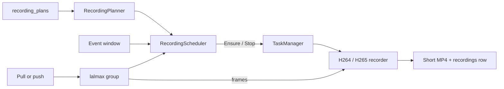
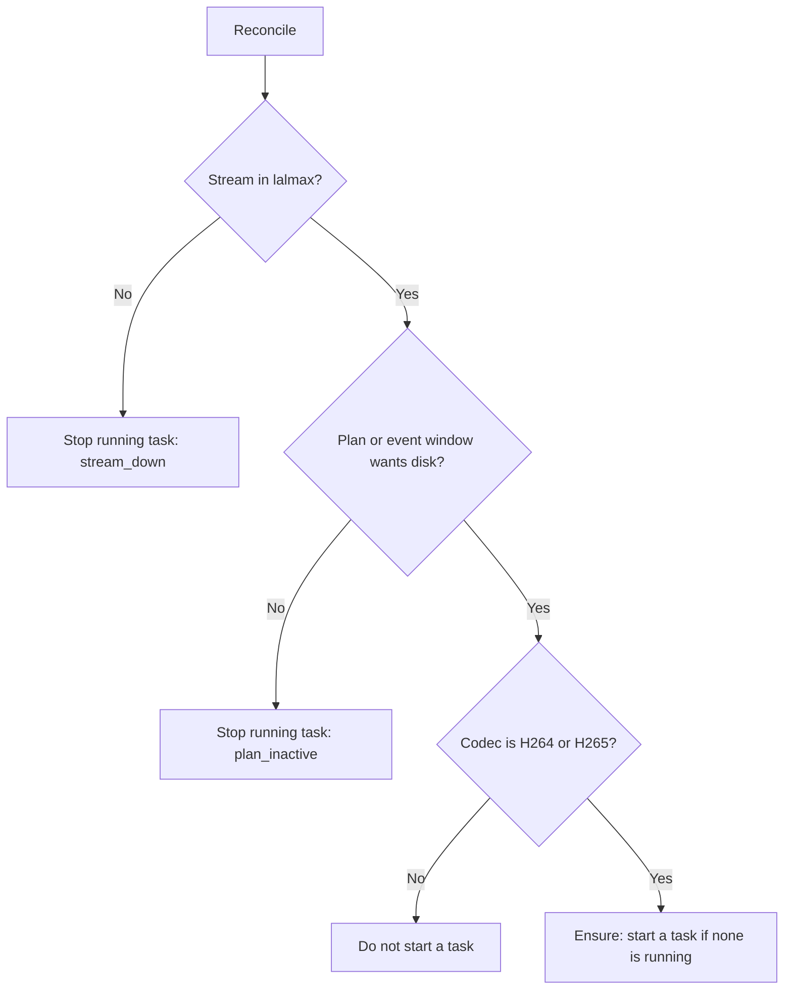
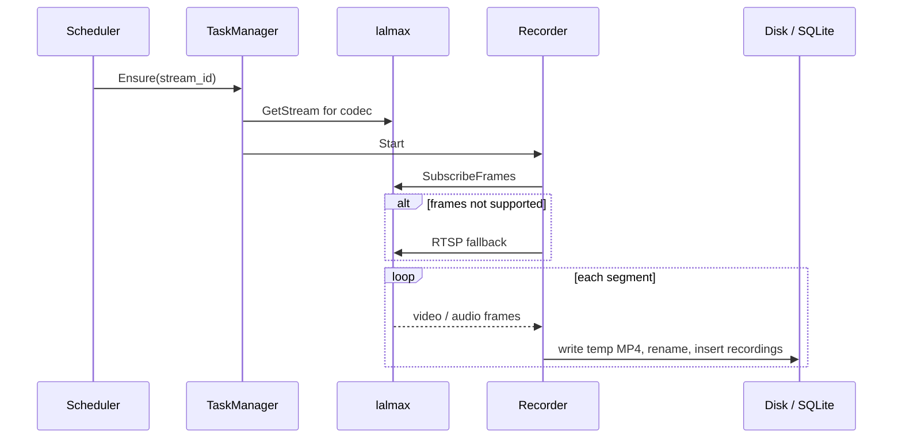
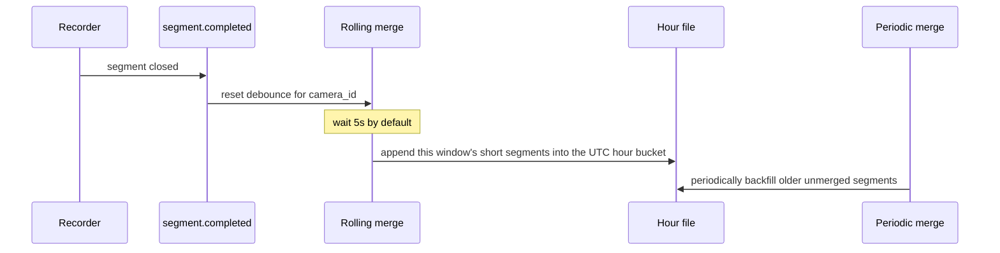
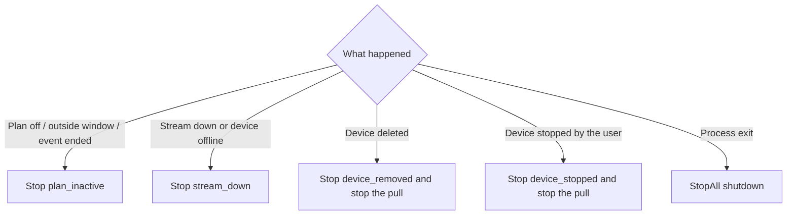
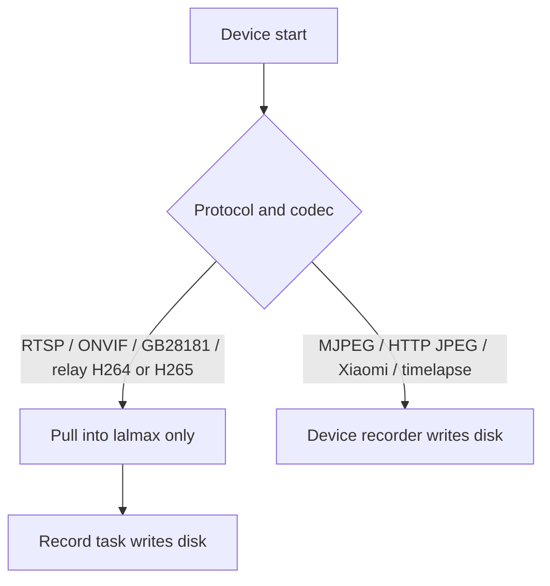

# Recording flow

[中文](../zh/recording-flow.md) · [Recording plans](recording-plans.md)

H.264 / H.265 disk writes are **record tasks**. A stream is recorded only when both are true: it is in lalmax right now, and a recording plan (or an open event window) wants it on disk. Registering the stream as a device does not change that decision.

MJPEG, HTTP JPEG, Xiaomi, and timelapse still write through the device recorder. They do not become record tasks.

## Roles

| Piece | Job |
|-------|-----|
| Device / pull | Brings a camera into lalmax. Push, GB28181, and WHIP already are a stream |
| `recording_plans` | The only policy: when this `stream_id` should be written |
| `RecordingPlanner` | Turns plans into "should this stream record right now" |
| `RecordingScheduler` | Reconciles plans with streams still in lalmax, then `Ensure` / `Stop` |
| `TaskManager` | Owns the single writer for a `stream_id` |
| H.264 / H.265 recorder | Subscribes to frames, cuts short MP4s, inserts recording rows |

## When recording starts

The scheduler reconciles once at startup, then every 30 seconds. Creating or editing a plan reconciles immediately.

"Should record" means:

| Plan | Record now |
|------|------------|
| `continuous` or `adaptive`, and `enabled` | Yes |
| `scheduled`, and the clock is inside a weekly window | Yes |
| `event`, and that stream's event window is still open | Yes. The plan row itself says no; the window is added on top |
| `off`, `enabled: false`, or no plan | No |

Sub-streams, Xiaomi, timelapse, MJPEG, and HTTP JPEG are skipped so they are not written twice.

Starting a device only starts ingest. If the plan already wants disk, the manager tries `Ensure` after the pull. If the group is not ready yet, that attempt fails and the stream-up event or the next reconcile starts the task.

## How one task writes

`Ensure` builds a recorder for the `stream_id`. A second call for the same stream does not start another task.

1. Pick H.264 or H.265 from the codec lalmax reports.
2. Subscribe to in-process frames (embedded). If that is unavailable (HTTP-mode lalmax), fall back to the stream's RTSP play URL.
3. Open a new segment on a keyframe and rotate on `segment_duration`.
4. On close, insert a `recordings` row. With a bound device, `camera_id` is the device id. For a plan-only stream, `camera_id` and `stream_id` are both the stream id.
5. An `adaptive` plan attaches a gate: periodic keyframes while calm, full rate while active. The interval comes from the bound device's `adaptive.timelapse_interval`.

Event recording: MQTT or ONVIF motion opens the stream's event window and calls `Ensure`. When the window ends (post-roll or max duration) the task stops. While the window is open, the scheduler does not stop the task just because the plan row says no.

## Merge

Merge runs after a segment is closed. It does not decide whether to record. Both record tasks and device recorders publish `segment.completed`. The event's `camera_id` is the device id, or the `stream_id` when there is no device. Merge groups by that id.

Two paths:

| Path | When | What |
|------|------|------|
| Rolling | `merge.rolling_enabled`, after `rolling_debounce` (default 5s) from the last close | Appends short segments in the current UTC window onto that hour file |
| Periodic | `merge.enabled`, on `check_interval` | Backfills segments rolling merge missed. A segment must be older than `min_segment_age` (default 10 minutes), and a window needs at least `min_segments_to_merge` segments |

Another close for the same id resets the debounce timer. Rolling merge appends the new samples onto the end of the hour file and rewrites moov, instead of copying the whole hour. An older hour file whose moov sits before mdat is remuxed once into the appendable layout, then keeps the same `recordings` row. Segments with different codec parameter sets stay in separate groups. A group smaller than `min_segments_to_merge` stays pending, so a later compatible segment can still join. The periodic pass scans every stream that still has pending rows, including streams that were never registered as devices. The first merge inserts one new `recordings` row and deletes the short files it consumed. Playback cuts continuous VOD from these hour files.

## When recording stops

Stopping a task closes the current segment. The reason is logged.

| Action | What stops | After |
|--------|------------|-------|
| Plan no longer wants disk | That `stream_id` | Stays stopped until the plan wants it again and the stream is back |
| Stream down, publisher stop, relay-pull stop | That `stream_id` | `Ensure` again when the stream returns and the plan still wants disk |
| Delete or archive the device | That device's ingest stream | The pull stops too. The plan remains; the same `stream_id` records again if it re-enters lalmax |
| User stops the device | That device's ingest stream | The pull stops too |
| Process shutdown | Every task | Segments are closed, then the media engine and database stop |

Device offline and stream down stop the task only. The device stays in config. If the pull retries and the stream returns, the scheduler or the stream-up event starts recording again.

## Boundary with the device recorder

A GB28181 device is ingested by SIP, not by the camera start path. Once its stream is in lalmax and a plan wants it, a record task writes it.
