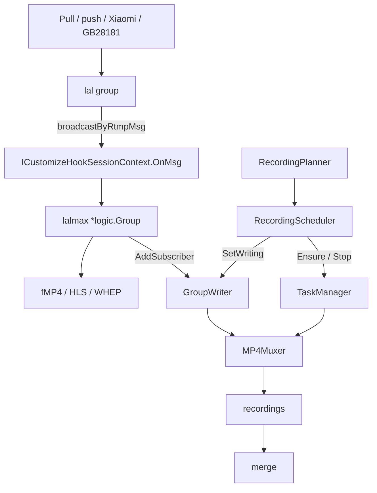
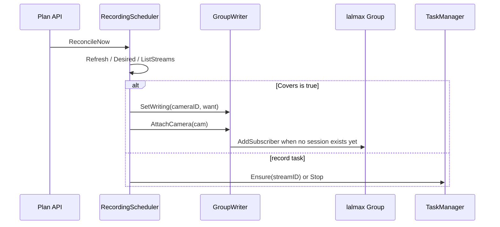

# Recording flow

[中文](../zh/recording-flow.md) · [Recording plans](recording-plans.md)

A stream enters the in-process lalmax group first. On the embedded engine, the recorder subscribes to that group with `GroupWriter`. A recording plan only flips the write switch. Pull, push, and the device session keep running.

With `media.mode: http` the group lives in another process, so this process cannot call `AddSubscriber`. That deployment, and any `adaptive` plan, still uses `TaskManager`. MJPEG, HTTP JPEG, and timelapse write through their own collectors.

## Modules

| Module | Code | What it does for recording |
|--------|------|----------------------------|
| Device access | `internal/camera`, `internal/onvif`, `internal/gb28181`, `internal/xiaomi` | Delivers the stream into the engine. GB28181 uses SIP/INVITE. Xiaomi uses `AddCustomizePubSession` |
| Media engine | `internal/media`; the embedded implementation is `*media.EmbeddedLalmax` | Exposes the group, stream events, `ListStreams`, and `SubscribeFrames` |
| lal group | `third/lal/pkg/logic` | Owns the publish session and turns media into `RtmpMsg` |
| lalmax group | `*logic.Group` in `third/lalmax/logic/group.go` | The group live subscribers use. Recording subscribes here |
| Plans | `recording_plans`, `RecordingPlanner` | Answers whether this `stream_id` should hit disk right now |
| Scheduler | `recorder.RecordingScheduler` | Reconciles plans with streams still in lalmax |
| Group writer | `recorder.GroupWriter` | Subscription and disk writes for embedded H.264/H.265 |
| Record task | `recorder.TaskManager` | `adaptive`, and H.264/H.265 the group writer does not cover |
| Muxer | `internal/muxer.MP4Muxer` | Writes short MP4s with `stts`, `ctts`, and `stss` |
| Storage | `storage.Manager`, `storage.DB` | Publishes the file and inserts a `recordings` row |
| Merge | `internal/merge` | Listens for `segment.completed` and appends short files into the hour file |


```mermaid
flowchart TB
  ingest["Pull / push / Xiaomi / GB28181"] --> lal["lal group"]
  lal -->|"broadcastByRtmpMsg"| hook["ICustomizeHookSessionContext.OnMsg"]
  hook --> group["lalmax *logic.Group"]
  group --> live["fMP4 / HLS / WHEP"]
  group -->|"AddSubscriber"| writer["GroupWriter"]
  plans["RecordingPlanner"] --> sched["RecordingScheduler"]
  sched -->|"SetWriting"| writer
  sched -->|"Ensure / Stop"| task["TaskManager"]
  writer --> mp4["MP4Muxer"]
  task --> mp4
  mp4 --> disk["recordings"]
  disk --> merge["merge"]
```

## How a frame reaches the lalmax group

NVR does not register a second `WithOnHookSession`. lalmax already owns that callback, and recording reuses the group it returns.

`LalMaxServer.initHookSession` in `third/lalmax/server/server.go` calls `lalsvr.WithOnHookSession`. The callback runs `GetOrCreateGroupByStreamName` and returns `*logic.Group`, which also implements lal's `ICustomizeHookSessionContext`.

After `broadcastByRtmpMsg`, the lal group calls `customizeHookSessionContext.OnMsg`. That call is `OnMsg` on the lalmax group. fMP4, HLS, WHEP, and recording all receive `base.RtmpMsg` from there.

The `streamName` lal passes into the hook is the last path segment. NVR groups are `live/{camera_id}`, so the lookup key is `camera_id`. The sub-stream `{camera_id}_sub` is neither subscribed nor recorded.

Lookup and subscribe:

| Call | Role |
|------|------|
| `logic.GetGroupManagerInstance().GetGroupByStreamName(cameraID)` | The group writer looks up the group by camera id. A miss waits for an event or the next `Sync` |
| `group.AddSubscriber(info, subscriber)` | Defaults to `replayCache=true`: replay the cached GOP, then live messages |
| `group.RemoveSubscriber(subscriberID)` | Drops the subscriber. Internally `stopWithoutNotify`, so `OnStop` is not called |
| The group itself stops | `stopWithNotify` calls the subscriber's `OnStop` while holding the write lock |

A subscriber implements `logic.Subscriber`:

```go
type Subscriber interface {
    OnMsg(msg base.RtmpMsg)
    OnStop()
}
```

`OnMsg` runs under the group's `writeMux` and must return immediately. Keep a copy with `msg.Clone()`. `OnStop` must not call `RemoveSubscriber` and must not wait for the write loop, or it deadlocks against the group's lock.

Timestamps are already fixed by the time `OnMsg` runs:

| Ingress | `RtmpMsg` |
|---------|-----------|
| RTSP pull, ONVIF, GB28181, RTSP push | CTS is 0, so `Pts() == Dts()` |
| RTMP push | The video tag's composition time is still present, so `Cts()` can be non-zero |
| SRT, Xiaomi, and any other `FeedAvPacket` path | The remuxer does not copy `AvPacket.Pts` into CTS, so `Pts() == Dts()` |

The writer reads `Dts()` (`Header.TimestampAbs`, milliseconds) and `Cts()`. Video PTS is `Dts + Cts`, which also covers the enhanced-HEVC CTS offset. Audio uses `Dts()` only.

## How the process wires the modules

`App.wireRecordTasks` (`cmd/lalmax-nvr/main.go`) runs after the media engine exists.

When the engine is `*media.EmbeddedLalmax`:

1. `recorder.NewGroupWriter(store, db, eventBus, engine, segmentDuration)`
2. `CameraManager.SetGroupWriter(writer)`

`SetGroupWriter` hands the writer three callbacks:

| Callback | Implementation | Meaning |
|----------|----------------|---------|
| `SetLookup` | `GetCameraConfig(id)` | Subscribe only when the stream name matches a camera |
| `SetShouldWrite` | `shouldRecordCamera(id)` | Default switch until something calls `SetWriting` |
| `SetAccept` | `CameraUsesGroupRecording` and the plan mode is not `adaptive` | This camera belongs to the group writer |

`CameraUsesGroupRecording` (`internal/recorder/group_cover.go`) is true for `xiaomi`, `gb28181`, `rtmp-pull`, `http-flv-pull`, and `udp-ts-pull`. `rtsp` and `onvif` also require H.264 or H.265. It is false for `http`, `timelapse`, MJPEG, and HTTP JPEG.

A `TaskManager` is always created. `SetSkip` returns true, and `Ensure` returns immediately, for:

- a sub-stream
- protocol `xiaomi`, `timelapse`, or `http`
- codec MJPEG or JPEG
- `groupWriter.Covers(cam)`

In `App.Start`, plans are loaded with `RecordingPlanner.Refresh` before cameras start: `SetRecordingDecision(planner.ShouldRecord)` and `SetRecordingModeSource(planner.Mode)`. The scheduler is built after that:

| Scheduler method | Wired to |
|------------------|----------|
| `SetPlanner` | `RecordingPlanner` |
| `SetTasks` | `TaskManager` |
| `SetEventActive` | `App.eventActive`: `eventMgr.IsActive(streamID)`, then the camera id |
| `SetAliveStreams` | `App.aliveRecordingStreams`: `mediaEngine.ListStreams`, sub-streams dropped |
| `SetWriteSwitch` | See the next section |
| `Start` | Reconcile immediately, then every 30 seconds, and on `ReconcileNow` |

The plan API (`internal/api/handlers_recording_plans.go`) calls `refreshRecordingPlans` after a write, then `ReconcileNow` through `SetRecordingReconciler`. It does not wait for the 30 second tick.

When a group writer exists, `Start` also runs `go groupWriter.Run(ctx)`. Shutdown calls `recTasks.StopAll()` and then `groupWriter.Close()`.

## Subscription follows the stream, writing follows the plan

`GroupWriter.Run` does three things:

1. `Sync` immediately. `groups.Each` walks `GroupManager.Iterate` and attaches groups that are already live. Subscribers whose group is gone are `Detach`ed.
2. `engine.SubscribeEvents` for `media.publisher.started` / `media.publisher.stopped`, `media.relay_pull.started` / `media.relay_pull.stopped`, and `media.stream.active` / `media.stream.stopped`. Stop events call `Detach(streamID)`. The others call `Attach(streamID)`.
3. `Sync` again every 15 seconds, to catch a missed event.

`Attach` resolves the stream name through `SetLookup`, then calls `AttachCamera`.

`AttachCamera` requires the camera to be `Enabled`, `Accepts` to be true, no `recSession` for that `camera_id` yet, and `GetGroupByStreamName(cam.ID)` to already return a group. Then:

```text
subscriberID = "nvr-record-" + cameraID
protocol     = "nvr-record"
group.AddSubscriber(SubscriberInfo{SubscriberID, Protocol}, recSubscriber)
```

A second `AttachCamera` for the same session returns. `AddSubscriber` replays the GOP, so turning the write switch on can open a segment from that cache.

`recSubscriber.OnMsg` only `Clone`s and enqueues (buffer 2048). A full queue drops the frame and does not block the group. `OnStop` calls `GroupWriter.forget(cameraID, removeSub=false)`: the session finishes, and it does not call `RemoveSubscriber`.

`recSession.loop` handles the queue on its own goroutine:

| `writing` | Behavior |
|-----------|----------|
| Off | `remember`: keep the video sequence header, the audio sequence header, and at most 300 recent GOP messages. `closeSegment` if one is open |
| On, and the held GOP has not been flushed this time | `flushHeld`: sequence headers, then the GOP, then live messages |
| On | `apply`: parse SPS/PPS/VPS, `openSegment` on a keyframe, `WriteTimedSample` |

A new segment waits for a keyframe and for SPS. After `storage.segment_duration`, the session sets `pendingCut` and `closeSegment`s on the next keyframe, so the cut is not a P-frame. `GroupWriter.Rotate` sets `rotate`; the next message closes the current segment first.

`closeSegment` calls, in order:

1. `MP4Muxer.Close`, which writes moov (including `ctts` and `stss`)
2. `storage.Manager.CloseSegment`, which renames the temp file to the final path
3. `DB.InsertRecordingWithRetry`. Both `CameraID` and `StreamID` are `camera_id`
4. `EventBus.Publish(TopicSegmentCompleted, SegmentCompleted)`. The topic is `segment.completed`

`SetWriting(cameraID, false)` only changes `recSession.writing`. The subscriber stays, and live playback is unchanged. `Detach` is what calls `RemoveSubscriber` and stops the loop. It runs on a stream-stop event, `StopCamera`, a `Sync` that finds the group gone, and `Close`.

## How the scheduler flips the switch

`RecordingScheduler.check`:

1. `planner.Refresh`
2. `planner.Desired()`: true for an enabled `continuous` plan; `scheduled` is true inside a weekly window; `event`, `off`, disabled, and no plan are false
3. `aliveRecordingStreams`
4. For each live stream: `want = desired[id] || eventActive(id)`

When `SetWriteSwitch` is set, that function runs first. The `App.Start` implementation:

```text
cam = CameraManager.CameraByStream(streamID)
cam is nil, or groupWriter.Covers(cam) is false → return false and leave it to TaskManager
otherwise groupWriter.SetWriting(cam.ID, want)
          groupWriter.AttachCamera(cam)
          return true
```

A true return means the group writer owns the stream, and `check` does not call `tasks.Ensure`. A false return with `want` true calls `Ensure`.

Running record tasks are handled separately: `Stop(id, stream_down)` when the stream is gone, and `Stop(id, plan_inactive)` when `want` is false. A group-covered stream is not in `RunningIDs`, so turning a plan off only calls `SetWriting(false)`. The subscriber stays.


```mermaid
sequenceDiagram
  participant API as Plan API
  participant Sched as RecordingScheduler
  participant GW as GroupWriter
  participant Group as lalmax Group
  participant Task as TaskManager

  API->>Sched: ReconcileNow
  Sched->>Sched: Refresh / Desired / ListStreams
  alt Covers is true
    Sched->>GW: SetWriting(cameraID, want)
    Sched->>GW: AttachCamera(cam)
    GW->>Group: AddSubscriber when no session exists yet
  else record task
    Sched->>Task: Ensure(streamID) or Stop
  end
```

Event windows: `eventActive` makes `want` true even when the plan row is `event` (the desired map itself is false). When the window ends, the next reconcile turns the switch off, or `Stop(plan_inactive)` on a record task.

## Camera start, pause, and stop

`CameraManager.startRecorderHeld` calls `startMediaPullLocked` first. Ingest and disk writing are separate.

When the group writer covers the camera, `startGroupRecording` runs:

- Xiaomi still calls `XiaomiRecorder.Start`. That calls `MediaEngine.AddCustomizePubSession`, and later `FeedAvPacket` sends frames into the engine. `closeCurrentSegment` is empty; the group writer owns the file. The recorder stays in `CameraManager.recorders` so the device session stays up.
- Other protocols already created the group via pull or push. This path does not build an H.264/H.265 recorder and does not open a second RTSP pull against lal.
- Then `SetWriting(shouldRecordCamera)` and `AttachCamera`. If the plan does not want disk yet, the subscriber can still attach with the switch off.

When `RecordsViaTask` is true and the group writer does not cover the camera (`adaptive`, or `media.mode: http`), start calls `TaskManager.OnStreamUp` only if `shouldRecordCamera` is true. `OnStreamUp` calls `Ensure`. If the group is not ready, that attempt fails and the stream-up event or the next reconcile tries again.

| Action | Group-covered camera | Record-task camera | MJPEG / HTTP JPEG / timelapse |
|--------|----------------------|--------------------|-------------------------------|
| `PauseRecording` | `SetWriting(false)`, pull stays, `pausedRecorders` is set | `TaskManager.Stop(plan_inactive)`, pull stays | Recorder `Pause`, or the recorder is stopped |
| `ResumeRecording` | Clear the pause flag, `SetWriting(true)`, `AttachCamera` again | `TaskManager.Ensure` | Recorder `Resume`, or a new recorder |
| `StopCamera` | Stop the pull, `Detach`, then `stopRecordTask(device_stopped)` | Stop the pull, `Stop(device_stopped)` | Stop the pull and the recorder |
| Stream-stop event | `Detach`. If the pull retries, `Attach` when the group returns | `Stop(stream_down)`, then `Ensure` again if the plan still wants disk | The device recorder's own reconnect |
| Process exit | `Close`: `RemoveSubscriber` for every session, wait up to 5 seconds for segments | `StopAll(shutdown)` | Stops with the camera manager |

`PauseRecording` and `ResumeRecording` are the manual pause on a camera. A plan window ending, or a plan API turning recording off, goes through the scheduler's `SetWriteSwitch` and does not set `pausedRecorders`. The UI pause state reads `GroupWriter.State`: attached with `writing` false is shown as paused.

## What a record task still owns

`TaskManager.Ensure`:

1. Returns when `SetSkip` is true.
2. Returns when a task for that `stream_id` is already running.
3. `newRecorder` reads the live codec from `engine.GetStream` and accepts only H.264 / H.265.
4. An `adaptive` plan attaches `AdaptiveGate`. Calm periods keep keyframes at the device's `adaptive.timelapse_interval`; active periods write full rate.
5. `Recorder.Start`. Frames come from `engine.SubscribeFrames`.

`SubscribeFrames` on the embedded engine (`internal/media/frames_subscribe.go`) is also `group.AddSubscriber`. The subscriber id looks like `nvr-record-{streamID}-{nanoseconds}` and the protocol is `NVR-RECORD`. It converts `RtmpMsg` to `MediaFrame` and keeps `msg.Pts()` as the only timestamp. In HTTP mode, `SubscribeFrames` returns `ErrFramesNotSupported`, and the recorder pulls the RTSP play URL from `BuildPlayURL`.

The group writer and this frame subscription must not both sit on the same group. `SetSkip` and the `SetWriteSwitch` return value are what keep them apart.

## Samples inside one segment

`recSession.apply` calls, for each VCL NAL:

```text
MP4Muxer.WriteTimedSample(trackID, nalu, dts, pts, duration)
```

Video `duration` is the DTS delta of this access unit from the previous frame. Later NALs in the same access unit use 1ms. `cts = pts - dts`. The `ctts` box is omitted when every CTS is 0, and it is omitted for audio. `stss` lists H.264 NAL type 5 and H.265 IRAP types 16–21. The box is omitted when there are no sync samples, or when every sample is a sync sample (the spec treats a missing `stss` as "every sample is sync").

Hour merge in `internal/merge` reads segments that are already closed. `merge.Manager` subscribes to `segment.completed`. With `merge.rolling_enabled`, once `rolling_debounce` (default 5s) passes with no newer segment for that id, short files in the current UTC hour are appended to the hour file and moov is rewritten. The periodic pass (`merge.enabled`) backfills older pending segments. A segment must be older than `min_segment_age`, and a window needs at least `min_segments_to_merge` segments. Merge groups by the event's `camera_id`. For the group writer that field is the camera id.
