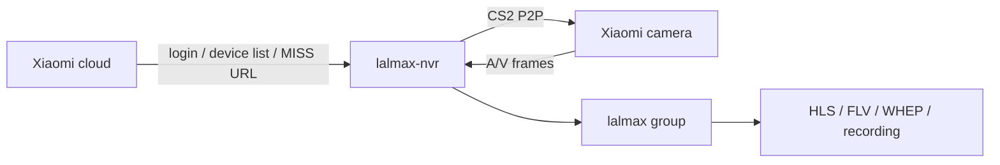
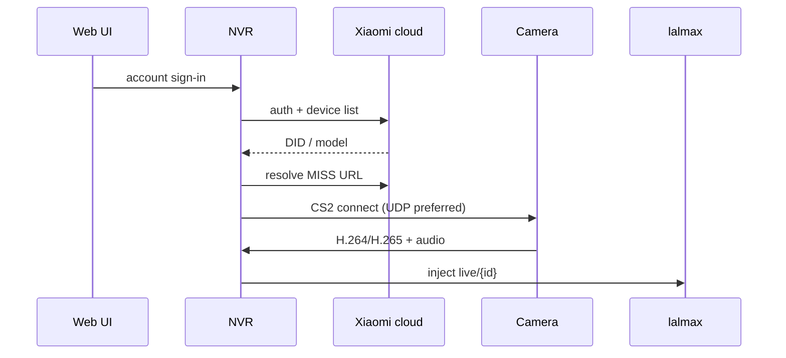

# Xiaomi Camera Integration

lalmax-nvr provides comprehensive support for Xiaomi cloud cameras through the CS2 P2P protocol. Video and audio frames are injected into lalmax, then played as WebRTC, HLS, HTTP-FLV, and the rest.





This is **P2P fetch then inject**, not RTSP pull and not GB28181 publish. Overview: [Architecture](architecture.md).

## Overview

- **Protocol**: CS2 P2P (Xiaomi's proprietary cloud protocol)
- **Authentication**: Xiaomi cloud services with token-based auth
- **Supported Models**: CS2-based cameras (see table below)
- **Features**: Live streaming, recording, two-way audio, dual-lens support
- **Transport**: UDP (CS2 over TCP has known 6-second disconnect issue)

## Prerequisites

- Xiaomi account with registered cameras
- Cameras bound to your Xiaomi account in Mi Home app
- Network access to camera's LAN IP from NVR

## Supported Camera Models

| Model | Identifier | Encoding | Audio | Notes |
|-------|------------|----------|-------|-------|
| **Xiaomi C200** | `chuangmi.camera.046c04` | H264 | PCMA | HD 1080p indoor camera |
| **Xiaomi C300** | `chuangmi.camera.72ac1` | H265 | Opus | 2K indoor camera |
| **Xiaofang** | `isa.camera.isc5c1` | H264 | PCM | Pan/tilt dome camera |
| **Xiaomi HLC8** | `isa.camera.hlc8` | H265 | PCMA | Dual-lens camera |
| **Loock V2** | `loock.cateye.v02` | H264 | PCMA | Smart doorbell camera |
| **Dafang** | `isa.camera.df3` | - | - | ❌ Not Supported (TUTK protocol) |

**Important**: Only CS2 protocol cameras are supported. Dafang cameras use the TUTK protocol which is not implemented.

## Features

- **Live Preview**: WebRTC, HLS, HTTP-FLV playback
- **Recording**: Automatic MP4 segment recording
- **Audio**: G.711 (PCMA/PCMU) and Opus audio codecs
- **Two-way Audio**: Send audio to camera speaker via WebSocket
- **Dual-lens Support**: Main/secondary channel selection
- **Auto Fallback**: HD to SD quality fallback when no HD data

## Setup Methods

### Web UI Setup (Recommended)

1. **Access Web UI**: Open lalmax-nvr Web Interface at `http://localhost:9090`

2. **Navigate to Cameras**: Go to the Cameras page

3. **Xiaomi Discovery**: Expand the "Xiaomi Device Discovery" section

4. **Authenticate**: Enter your Xiaomi account credentials and click "Sign In"
   - If captcha/2FA is required, follow the prompts

5. **Select Devices**: Browse the discovered devices and select cameras you want to add

6. **Add to NVR**: Click "Add to NVR" for each selected camera

7. **Configure**: Customize settings for each camera (retention, quality, etc.)

8. **Save**: Click "Save Configuration" to apply changes

### Manual Configuration

Edit the configuration file:

```yaml
xiaomi:
  user_id: "123456789"
  token: "your_passToken_here"
  region: "cn"

cameras:
  - id: "xiaomi_c200_front"
    name: "Xiaomi C200 - Front"
    protocol: "xiaomi"
    encoding: "h264"
    did: "device_id_here"
    vendor: "cs2"
    enabled: true
    audio_enabled: true
```

### Configuration Options

| Field | Required | Type | Default | Description |
|-------|----------|------|---------|-------------|
| `user_id` | Yes | string | - | Xiaomi user ID (auto-filled after login) |
| `token` | Yes | string | - | Xiaomi passToken (auto-filled after login) |
| `region` | No | string | "cn" | Region code (cn, sg, de, us, etc.) |
| `did` | Yes | string | - | Xiaomi device ID |
| `encoding` | Yes | string | "h264" | Video encoding (h264, h265) |
| `audio_enabled` | No | boolean | false | Enable audio recording |

## Two-way Audio (Talk)

Xiaomi cameras support two-way audio, allowing you to send audio to the camera's speaker.

### Usage

1. In the live preview page, click the microphone button
2. Browser will request microphone permission
3. After granting permission, start talking
4. Click again to stop

### Supported Audio Codecs

| Camera Model | Talk Codec |
|--------------|-----------|
| Dafang, Xiaofang | PCM (16bit) |
| C300 | Opus |
| Other models | PCMA (G.711) |

### API Endpoint

```
GET /api/xiaomi/talk/ws?camera_id={camera_id}
```

Connect via WebSocket and send binary PCMA audio data.

## Network Transport

### Transport Protocol

The system uses **UDP transport** by default for CS2 P2P communication. CS2 over TCP has a known 6-second disconnect issue.

### Network Requirements

- NVR must be able to reach the camera's LAN IP
- UDP port 32108 must be accessible
- Firewall must allow UDP traffic

## Troubleshooting

### Common Issues

#### "Unsupported vendor" Error
- **Cause**: Camera uses TUTK protocol
- **Solution**: Ensure your camera model is in the supported list

#### "Authentication Failed" Error
- **Cause**: Invalid credentials or account requires captcha/2FA
- **Solution**:
  - Verify Xiaomi account credentials
  - Complete captcha or phone verification if prompted
  - Check if 2FA is enabled on your account

#### Camera Not Listed
- **Cause**: Camera not bound to Xiaomi account or offline
- **Solution**:
  - Ensure camera is online and connected to Xiaomi cloud
  - Verify camera is bound in Mi Home app
  - Check network connectivity

#### Connection Drops Immediately
- **Cause**: CS2 connection issue
- **Solution**:
  - Ensure NVR and camera are on the same LAN
  - Check if UDP port is blocked by firewall
  - Check logs for specific error messages

#### WebRTC Cannot Play
- **Cause**: Browser doesn't support H265 or network issue
- **Solution**:
  - Try Safari browser (better H265 support)
  - Check browser console for errors
  - Try switching to HLS or HTTP-FLV protocol

### Logs

```bash
# View Xiaomi-related logs
grep "xiaomi" logs/lalmax-nvr.log

# View connection errors
grep "cs2:" logs/lalmax-nvr.log
```

## Technical Details

### Streaming Architecture

```
Xiaomi Camera → MISS Protocol → H264/H265 + PCMA/Opus
    ↓
CS2 P2P (UDP) → lal Media Server
    ↓
WebRTC / HLS / HTTP-FLV → Browser Playback
    ↓
RTSP Pull → MP4 Recording
```

### Supported Codecs

| Type | Codec | Notes |
|------|-------|-------|
| Video | H.264 | Most models |
| Video | H.265 | C300, HLC8, newer models |
| Audio | G.711 PCMA | Most models |
| Audio | G.711 PCMU | Some models |
| Audio | Opus | C300 and newer models |

## API Reference

### Authentication

- `POST /api/xiaomi/auth` - Login with Xiaomi account
- `POST /api/xiaomi/captcha` - Submit captcha code
- `POST /api/xiaomi/verify` - Submit 2FA verification

### Device Management

- `GET /api/xiaomi/devices` - List discovered devices
- `POST /api/xiaomi/sync` - Sync device info from cloud
- `GET /api/xiaomi/check-vendor?did={did}` - Check device compatibility

### Streaming

- `POST /api/cameras/{id}/stream/webrtc` - Start WebRTC playback
- `GET /api/xiaomi/talk/ws?camera_id={id}` - Two-way audio WebSocket

## Support

For additional help, see [lalmax-nvr documentation](../getting-started.md) or create an issue on the GitHub repository.
