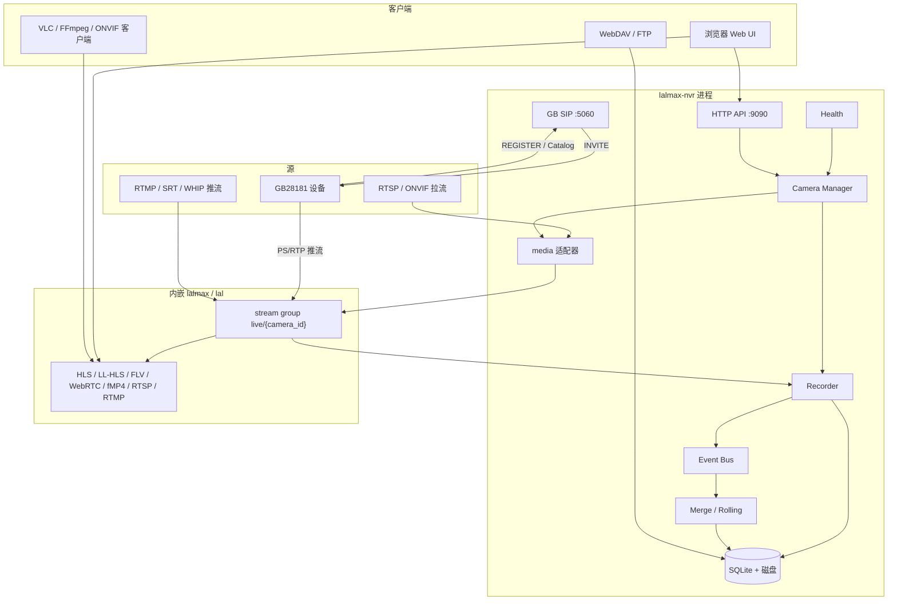
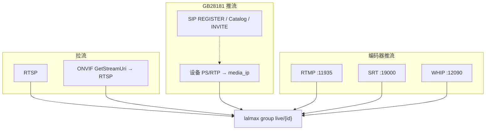
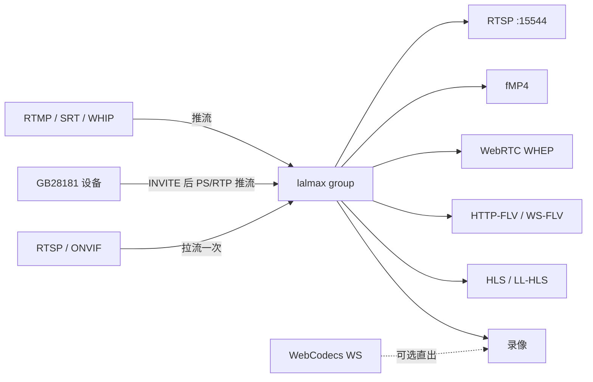
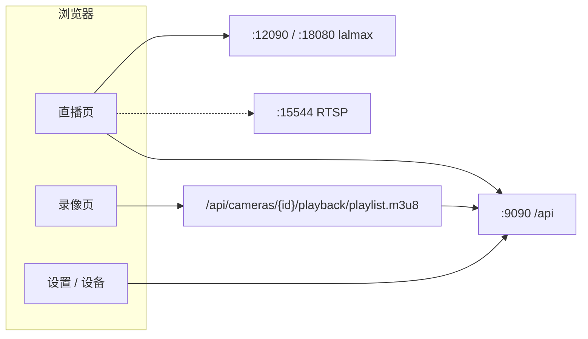
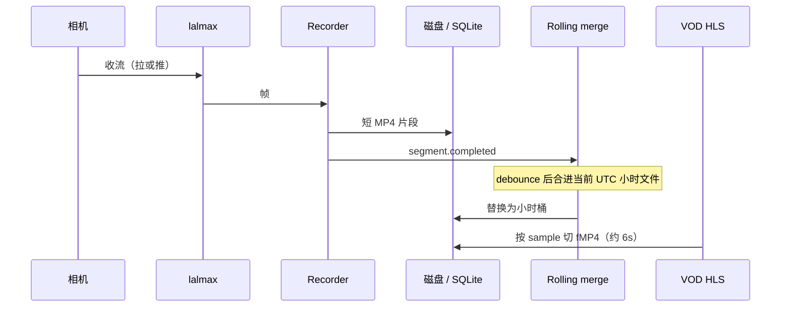
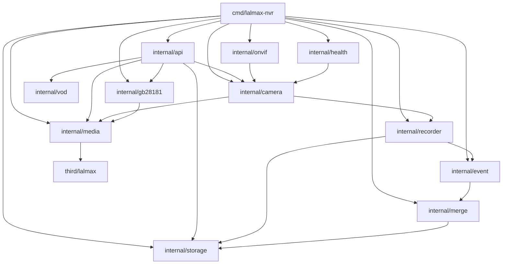
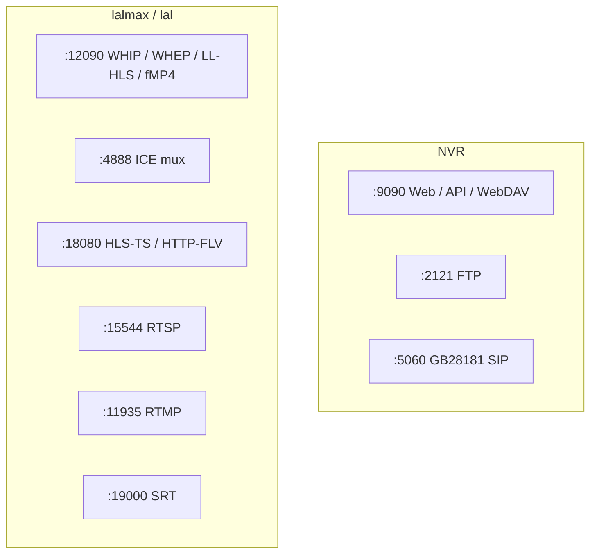

# lalmax-nvr 架构

lalmax-nvr 是一层 **业务 NVR**，叠在内嵌的 **lal / lalmax 媒体引擎** 上。每路摄像头只收一次：lalmax 负责收流、转协议、给观众播；NVR 负责设备、录像、存储和 Web UI。

相关入口：[快速入门](getting-started.md) · [配置](configuration.md) · [部署](deployment.md) · [ONVIF](onvif-guide.md) · [GB28181](gb28181-guide.md)

## 总体分层



- **lalmax / lal**：唯一媒体面。H.264 / H.265 的拉流、推流、转协议都走这里。
- **NVR 层**：相机生命周期、ONVIF 发现、GB28181 SIP 上级、录像策略、小时合并、健康修复、SQLite 与文件、Svelte UI。
- **`media.mode: embedded`（推荐）**：引擎跑在同一进程里。`http` 模式则连外部 lalmax。
- **例外**：MJPEG / HTTP JPEG 仍由 NVR 直拉（lalmax 不吃这类源）。

## 接入路径：拉流 vs 推流

三种进 group 的方式不同，不要把 GB28181 画成 RTSP 拉流。

| 来源 | 信令 | 媒体方向 | 详见 |
|------|------|----------|------|
| RTSP | 无（URL 直连） | NVR **拉** RTSP | [摄像头指南](camera-guide.md) |
| ONVIF | SOAP：发现 / `GetStreamUri` | 解析出 RTSP 后再 **拉** | [ONVIF 指南](onvif-guide.md) |
| GB28181 | SIP：设备 REGISTER，平台 INVITE | 设备向 `media_ip` **推** PS/RTP | [GB28181 指南](gb28181-guide.md) |
| RTMP / SRT / WHIP | 编码器主动连入 | 编码器 **推** | 配置里的 `rtmp` / `srt` / `whip` |
| 小米 CS2 | 云端鉴权 + P2P | NVR 连相机取帧再注入 lalmax | [小米摄像头](xiaomi-setup.md) |



## 直播：收流与分发

一台相机对应 lalmax 里一个 group，名字一般是 `live/{camera_id}`。子码流是 `{camera_id}_sub`。



浏览器默认走 API 反代或 lalmax 播放 URL。也可以把 RTSP 地址拷出来给 VLC：`rtsp://{对外主机}:15544/live/{camera_id}`。请把 `media.lalmax_public_url` 设成客户端能访问的 hostname，否则 URL 会是 `127.0.0.1`。



浏览器直播通常只访问 **`:9090`**（API 反代 HLS/FLV/WebRTC/fMP4）。给 VLC 的 RTSP、以及 RTMP/SRT/WHIP 推流，才需要把 **15544 / 11935 / 19000 / 12090 / 4888** 暴露出去。`docker-compose.yml` 默认映射 9090、12090、4888、15544、5060、2121。

## 录像与连续回放



- 录像模式：`continuous` / `scheduled` / `event` / `adaptive` / `off`。
- **滚动合并**：片段一关就 debounce（默认 5s）合进小时桶；周期合并仍做历史补齐。
- **连续 VOD**：录像页按天拉 `playlist.m3u8`，段间缺口用 `#EXT-X-DISCONTINUITY`。MJPEG 仍走单文件播放。

## 进程内模块



| 模块 | 职责 |
|------|------|
| `camera` | 启停接入、录像、子码流、IP 自愈 |
| `media` | 对 lalmax 的 pull / RTP 收口 / GetStream / BuildPlayURL |
| `recorder` | 把帧写成 MP4 / MJPEG 目录 |
| `merge` | 周期合并 + 滚动小时桶 |
| `vod` | 按需切 init + fMP4，生成 HLS VOD |
| `health` | 多层探活与自动修复 |
| `autodiscover` / `onvif` | WS-Discovery、Hello、PTZ |
| `gb28181` | SIP 上级、目录、INVITE 后收 RTP 推流、回放、对讲 |
| `storage` | SQLite + 片段文件 |

## 默认端口

| 端口 | 用途 |
|------|------|
| **9090** | Web UI 与 NVR API |
| **12090** | lalmax HTTP（LL-HLS、WHIP/WHEP、fMP4、WS-FLV） |
| **4888** | WebRTC ICE mux（WHIP/WHEP） |
| **15544** | lal RTSP 播放 |
| **18080** | lal HTTP（HLS-TS、HTTP-FLV） |
| **11935** | RTMP 推流接入 |
| **19000** | SRT 推流接入 |
| **2121** | FTP |
| **5060** | GB28181 SIP |



Docker bridge 模式需要把这些端口映射出去。ONVIF 组播发现在 bridge 里不可用，需要 `network_mode: host`。

## 数据落盘

```
{storage.root_dir}/
  lalmax-nvr.db          # SQLite：相机、录像索引、事件
  recordings/{camera_id}/  # MP4 片段与合并后的小时文件
  config/                  # 生成的 lalmax 配置等
```

Web UI 编译进二进制（`internal/ui`）。`CGO_ENABLED=0`，无外部运行时依赖。
