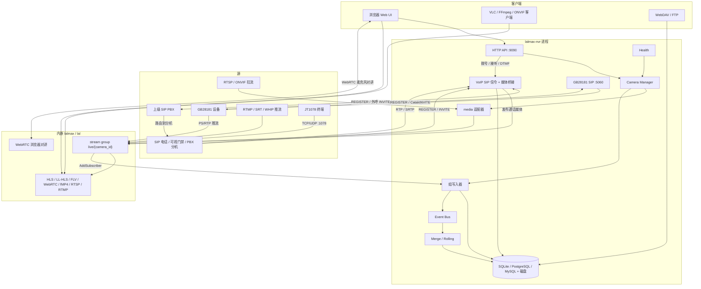
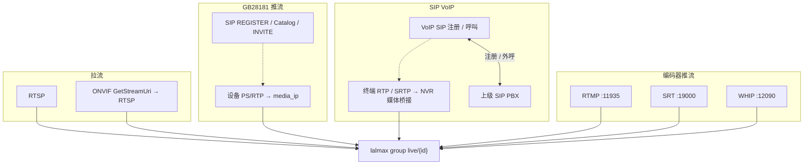
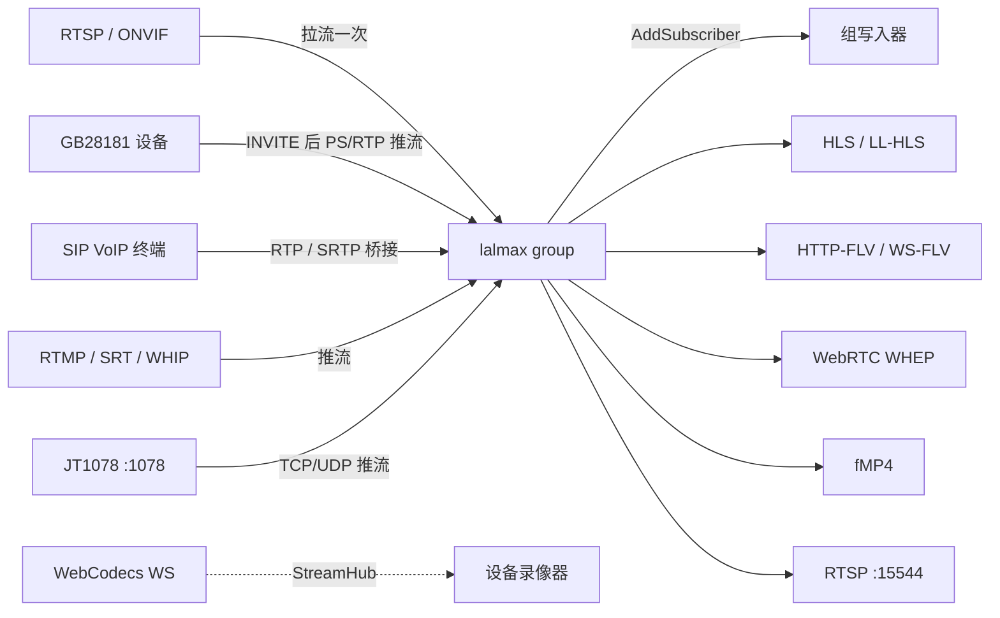
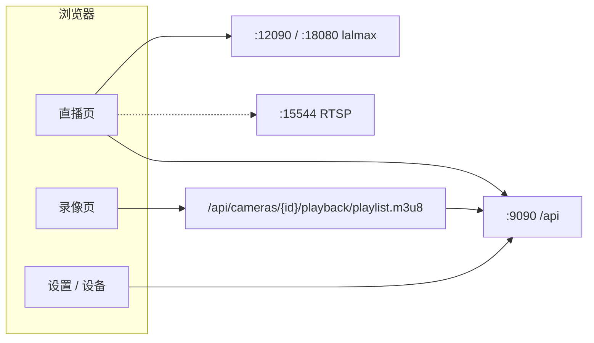
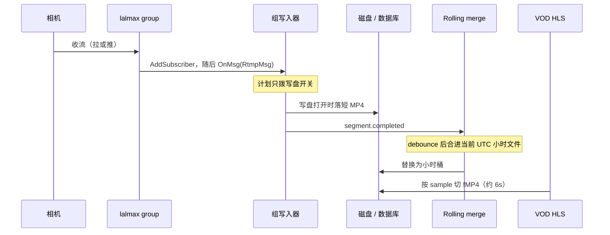
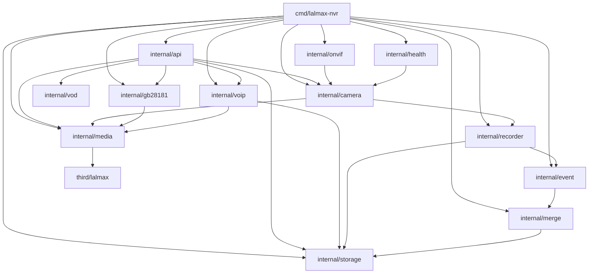
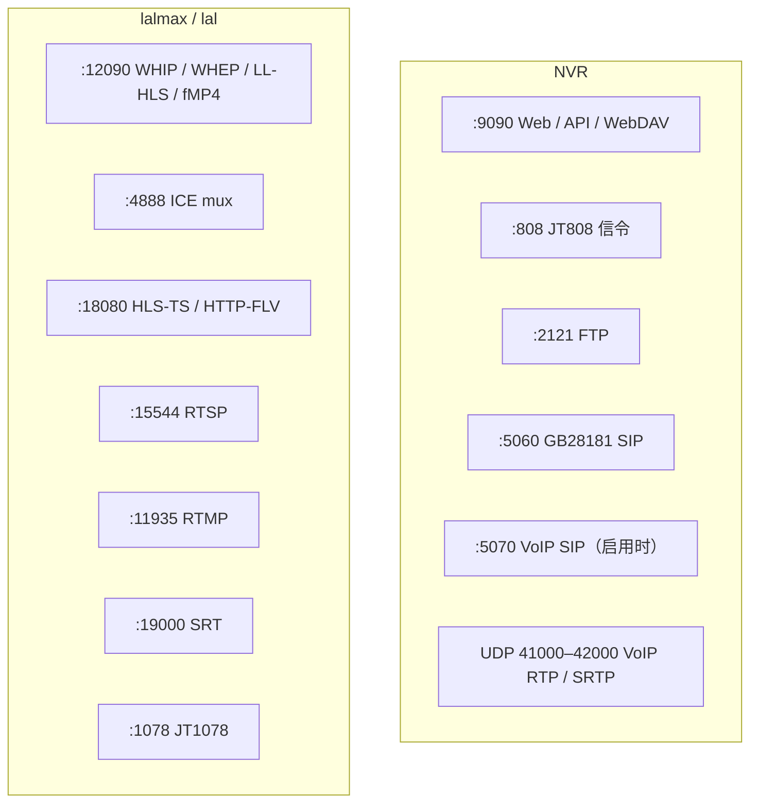

# lalmax-nvr 架构

lalmax-nvr 是一层 **业务 NVR**，叠在内嵌的 **lal / lalmax 媒体引擎** 上。每路摄像头只收一次：lalmax 负责收流、转协议、给观众播；NVR 负责设备、录像、存储和 Web UI。

相关入口：[快速入门](getting-started.md) · [配置](configuration.md) · [部署](deployment.md) · [ONVIF](onvif-guide.md) · [GB28181](gb28181-guide.md) · [VoIP](voip.md)

## 总体分层


```mermaid
flowchart TB
  subgraph clients [客户端]
    Browser[浏览器 Web UI]
    Player[VLC / FFmpeg / ONVIF 客户端]
    Files[WebDAV / FTP]
  end

  subgraph nvr [lalmax-nvr 进程]
    API[HTTP API :9090]
    CamMgr[Camera Manager]
    Rec[组写入器]
    Merge[Merge / Rolling]
    Health[Health]
    Bus[Event Bus]
    Store[(SQLite / PostgreSQL / MySQL + 磁盘)]
    GBSIP[GB28181 SIP :5060]
    VoIP[VoIP SIP 信令 + 媒体桥接]
    MediaAdp[media 适配器]
  end

  subgraph engine [内嵌 lalmax / lal]
    Group["stream group live/{camera_id}"]
    Out[HLS / LL-HLS / FLV / WebRTC / fMP4 / RTSP / RTMP]
    Talk[WebRTC 浏览器对讲]
  end

  subgraph sources [源]
    RTSP[RTSP / ONVIF 拉流]
    GB[GB28181 设备]
    Phone[SIP 电话 / 可视门禁 / PBX 分机]
    PBX[上级 SIP PBX]
    Push[RTMP / SRT / WHIP 推流]
    JT[JT1078 终端]
  end

  RTSP --> MediaAdp
  GB -->|REGISTER / Catalog| GBSIP
  GBSIP -->|INVITE| GB
  GB -->|PS/RTP 推流| Group
  Phone -->|REGISTER / INVITE| VoIP
  Phone -->|RTP / SRTP| VoIP
  VoIP <-->|REGISTER / 外呼 INVITE| PBX
  PBX -->|路由到分机| Phone
  VoIP -->|发布通话媒体| Group
  JT -->|TCP/UDP :1078| Group
  Push --> Group
  MediaAdp --> Group
  Group --> Out
  Group -->|AddSubscriber| Rec
  Rec --> Store
  Rec --> Bus
  Bus --> Merge
  Merge --> Store
  CamMgr --> MediaAdp
  CamMgr --> Rec
  Health --> CamMgr
  API --> CamMgr
  Browser --> API
  Browser --> Out
  Browser <-->|WebRTC 麦克风对讲| Talk
  API -->|拨号 / 接听 / DTMF| VoIP
  VoIP --> Store
  Player --> Out
  Files --> Store
```

- **lalmax / lal**：负责已接入 NVR 流的分发和转协议。IPTV 频道在浏览器中播放时走独立的同源 HLS 代理；启用发布或录像后才进入媒体引擎。
- **NVR 层**：相机生命周期、ONVIF 发现、GB28181 SIP 上级、独立的 VoIP SIP 服务、录像策略、小时合并、健康修复、数据库与文件、Svelte UI。
- **`media.mode: embedded`（推荐）**：引擎跑在同一进程里。`http` 模式则连外部 lalmax。
- **例外**：MJPEG / HTTP JPEG 仍由 NVR 直拉（lalmax 不吃这类源）。

## 接入路径：拉流 vs 推流

三种进 group 的方式不同，不要把 GB28181 画成 RTSP 拉流。

| 来源 | 信令 | 媒体方向 | 详见 |
|------|------|----------|------|
| RTSP | 无（URL 直连） | NVR **拉** RTSP | [摄像头指南](camera-guide.md) |
| ONVIF | SOAP：发现 / `GetStreamUri` | 解析出 RTSP 后再 **拉** | [ONVIF 指南](onvif-guide.md) |
| GB28181 | SIP：设备 REGISTER，平台 INVITE | 设备向 `media_ip` **推** PS/RTP | [GB28181 指南](gb28181-guide.md) |
| SIP VoIP | SIP：终端注册并呼入；也可由 NVR 经 PBX 外呼 | 终端发送 RTP/SRTP，NVR 桥接为实时流；网页对讲使用 WebRTC | [VoIP 指南](voip.md) |
| RTMP / SRT / WHIP | 编码器主动连入 | 编码器 **推** | 配置里的 `rtmp` / `srt` / `whip` |
| JT1078 | 可选 JT808：注册鉴权后下发 0x9101 直播或 0x9201 回放 | 终端向 `:1078` **推** TCP/UDP 帧。启用信令后，未授权通道会被拒绝 | [配置](configuration.md) |
| 小米 CS2 | 云端鉴权 + P2P | NVR 连相机取帧再注入 lalmax | [小米摄像头](xiaomi-setup.md) |


```mermaid
flowchart TB
  subgraph pull [拉流]
    RTSP[RTSP]
    ONVIF["ONVIF GetStreamUri → RTSP"]
  end
  subgraph gb [GB28181 推流]
    GBSIP["SIP REGISTER / Catalog / INVITE"]
    RTP["设备 PS/RTP → media_ip"]
  end
  subgraph voip [SIP VoIP]
    VoIPSIP["VoIP SIP 注册 / 呼叫"]
    VoIPMedia["终端 RTP / SRTP → NVR 媒体桥接"]
    PBX[上级 SIP PBX]
  end
  subgraph pub [编码器推流]
    RTMP[RTMP :11935]
    SRT[SRT :19000]
    WHIP["WHIP :12090"]
  end
  Group["lalmax group live/{id}"]
  RTSP --> Group
  ONVIF --> Group
  GBSIP -.-> RTP
  RTP --> Group
  VoIPSIP -.-> VoIPMedia
  VoIPSIP <-->|注册 / 外呼| PBX
  VoIPMedia --> Group
  RTMP --> Group
  SRT --> Group
  WHIP --> Group
```

## 直播：收流与分发

一台相机对应 lalmax 里一个 group，名字一般是 `live/{camera_id}`。子码流是 `{camera_id}_sub`。


```mermaid
flowchart LR
  RTSP[RTSP / ONVIF] -->|拉流一次| G["lalmax group"]
  GB[GB28181 设备] -->|INVITE 后 PS/RTP 推流| G
  VoIP[SIP VoIP 终端] -->|RTP / SRTP 桥接| G
  Push[RTMP / SRT / WHIP] -->|推流| G
  JT[JT1078 :1078] -->|TCP/UDP 推流| G
  G -->|AddSubscriber| Rec[组写入器]
  G --> HLS[HLS / LL-HLS]
  G --> FLV[HTTP-FLV / WS-FLV]
  G --> RTC[WebRTC WHEP]
  G --> FMP4[fMP4]
  G --> RTSPOut["RTSP :15544"]
  WS[WebCodecs WS] -.->|StreamHub| Dev[设备录像器]
```

浏览器默认走 API 反代或 lalmax 播放 URL。也可以把 RTSP 地址拷出来给 VLC：`rtsp://{对外主机}:15544/live/{camera_id}`。请把 `media.lalmax_public_url` 设成客户端能访问的 hostname，否则 URL 会是 `127.0.0.1`。


```mermaid
flowchart LR
  subgraph browser [浏览器]
    LiveUI[直播页]
    RecUI[录像页]
    SetUI[设置 / 设备]
  end
  API[":9090 /api"]
  LalHTTP[":12090 / :18080 lalmax"]
  RTSP[":15544 RTSP"]
  VOD["/api/cameras/{id}/playback/playlist.m3u8"]

  LiveUI --> API
  LiveUI --> LalHTTP
  LiveUI -.-> RTSP
  RecUI --> VOD
  VOD --> API
  SetUI --> API
```

浏览器直播通常只访问 **`:9090`**（API 反代 HLS/FLV/WebRTC/fMP4）。Web VoIP 对讲还会使用 WebRTC ICE 端口 `4888/udp`；SIP 终端需访问已启用的 SIP 监听端口和媒体 UDP 端口范围。给 VLC 的 RTSP、以及 RTMP/SRT/WHIP 推流，才需要把对应端口暴露出去。`docker-compose.yml` 默认映射 9090、12090、4888、15544、5060、2121。

## 录像与连续回放


```mermaid
sequenceDiagram
  participant Cam as 相机
  participant Group as lalmax group
  participant Rec as 组写入器
  participant Disk as 磁盘 / 数据库
  participant Roll as Rolling merge
  participant VOD as VOD HLS

  Cam->>Group: 收流（拉或推）
  Group->>Rec: AddSubscriber，随后 OnMsg(RtmpMsg)
  Note over Rec: 计划只拨写盘开关
  Rec->>Disk: 写盘打开时落短 MP4
  Rec->>Roll: segment.completed
  Note over Roll: debounce 后合进当前 UTC 小时文件
  Roll->>Disk: 替换为小时桶
  VOD->>Disk: 按 sample 切 fMP4（约 6s）
```

- 嵌入式引擎上，H.264/H.265 录像订阅 lalmax group。挂在 `stream_id` 上的计划（`continuous` / `scheduled` / `event` / `off`）只拨写盘开关。`adaptive` 和 `media.mode: http` 仍走 record task。没有计划就不录；把流登记为设备也不会自动开录。详见 [录像计划](recording-plans.md) 和 [录制流程](recording-flow.md)。
- **滚动合并**：片段一关就 debounce（默认 5s）合进小时桶；周期合并仍做历史补齐。
- **连续 VOD**：录像页按天拉 `playlist.m3u8`，段间缺口用 `#EXT-X-DISCONTINUITY`。MJPEG 仍走单文件播放。

## 进程内模块


```mermaid
flowchart TB
  Main[cmd/lalmax-nvr] --> API[internal/api]
  Main --> Cam[internal/camera]
  Main --> Media[internal/media]
  Main --> Rec[internal/recorder]
  Main --> Merge[internal/merge]
  Main --> Health[internal/health]
  Main --> Store[internal/storage]
  Main --> Bus[internal/event]
  Main --> GB[internal/gb28181]
  Main --> VoIP[internal/voip]
  Main --> ONVIF[internal/onvif]
  API --> Cam
  API --> Media
  API --> Store
  API --> VOD[internal/vod]
  API --> GB
  API --> VoIP
  Cam --> Media
  Cam --> Rec
  GB --> Media
  VoIP --> Media
  VoIP --> Store
  ONVIF --> Cam
  Rec --> Store
  Rec --> Bus
  Bus --> Merge
  Merge --> Store
  Health --> Cam
  Media --> Lalmax[third/lalmax]
```

| 模块 | 职责 |
|------|------|
| `camera` | 启停接入、子码流、IP 自愈。组写入器覆盖的相机不再另开一路录像器 |
| `media` | 对 lalmax 的 pull / RTP 收口 / GetStream / BuildPlayURL / 流事件 |
| `recorder` | 组写入器订阅 lalmax group，计划调用 `SetWriting`。record task 覆盖 `adaptive` 和 HTTP 模式。MJPEG / HTTP JPEG / 延时摄影仍走各自采集器 |
| `merge` | 周期合并 + 滚动小时桶 |
| `vod` | 按需切 init + fMP4，生成 HLS VOD |
| `health` | 多层探活与自动修复 |
| `autodiscover` / `onvif` | WS-Discovery、Hello、PTZ |
| `gb28181` | SIP 上级、目录、INVITE 后收 RTP 推流、回放、对讲 |
| `voip` | 独立 SIP 终端 / PBX 注册与呼叫、Web 外呼、通话记录；浏览器对讲走 WebRTC |
| `jt808` | JT/T 808 信令：注册鉴权、直播、回放、检索、上传、云台。媒体仍由 lalmax `:1078` 接收 |
| `storage` | SQLite、PostgreSQL 或 MySQL + 片段文件 |

## 默认端口

| 端口 | 用途 |
|------|------|
| **9090** | Web UI 与 NVR API |
| **12090** | lalmax HTTP（LL-HLS、WHIP/WHEP、fMP4、WS-FLV） |
| **4888** | WebRTC ICE mux（WHIP/WHEP） |
| **15544** | lal RTSP 播放 |
| **18080** | lal HTTP（HLS-TS、HTTP-FLV） |
| **11935** | RTMP 推流接入（启用时） |
| **19000** | SRT 推流接入（启用时） |
| **1078/tcp, 1078/udp** | JT1078 单端口收流（embedded 默认启用） |
| **808/tcp** | JT808 信令（配置启用时） |
| **2121** | FTP |
| **5060** | GB28181 SIP |
| **5070/udp** | VoIP SIP（默认监听；需启用 VoIP 并按部署映射） |
| **41000–42000/udp** | VoIP RTP/SRTP 媒体端口（默认范围，可配置） |
| **8200** | DLNA HTTP（启用时，另需 UDP 1900 组播发现；见 [DLNA](dlna.md)） |


```mermaid
flowchart TB
  subgraph nvrPort [NVR]
    P9090[":9090 Web / API / WebDAV"]
    P808[":808 JT808 信令"]
    P2121[":2121 FTP"]
    P5060[":5060 GB28181 SIP"]
    P5070[":5070 VoIP SIP（启用时）"]
    PVoIPRTP["UDP 41000–42000 VoIP RTP / SRTP"]
  end
  subgraph lalPort [lalmax / lal]
    P12090[":12090 WHIP / WHEP / LL-HLS / fMP4"]
    P4888[":4888 ICE mux"]
    P18080[":18080 HLS-TS / HTTP-FLV"]
    P15544[":15544 RTSP"]
    P11935[":11935 RTMP"]
    P19000[":19000 SRT"]
    P1078[":1078 JT1078"]
  end
```

Docker bridge 模式需要把这些端口映射出去。ONVIF 组播发现在 bridge 里不可用，需要 `network_mode: host`。

## 数据落盘

```
{storage.root_dir}/
  lalmax-nvr.db          # SQLite：相机、录像索引、事件
  recordings/{camera_id}/  # MP4 片段与合并后的小时文件
  config/                  # 生成的 lalmax 配置等
```

Web UI 编译进二进制（`internal/ui`）。`CGO_ENABLED=0`，无外部运行时依赖。
