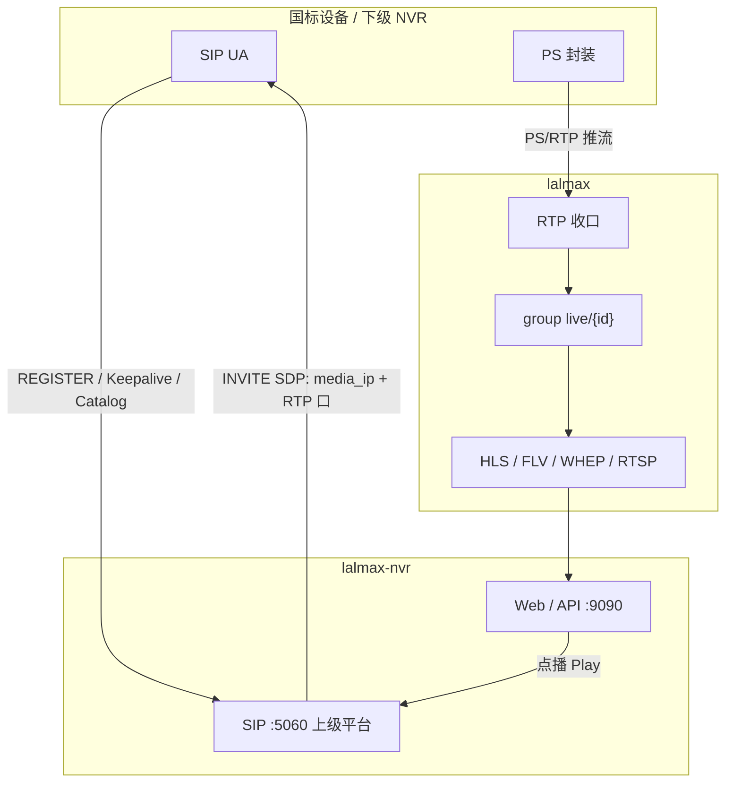
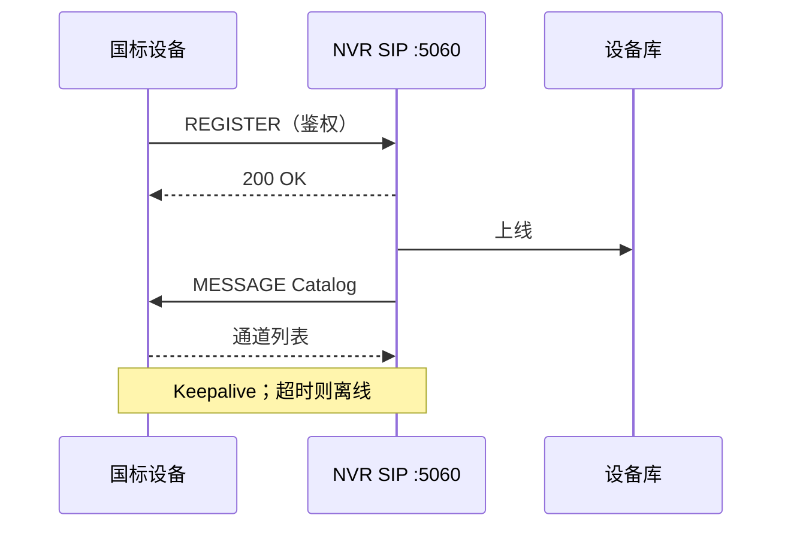
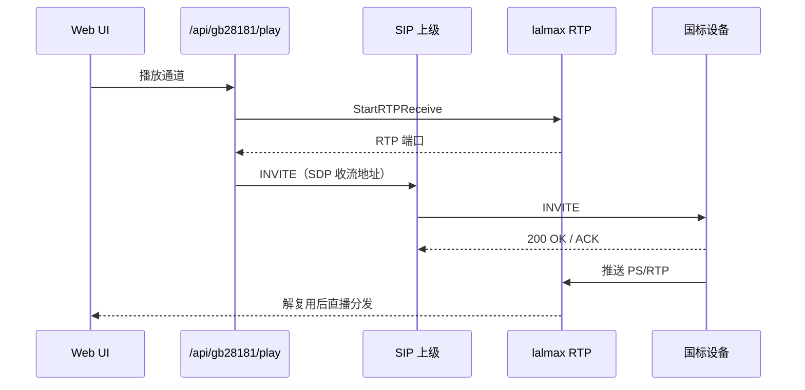
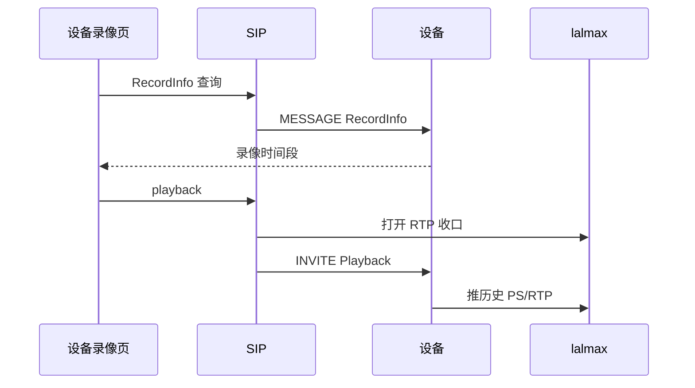
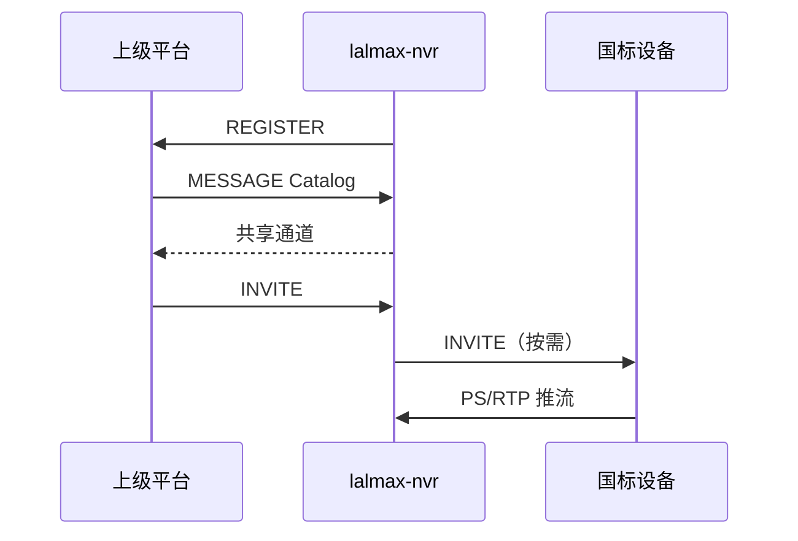

# GB28181 国标设备指南

## 概述

lalmax-nvr 作为 GB/T 28181 **SIP 上级平台** 接入国标摄像头、NVR、下级平台。设备向 `:5060` **REGISTER**；点播时平台发 **INVITE** 并打开 RTP 收口，设备把 **PS/RTP 推到 `media_ip`**。这是国标推流，不是 RTSP 拉流。

lalmax 解复用 PS 后写入 `live/{camera_id}`，之后的 HLS / FLV / WebRTC / fMP4 / RTSP 分发与其它相机相同。

支持设备注册、录像查询、录像回放、语音对讲、级联上级平台等。分层总图见 [架构](architecture.md)。

## 架构与流程



### 注册与目录



设备在 Web **设备管理 → GB28181** 出现，无需在 YAML 里逐台写 RTSP URL。

### 实时预览（INVITE 后推流）

点播时 NVR **先**在 lalmax 打开 RTP 收口，再发 SIP INVITE；SDP 里的 `c=` / `m=` 指向本机 `media_ip` 和 RTP 端口。设备按 SDP **主动推** PS/RTP。



`media_ip` 必须是设备能路由到的地址（不要填 `127.0.0.1`）。`media_port: 0` 为多端口随机分配；大于 0 为单端口模式。

### 录像回放与下载

回放同样是 INVITE，SDP 标明 `Playback` 和时间范围；设备仍 **推** 历史 PS/RTP。暂停/倍速/seek 走 SIP INFO。下载走另一路 INVITE（Download）。



### 级联（本机作为下级）

本机再向 **更上级平台** REGISTER，并按共享通道应答 Catalog。上级点播时对本机 INVITE；实时预览在本机侧仍是对设备 INVITE、设备推 RTP。



## 功能特性

- **设备管理**：自动注册、心跳维持、在线状态监控
- **录像查询**：按时间范围查询设备录像，可视化时间轴显示
- **录像回放**：多协议流媒体（ws-flv、flv、hls、webrtc 等）
- **播放控制**：暂停/恢复、倍速播放（0.5x/1x/2x/4x）、时间拖动
- **录像下载**：单个/批量下载设备录像
- **语音对讲**：SIP INVITE 方式，支持 UDP/TCP 传输
- **级联平台**：配置上级平台，实现平台级联
- **级联历史**：记录注册/注销等事件

## 快速开始

### 1. 启用 GB28181

在配置文件中启用 GB28181：

```yaml
gb28181:
  enabled: true
  id: "34020000002000000001"  # 本端平台 20 位 SIP ID
  host: "192.168.1.100"       # SIP 监听（可空，按 media_ip 推断）
  port: 5060                  # SIP 端口
  media_ip: "192.168.1.100"   # 设备推 PS/RTP 的目标 IP（设备必须能访问）
  media_port: 30000           # RTP 端口；0 表示每路随机
  password: "12345678"        # 设备 REGISTER 密码
  standard_version: "2016"    # 2016 或 2022
```

### 2. 添加设备

在 Web 界面中：

1. 进入 **设备管理** 页面
2. 切换到 **GB28181** 标签
3. 设备会自动注册显示

### 3. 配置设备

在设备端配置 SIP 参数：

| 参数 | 值 |
|------|-----|
| SIP 服务器 IP | lalmax-nvr 所在机器 IP |
| SIP 端口 | 5060（默认） |
| 设备 ID | 20 位国标 ID |
| 密码 | 与配置文件一致 |

## 功能使用

### 设备列表

进入 **设备管理** → **GB28181** → **设备列表**，可以：

- 查看设备在线状态
- 播放实时视频
- 查看设备信息（厂商、型号、心跳时间等）

### 设备录像

#### 查询录像

1. 切换到 **设备录像** 标签
2. 选择设备和通道
3. 设置开始/结束时间
4. 点击 **查询录像**

#### 时间轴

查询结果会显示 24 小时时间轴，蓝色色块表示有录像的时间段。点击色块可以直接播放对应录像。

#### 播放控制

| 控制 | 说明 |
|------|------|
| 暂停/恢复 | 暂停或恢复录像播放 |
| 倍速 | 支持 0.5x、1x、2x、4x 倍速 |
| 拖动 | 跳转到指定时间点（起点、30秒、1分钟、5分钟、10分钟） |

#### 多协议播放

支持多种播放协议，点击播放按钮后可以通过协议切换按钮选择：

| 协议 | 说明 |
|------|------|
| ws-flv | WebSocket FLV（推荐） |
| flv | HTTP-FLV |
| hls | HLS |
| webrtc | WebRTC |
| fmp4 | Fragmented MP4 |

#### 下载录像

- **单个下载**：点击录像列表中的下载按钮
- **批量下载**：点击"批量下载"，选择多条录像后点击"下载选中"

### 级联管理

切换到 **级联管理** 标签，可以：

- 添加上级平台
- 查看平台状态
- 删除平台

#### 添加平台

1. 点击 **添加平台**
2. 填写平台信息：
   - 平台名称
   - 上级 SIP ID
   - 上级 IP 和端口
   - 传输协议（UDP/TCP）
   - 用户名/密码（可选）

### 级联历史

切换到 **级联历史** 标签，可以：

- 查看平台状态概览
- 查看注册/注销事件
- 按平台或事件类型筛选

### 语音对讲

在设备列表中，对在线设备可以发起语音对讲：

1. 点击设备的对讲按钮
2. 允许浏览器访问麦克风
3. 开始对讲

## API 接口

### 设备管理

```
GET  /api/gb28181/devices          # 获取设备列表
POST /api/gb28181/play             # 开始实时播放
POST /api/gb28181/stop             # 停止播放
```

### 录像查询与回放

```
POST /api/gb28181/record_info      # 查询录像
POST /api/gb28181/playback         # 开始录像回放
POST /api/gb28181/playback/pause   # 暂停回放
POST /api/gb28181/playback/resume  # 恢复回放
POST /api/gb28181/playback/speed   # 倍速控制
POST /api/gb28181/playback/seek    # 时间拖动
```

### 录像下载

```
POST /api/gb28181/download/start   # 开始下载
POST /api/gb28181/download/batch   # 批量下载
POST /api/gb28181/download/stop    # 停止下载
GET  /api/gb28181/downloads        # 下载列表
```

### 级联平台

```
GET    /api/gb28181/platforms       # 平台列表
POST   /api/gb28181/platforms       # 添加平台
DELETE /api/gb28181/platforms       # 删除平台
GET    /api/gb28181/platform/events # 平台事件
GET    /api/gb28181/platform/status # 平台状态
```

### 语音对讲

```
POST /api/gb28181/broadcast/start   # 开始对讲
POST /api/gb28181/broadcast/stop    # 停止对讲
```

### 报警

```
GET /api/gb28181/alarms             # 报警列表
```

## 故障排除

### 设备无法注册

1. 检查设备 SIP 配置是否正确（上级 ID、域、密码）
2. 检查网络是否通畅，UDP/TCP **5060** 是否对设备开放
3. 检查 lalmax-nvr 的 SIP 端口是否被占用
4. 查看日志中的 SIP 消息

### 已注册但没有画面

国标是 **设备推流**：INVITE 成功后仍无视频，多半是 RTP 回不来。

1. `media_ip` 必须是设备能访问的网卡 IP，不要用 `127.0.0.1`
2. 防火墙放行 `media_port`（或随机 RTP 口）的 UDP/TCP
3. Docker bridge 下确认端口已映射；跨网段时检查 NAT
4. 日志里应先有 RTP 收口，再有 INVITE；只有 200 没有 RTP 就是媒体面不通

### 录像查询失败

1. 确认设备在线
2. 确认设备支持录像查询
3. 检查时间格式是否正确
4. 查看日志中的 RecordInfo 消息

### 回放 415 错误

415 错误表示设备不支持 SDP 格式。可能原因：

1. 设备不支持回放功能
2. SDP 格式不兼容
3. 时间戳格式不正确

### 倍速控制失败

1. 确认设备支持 SIP INFO 命令
2. 确认设备支持倍速播放
3. 查看日志中的 SIP INFO 消息

### 对讲无声音

1. 检查浏览器麦克风权限
2. 检查设备是否支持对讲
3. 检查音频编码格式是否匹配
4. 查看日志中的 Broadcast 消息

## 配置参考

```yaml
gb28181:
  enabled: false                   # 是否启用
  id: ""                           # 本端平台 SIP ID（20 位）
  host: ""                         # SIP 监听地址（可空）
  port: 5060                       # SIP 监听端口
  media_ip: ""                     # 设备推 PS/RTP 的目标 IP
  media_port: 30000                # RTP 端口（0 表示每路随机）
  password: ""                     # 设备 REGISTER 密码
  standard_version: "2016"         # 2016 或 2022
```
