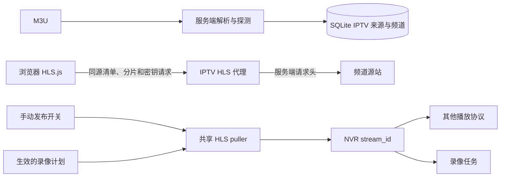

# IPTV

IPTV 是独立模块，负责导入 M3U、检测频道、管理频道和播放地址。频道不是摄像头，也不会写入 `created_streams`。

Web UI：侧栏 **IPTV**（`#/iptv`）。REST：`/api/iptv`。

## 工作方式

1. 导入 M3U URL 或文本；服务端解析并验证频道。
2. 选择频道纳管。此步骤只保存来源和频道，不启动媒体拉流。
3. 点击频道后，浏览器里的 HLS.js 请求同源 IPTV HLS 代理；NVR 代取源站清单和媒体资源，并重写清单中的分片、子清单和密钥地址。
4. 在频道卡片启用“发布”后，NVR 启动服务端 HLS pull，其他协议可通过 NVR 播放该频道。录像计划也会触发同一条 pull；发布关闭且没有录像需求时才停止 pull。

每个频道保留稳定的 `stream_id`，用于发布、录像计划和历史录像关联。浏览器播放走 HLS 代理，不要求上游开放 CORS，也不依赖 lal；发布和录像共享同一个 HLS pull。



## 播放限制

播放清单及其分片、子清单和密钥均由同源代理转发，因此浏览器不再直接请求频道域名，也不受源站 CORS 设置限制。服务端使用导入时保存的源站请求头；凭据只会发往频道来源相同的源站，不会转发到清单引用的其他 CDN 域名。代理限制上游 URL 为 HTTP/HTTPS，并拦截 loopback、link-local 地址。

M3U URL 和请求头在服务端加密存储（配置 `NVR_ENCRYPTION_KEY` 时）。播放详情接口只返回本地代理地址并设置 `Cache-Control: no-store`。NVR 的 Basic Auth 凭据只用于访问本地代理，不会发送到第三方源站。

## 录像

在频道卡片启用“发布”可持续发布频道。发布后，频道会出现在流列表中，可通过 `GET /api/streams/{stream_id}` 获取 `play_urls`，使用 NVR 支持的 RTSP、HTTP-FLV、HLS、WebRTC 等协议播放。关闭发布后，如果录像计划仍生效，共享 pull 会继续；两种需求都结束后才停止。

配置录像计划仍使用频道稳定 `stream_id`。连续计划、计划时间窗和事件窗口会按需启动同一个 HLS pull。发布和录像均要求 `media.mode: embedded`，默认配置就是 `embedded`。支持的源视频编码为 H.264/H.265，音频可为 AAC。`iptv.max_concurrent_pulls` 限制发布与录像共享的并发拉流数，默认 32。

```bash
curl -u admin:password -X POST http://localhost:9090/api/recording-plans \
  -H 'Content-Type: application/json' \
  -d '{"stream_id":"iptv_…","name":"IPTV 频道","mode":"continuous","enabled":true}'
```

建议给 IPTV 录像单独分配磁盘配额，避免给大量频道设置连续录像。

## Web 界面

1. 打开 **IPTV**，导入 M3U URL 或粘贴 `#EXTM3U` 文本。
2. 等待检测结果：`pending` → `probing` → `playable` / `warning` / `unsupported` / `failed`。
3. 选择需要保留的频道并纳管。纳管不会启动 HLS pull。
4. 点击频道开始浏览器直播放；需要通过 NVR 协议观看时，启用频道卡片上的“发布”；要录像时，在录像计划中为频道配置 `stream_id`。浏览器代理播放独立于 NVR；发布和录像可以同时使用同一条上游拉流。

支持的录像接入编码是 H.264/H.265 + AAC。DRM / SAMPLE-AES 和其它未支持编码会在检测阶段标记为不可用。H.265 是否能在浏览器播放取决于浏览器和设备。

## REST API

HTTP Basic Auth；写操作需要操作权限。

```
POST   /api/iptv/imports
GET    /api/iptv/imports/{id}
GET    /api/iptv/imports/{id}/items
POST   /api/iptv/imports/{id}/items/{item_id}/probe
POST   /api/iptv/imports/{id}/commit
GET    /api/iptv/sources
DELETE /api/iptv/sources/{id}
GET    /api/iptv/groups
GET    /api/iptv/channels
GET    /api/iptv/channels/{id}
GET    /api/iptv/channels/{id}/playback
GET    /api/iptv/channels/{id}/hls[?url=<upstream-url>]
PUT    /api/iptv/channels/{id}
DELETE /api/iptv/channels/{id}
```

启用发布：`PUT /api/iptv/channels/{id}` 请求体传 `{"publish_enabled":true}`；停用传 `false`。频道 `enabled` 为 false 时不会拉流。发布开启后可从 `/api/streams/{stream_id}` 的 `play_urls` 获取可播放地址。

播放详情示例：

```bash
curl -u admin:password http://localhost:9090/api/iptv/channels/{id}/playback
```

响应中的 `url` 是受认证保护的同源代理地址。HLS 清单内的分片地址由服务端重写为同源代理请求。

## 导入 API 示例

```bash
curl -u admin:password -X POST http://localhost:9090/api/iptv/imports \
  -H 'Content-Type: application/json' \
  -d '{"name":"science","playlist_url":"https://iptv-org.github.io/iptv/categories/science.m3u"}'
```

响应 `202` 返回导入任务。状态先为 `probing`，结束后为 `ready`。也可以传入 `playlist_text` 直接粘贴 M3U；确认导入时向 `/imports/{id}/commit` 提交所选项目 ID。

服务端限制导入 URL 为 HTTP/HTTPS 并拦截 loopback、link-local 地址。单次最多 2000 个频道；探测并发数为 4；播放列表体积上限为 2 MiB。
