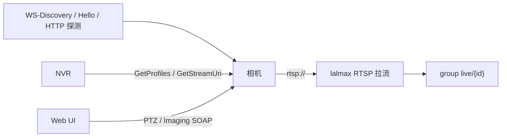
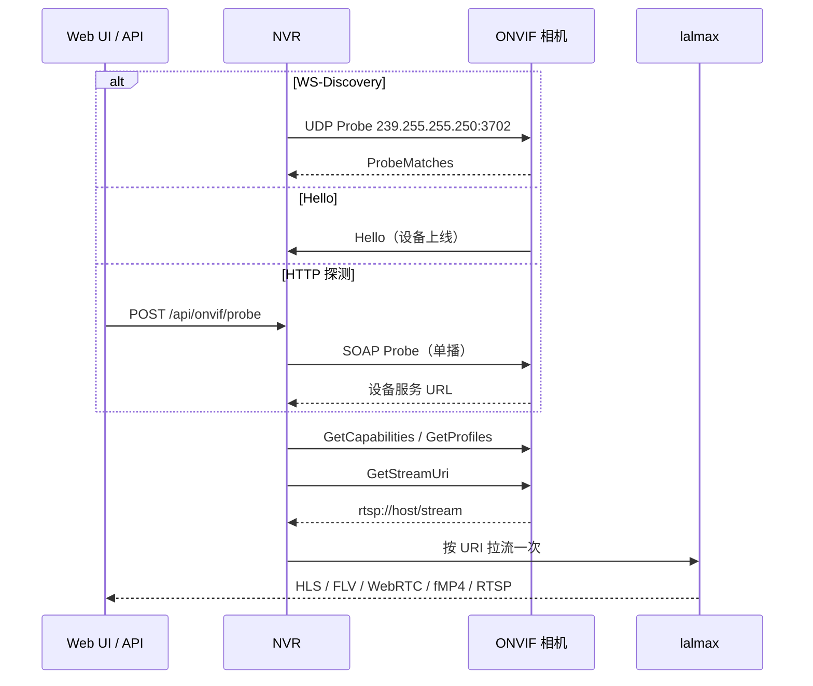
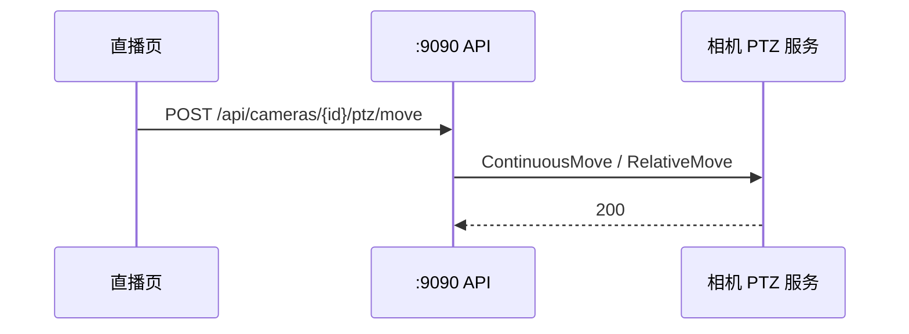

# lalmax-nvr ONVIF 指南

本指南介绍 lalmax-nvr 与 ONVIF（开放网络视频接口论坛）的集成，包括摄像头发现、管理、PTZ 控制和故障排除。

## 什么是 ONVIF 和 Profile S 概述

ONVIF 是网络视频产品的开放行业标准，使不同制造商的 IP 摄像头能够协同工作。lalmax-nvr 主要实现 ONVIF Profile S，专注于核心视频流功能：

- **Profile S**：视频流、PTZ 控制、设备管理
- **Profile T**：安全增强功能（访问控制事件）
- **Profile G**：分析和元数据
- **Profile Q**：高级 PTZ 控制

lalmax-nvr 主要支持 Profile S 功能，设备管理和事件监控取决于摄像头固件。

## 架构与流程

ONVIF 负责 **发现和控制**；真正的视频仍走 **RTSP 拉流**（一次拉进 lalmax）。这和 GB28181 不同：国标是 SIP 点播后设备 **推** PS/RTP。





Docker **bridge 网络拦组播**，WS-Discovery 会失败；用 HTTP 探测、手动填 `onvif/device_service`，或 `network_mode: host`。

PTZ / 成像走另一条 SOAP 通道，不经过 lalmax：



总分层与端口见 [架构](architecture.md)。

## 支持的 ONVIF 服务

lalmax-nvr 提供以下 ONVIF 服务集成：

### 设备服务
- 设备信息和功能
- 网络接口配置
- 用户管理
- 系统重启

### 媒体服务
- 视频流配置文件
- 分辨率和编解码器支持
- 帧率和比特率设置
- 音频流配置

### PTZ 服务
- 平移、倾斜、变焦控制
- 预置位管理
- 位置移动
- 连续移动

### 成像服务
- 图像设置（亮度、对比度、饱和度）
- 曝光控制
- 聚焦调整
- 白平衡

### 事件服务（有限）
- 移动检测事件
- 设备状态变化
- **注意**：事件服务支持因摄像头型号而异

### 设备管理服务（有限）
- 网络配置
- 系统设置
- 用户管理
- **注意**：设备管理支持因摄像头型号而异

## 摄像头发现

lalmax-nvr 支持两种摄像头发现方法：

### WS-Discovery（多播）

**方法**：UDP 多播到 `239.255.255.250:3702`
```bash
# 手动测试 WS-Discovery
nmap -p 3702 --open 192.168.1.0/24
```

**状态**：
- ✅ 在裸机/Raspberry Pi 上正常工作
- ❌ **在 Docker 容器中被阻塞**（不支持多播）

### HTTP 探测

**方法**：直接 HTTP 请求到 ONVIF 端点
```bash
# 探测特定 IP 地址
curl -X POST http://localhost:9090/api/onvif/probe \
  -H "Content-Type: application/json" \
  -d '{"ip": "192.168.1.100", "port": 80}'
```

**状态**：
- ✅ 在所有环境中包括 Docker 中都能工作
- ✅ 对于网络故障排除更可靠

### 手动添加摄像头

当自动发现失败时，可以手动添加摄像头：

```yaml
cameras:
  - id: "manual_onvif"
    name: "手动 ONVIF 摄像头"
    protocol: "onvif"
    url: "http://192.168.1.100:80/onvif/device_service"
    username: "admin"
    password: "password"
    enabled: true
```

## 添加 ONVIF 摄像头分步指南

### 方法 1：Web UI 发现（推荐）

1. 打开 lalmax-nvr Web 界面
2. 导航到 **摄像头** → **添加摄像头**
3. 从协议下拉菜单中选择 **ONVIF**
4. 点击 **发现摄像头**
5. 如果自动发现失败：
   - 使用 **手动探测** 部分
   - 直接输入摄像头 IP 地址
6. 从列表中选择发现的摄像头
7. 配置设置：
   - 摄像头名称
   - 录制计划
   - 流偏好
8. 点击 **添加摄像头**

### 方法 2：手动配置

对于无法自动发现的摄像头：

1. 获取摄像头 ONVIF 端点 URL：
   ```bash
   # 查找 ONVIF 设备服务
   nmap -p 80 --open 192.168.1.0/24 | grep 80/open
   curl http://192.168.1.100/onvif/device_service
   ```

2. 添加到配置：
   ```yaml
   cameras:
     - id: "camera_ip"
       name: "摄像头位置"
       protocol: "onvif"
       url: "http://192.168.1.100:80/onvif/device_service"  
       username: "admin"
       password: "password"
       encoding: "h264"  # 或 h265, mjpeg
       enabled: true
   ```

### 方法 3：API 配置

```bash
# 通过 API 添加摄像头
curl -X POST http://localhost:9090/api/cameras \
  -H "Content-Type: application/json" \
  -H "Authorization: Bearer your-token" \
  -d '{
    "id": "api_camera",
    "name": "API 摄像头", 
    "protocol": "onvif",
    "url": "http://192.168.1.100/onvif/device_service",
    "username": "admin",
    "password": "password",
    "encoding": "h264",
    "enabled": true
  }'
```

## PTZ 控制和预置位

### PTZ 控制 API 端点

所有 PTZ 操作都可通过 REST API 使用：

#### 移动摄像头
```bash
curl -X POST http://localhost:9090/api/cameras/{id}/ptz/move \
  -H "Content-Type: application/json" \
  -H "Authorization: Bearer your-token" \
  -d '{
    "pan": 0.5,
    "tilt": 0.3,
    "zoom": 1.0,
    "relative": true
  }'
```

#### 停止 PTZ 移动
```bash
curl -X POST http://localhost:9090/api/cameras/{id}/ptz/stop \
  -H "Authorization: Bearer your-token"
```

#### 获取 PTZ 状态
```bash
curl -X GET http://localhost:9090/api/cameras/{id}/ptz/status \
  -H "Authorization: Bearer your-token"
```

### 预置位管理

#### 列出预置位
```bash
curl -X GET http://localhost:9090/api/cameras/{id}/ptz/presets \
  -H "Authorization: Bearer your-token"
```

#### 创建预置位
```bash
curl -X POST http://localhost:9090/api/cameras/{id}/ptz/presets \
  -H "Content-Type: application/json" \
  -H "Authorization: Bearer your-token" \
  -d '{
    "name": "主入口",
    "position": {
      "pan": 0.0,
      "tilt": 0.0,
      "zoom": 1.0
    }
  }'
```

#### 转到预置位
```bash
curl -X POST http://localhost:9090/api/cameras/{id}/ptz/presets/{token}/goto \
  -H "Authorization: Bearer your-token"
```

#### 删除预置位
```bash
curl -X DELETE http://localhost:9090/api/cameras/{id}/ptz/presets/{token} \
  -H "Authorization: Bearer your-token"
```

### Web UI PTZ 控制

1. 打开摄像头实时视图
2. 点击 **PTZ 控制** 按钮
3. 使用方向键进行平移/倾斜
4. 使用 +/- 按钮进行变焦
5. 将位置保存为预置位
6. 从下拉菜单访问预置位

## 成像设置配置

### 可用的成像设置

#### 获取当前设置
```bash
curl -X GET http://localhost:9090/api/cameras/{id}/imaging/settings \
  -H "Authorization: Bearer your-token"
```

**响应示例**：
```json
{
  "brightness": 50,
  "contrast": 50, 
  "saturation": 50,
  "sharpness": 50,
  "exposure_mode": "auto",
  "exposure_priority": "normal",
  "backlight_compensation": false,
  "wide_dynamic_range": false
}
```

#### 更新成像设置
```bash
curl -X PUT http://localhost:9090/api/cameras/{id}/imaging/settings \
  -H "Content-Type: application/json" \
  -H "Authorization: Bearer your-token" \
  -d '{
    "brightness": 70,
    "contrast": 60,
    "saturation": 55,
    "sharpness": 65,
    "exposure_mode": "auto",
    "exposure_priority": "normal",
    "backlight_compensation": true
  }'
```

### 获取支持选项
```bash
curl -X GET http://localhost:9090/api/cameras/{id}/imaging/options \
  -H "Authorization: Bearer your-token"
```

**响应示例**：
```json
{
  "brightness": {
    "min": 0,
    "max": 100,
    "step": 1
  },
  "exposure_mode": ["auto", "manual", "aperture_priority"],
  "wide_dynamic_range": [false, true]
}
```

### 成像设置说明

- **OV5647 Raspberry Pi 摄像头**：设置更改可能不会持久化
- **摄像头差异**：支持设置因制造商而异
- **持久化**：某些摄像头需要重启才能使更改生效
- **重置**：如需要，使用摄像头 Web 界面恢复出厂默认设置

## 快照支持

### 获取快照 URI

```bash
curl -X GET http://localhost:9090/api/cameras/{id}/snapshot/uri \
  -H "Authorization: Bearer your-token"
```

**响应示例**：
```json
{
  "uri": "http://192.168.1.100/snapshot.jpg",
  "expires": "2024-01-01T12:00:00Z"
}
```

### 获取直接快照

```bash
curl -X GET http://localhost:9090/api/cameras/{id}/snapshot \
  -H "Authorization: Bearer your-token" \
  -o camera_snapshot.jpg
```

### 快照使用

- **格式**：摄像头原生格式（通常是 JPEG）
- **浏览器兼容性**：大多数浏览器支持 JPEG 快照
- **分辨率**：原生摄像头分辨率（可能无法在所有浏览器中查看）
- **缓存**：lalmax-nvr 缓存快照 5 秒以减少负载
- **替代方案**：使用 RTSP/HTTP JPEG 流获得一致的格式

### Web UI 快照

1. 打开摄像头实时视图
2. 点击 **快照** 按钮
3. 下载捕获的图像
4. 快照被缓存以便立即访问

## 事件监控（移动检测）

### ONVIF 事件服务支持

**注意**：事件服务支持因摄像头型号而有很大差异。

#### 检查事件服务支持
```bash
curl -X GET http://localhost:9090/api/cameras/{id}/onvif/capabilities \
  -H "Authorization: Bearer your-token"
```

在功能响应中查找 `Events`：
```json
{
  "capabilities": {
    "Events": true,
    "Media": true,
    "PTZ": true
  }
}
```

### 替代移动检测

对于不支持 ONVIF 事件服务的摄像头：
- 使用摄像头内置的移动检测
- 在 lalmax-nvr 中配置外部移动检测
- 使用第三方移动检测解决方案

## 设备管理

### 重启设备

```bash
curl -X POST http://localhost:9090/api/cameras/{id}/onvif/reboot \
  -H "Authorization: Bearer your-token"
```

### 网络配置

#### 获取网络接口
```bash
curl -X GET http://localhost:9090/api/cameras/{id}/onvif/network \
  -H "Authorization: Bearer your-token"
```

#### 设置网络配置
```bash
curl -X PUT http://localhost:9090/api/cameras/{id}/onvif/network \
  -H "Content-Type: application/json" \
  -H "Authorization: Bearer your-token" \
  -d '{
    "interface": "eth0",
    "mode": "static",
    "ip_address": "192.168.1.100",
    "subnet_mask": "255.255.255.0",
    "default_gateway": "192.168.1.1"
  }'
```

### 用户管理

#### 列出用户
```bash
curl -X GET http://localhost:9090/api/cameras/{id}/onvif/users \
  -H "Authorization: Bearer your-token"
```

#### 创建用户
```bash
curl -X POST http://localhost:9090/api/cameras/{id}/onvif/users \
  -H "Content-Type: application/json" \
  -H "Authorization: Bearer your-token" \
  -d '{
    "username": "viewer",
    "password": "password123",
    "user_level": "operator"
  }'
```

#### 删除用户
```bash
curl -X DELETE http://localhost:9090/api/cameras/{id}/onvif/users/username \
  -H "Authorization: Bearer your-token"
```

### 设备管理说明

- **摄像头支持**：设备管理因摄像头型号而异
- **OV5647 测试摄像头**：有限的设备管理功能
- **网络更改**：可能需要摄像头重启
- **用户级别**：标准：`admin`、`operator`、`viewer`、`user`

## 故障排除

### 常见 ONVIF 问题

#### 身份验证失败

**症状**：访问 ONVIF 端点时出现 `401 Unauthorized` 错误

**解决方案**：
```bash
# 测试基本 ONVIF 连接性
curl -I http://192.168.1.100/onvif/device_service

# 检查 ONVIF 端点可访问性
nc -zv 192.168.1.100 80

# 测试身份验证
curl -u admin:password http://192.168.1.100/onvif/device_service
```

**配置修复**：
```yaml
# 检查摄像头配置中的用户名/密码
cameras:
  - id: "problem_camera"
    protocol: "onvif"
    username: "admin"        # 验证正确的用户名
    password: "correct_pass" # 验证正确的密码
```

#### 发现问题

**Docker 多播问题**：
- **问题**：WS-Discovery 在 Docker 容器中无法工作
- **解决方案**：使用 HTTP 探测或手动配置

**主机网络解决方案**：
```yaml
# 使用主机网络的 docker-compose.yml
services:
  lalmax-nvr:
    network_mode: host  # 启用多播
    ports:
      - "9090:9090"
```

**手动探测解决方案**：
```bash
curl -X POST http://localhost:9090/api/onvif/probe \
  -H "Content-Type: application/json" \
  -d '{"ip": "192.168.1.100", "port": 80}'
```

#### 不支持的操作

**症状**：`501 Not Implemented` 错误

**原因**：
- 摄像头不支持请求的 ONVIF 功能
- 功能需要特定固件版本
- 摄像头制造商实现差异

**解决方案**：
```bash
# 检查支持的功能
curl -X GET http://localhost:9090/api/cameras/{id}/onvif/capabilities \
  -H "Authorization: Bearer your-token"

# 查找替代配置
# 使用摄像头的本机接口处理不支持的功能
```

#### 连接超时

**解决方案**：
```bash
# 测试摄像头网络连接
ping 192.168.1.100

# 检查防火墙规则
sudo ufw status

# 直接测试 ONVIF 端点
curl --connect-timeout 5 http://192.168.1.100/onvif/device_service
```

### Docker 限制

#### WS-Discovery 限制

**问题**：Docker 的默认桥接网络阻塞多播流量 (239.255.255.250:3702)

**解决方案**：

1. **主机网络**（推荐）：
   ```yaml
   services:
     lalmax-nvr:
       network_mode: host
       ports:
         - "9090:9090"
   ```

2. **手动探测**（在任何网络中都有效）：
   ```bash
   # 在 Web UI 中，使用"手动探测"部分
   # 或使用 API 端点
   curl -X POST http://localhost:9090/api/onvif/probe \
     -d '{"ip": "192.168.1.100"}'
   ```

3. **手动添加摄像头**：
   ```yaml
   cameras:
     - id: "manual_camera"
       protocol: "onvif"
       url: "http://192.168.1.100:80/onvif/device_service"
       username: "admin"
       password: "password"
   ```

#### 网络配置

**Docker 端口映射**：
```yaml
services:
  lalmax-nvr:
    ports:
      - "9090:9090"        # Web 界面
      - "2121:2121"        # FTP
      - "2122-2140:2122-2140"  # FTP 被动模式
```

## 已知限制

### 快照格式问题
- **原生格式**：返回摄像头原生格式（通常是 JPEG）
- **浏览器兼容性**：可能在某些浏览器中无法查看
- **分辨率**：原生分辨率因摄像头而异
- **建议**：使用 RTSP/HTTP JPEG 获得一致格式

### 事件服务支持差异
- **依赖摄像头**：仅特定型号支持 ONVIF 事件服务
- **需要固件**：通常需要特定固件版本
- **制造商差异**：不同品牌的实现不同

### 设备管理支持
- **有限可用性**：并非所有摄像头都支持设备管理
- **OV5647 测试摄像头**：有限的设备管理功能
- **网络更改**：可能需要摄像头重启

### ONVIF Profile 兼容性
- **Profile S**：完全支持（视频流、PTZ）
- **Profile T**：部分支持（安全事件）
- **Profile G**：有限支持（分析）
- **Profile Q**：基本支持（高级 PTZ）

### Docker 限制
- **多播阻塞**：WS-Discovery 在默认 Docker 网络中无法工作
- **网络要求**：可能需要主机网络进行发现
- **端口冲突**：确保端口与主机服务不冲突

### 摄像头特定限制
- **固件差异**：不同制造商的实现差异
- **协议扩展**：不支持供应商特定的 ONVIF 扩展
- **身份验证方法**：某些摄像头使用非标准身份验证

## 测试摄像头行为

### OV5647 Raspberry Pi 摄像头
- **PTZ 控制**：有限的平移/倾斜，基本变焦
- **成像设置**：更改可能不会在重启后持久化
- **快照格式**：JPEG，一致格式
- **事件服务**：不支持
- **设备管理**：仅基本配置

### 通用测试结果
- **发现**：通过 HTTP 探测可靠工作
- **流传输**：H.264 格式，质量良好
- **PTZ**：标准控制功能正常
- **配置**：大多数设置持久化，有些需要摄像头重启
- **网络**：在带外部 USB 存储的 Raspberry Pi 3B 上稳定

## API 参考

### 发现端点
- `POST /api/onvif/probe` - HTTP 探测特定 IP
- `POST /api/onvif/discover` - WS-Discovery 多播
- `GET /api/onvif/discover/{ip}` - 设备详情

### 摄像头级端点
- `GET /api/cameras/{id}/onvif/profiles` - 媒体配置文件
- `GET /api/cameras/{id}/onvif/capabilities` - 设备功能

### PTZ 端点
- `POST /api/cameras/{id}/ptz/move` - 移动 PTZ
- `POST /api/cameras/{id}/ptz/stop` - 停止 PTZ
- `GET /api/cameras/{id}/ptz/status` - PTZ 状态
- `GET /api/cameras/{id}/ptz/presets` - 列出预置位
- `POST /api/cameras/{id}/ptz/presets` - 创建预置位
- `POST /api/cameras/{id}/ptz/presets/{token}/goto` - 转到预置位
- `DELETE /api/cameras/{id}/ptz/presets/{token}` - 删除预置位

### 成像端点
- `GET /api/cameras/{id}/imaging/settings` - 获取设置
- `PUT /api/cameras/{id}/imaging/settings` - 更新设置
- `GET /api/cameras/{id}/imaging/options` - 获取支持范围

### 快照端点
- `GET /api/cameras/{id}/snapshot/uri` - 获取快照 URI
- `GET /api/cameras/{id}/snapshot` - 获取快照

### 设备管理端点
- `POST /api/cameras/{id}/onvif/reboot` - 重启设备
- `GET /api/cameras/{id}/onvif/network` - 获取网络接口
- `PUT /api/cameras/{id}/onvif/network` - 设置网络配置
- `GET /api/cameras/{id}/onvif/users` - 列出用户
- `POST /api/cameras/{id}/onvif/users` - 创建用户
- `DELETE /api/cameras/{id}/onvif/users` - 删除用户

## 支持资源

### 文档
- [lalmax-nvr 入门指南](./getting-started.md)
- [lalmax-nvr 配置指南](./configuration.md)
- [lalmax-nvr API 参考](./api-reference.md)

### 社区支持
- GitHub Issues：[lalmax-nvr Issues](https://github.com/lalmax-pro/lalmax-nvr/issues)
- 讨论区：[lalmax-nvr Discussions](https://github.com/lalmax-pro/lalmax-nvr/discussions)

### ONVIF 资源
- ONVIF 官方网站：https://www.onvif.org/
- ONVIF 设备管理器：https://www.onvif.org/Downloads/ONVIF-DM-Software.zip
- ONVIF 文档：https://www.onvif.org/resources/

---

本指南提供了 lalmax-nvr ONVIF 集成的全面覆盖。对于特定摄像头型号，请查阅制造商文档了解 ONVIF 功能和限制。