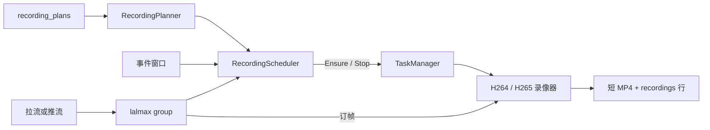
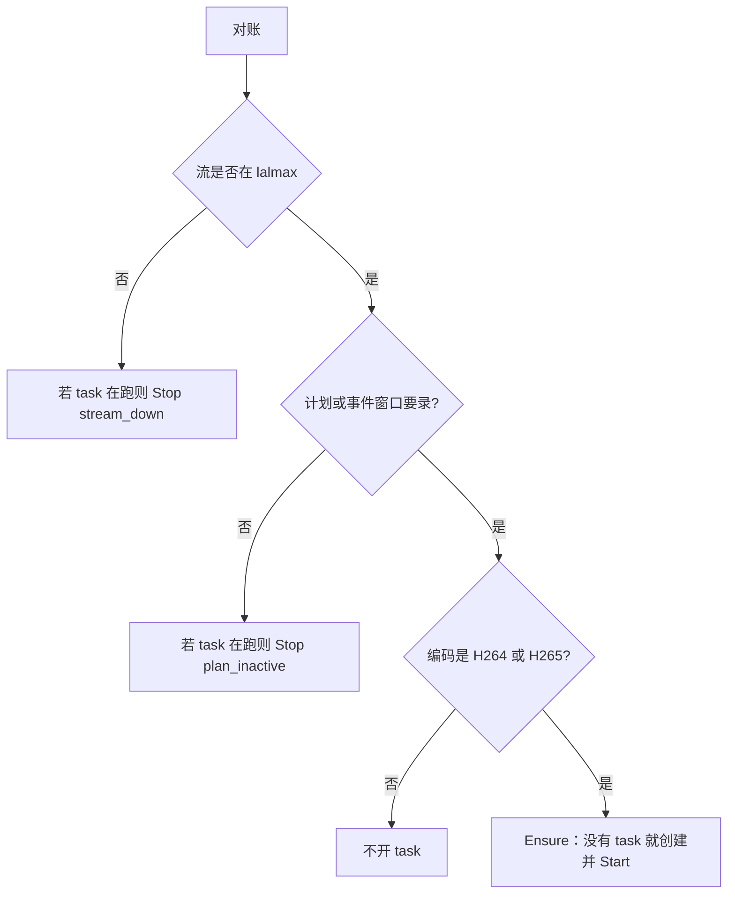
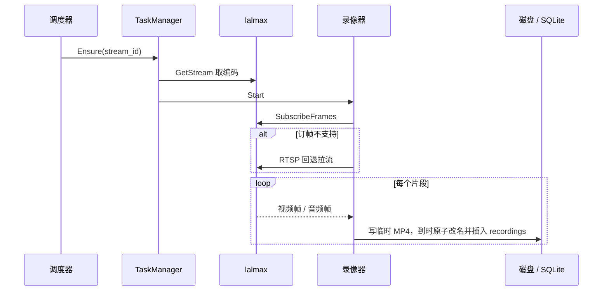
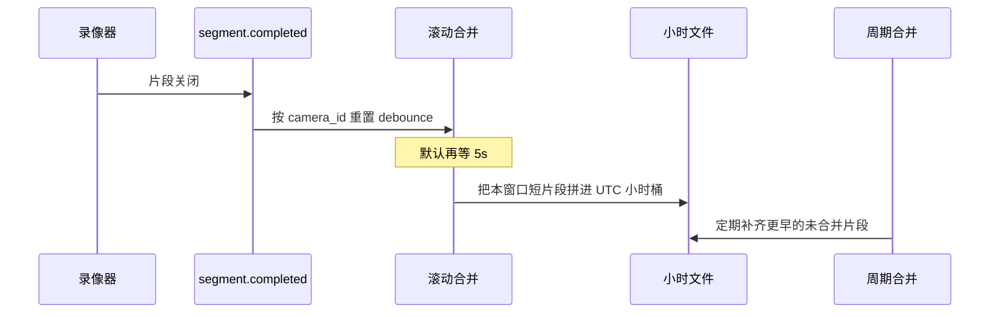
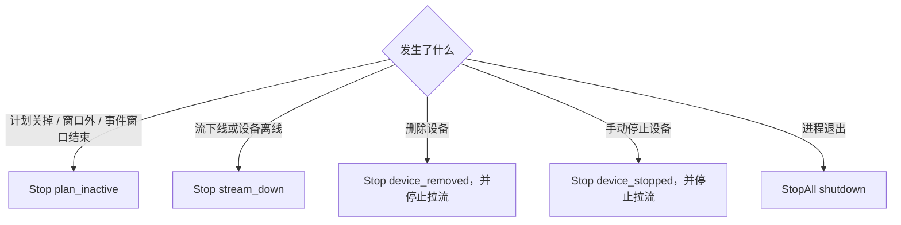
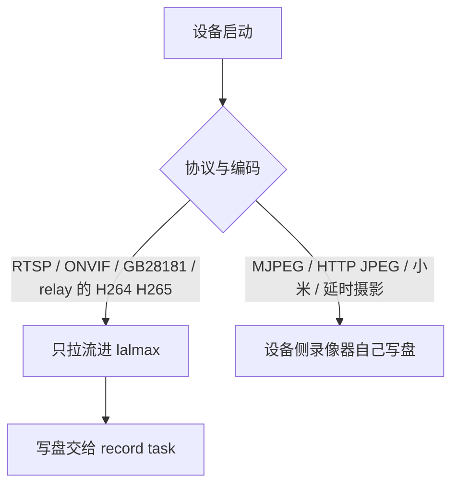

# 录制流程

[English](../en/recording-flow.md) · [录像计划](recording-plans.md)

H.264 / H.265 的写盘由 **record task** 完成。一条流要同时满足两件事才会开录：它此刻在 lalmax 里，并且录制计划（或还没结束的事件窗口）要求写盘。有没有登记成设备不参与这个判断。

MJPEG、HTTP JPEG、小米、延时摄影仍由设备自己的录像器写盘，不进 record task。

## 角色

| 模块 | 做什么 |
|------|--------|
| 设备 / 拉流 | 把摄像头拉进 lalmax。推流、GB28181、WHIP 自己就会变成一条流 |
| `recording_plans` | 唯一策略：这条 `stream_id` 何时该写盘 |
| `RecordingPlanner` | 把计划收成「此刻要不要录」 |
| `RecordingScheduler` | 对账计划与 lalmax 里还在的流，调用 `Ensure` / `Stop` |
| `TaskManager` | 按 `stream_id` 持有唯一的写盘任务 |
| H.264 / H.265 录像器 | 订帧，切成短 MP4，写入数据库 |

## 什么时候开录

调度器立刻对一次账，之后每 30 秒再对一次。计划增删改会马上再触发一次，不必等下一轮。

「要录」的计算：

| 计划 | 此刻是否要录 |
|------|----------------|
| `continuous`、`adaptive`，且 `enabled` | 是 |
| `scheduled`，且当前落在某个周窗口内 | 是 |
| `event`，且该流的事件窗口还没结束 | 是。计划表本身给出的期望是「否」，窗口是额外加上的 |
| `off`、`enabled: false`、没有计划 | 否 |

子码流、小米、延时摄影、MJPEG、HTTP JPEG 会被跳过，避免和设备侧录像器写两份。

设备启动时只负责把流拉起来。拉流成功后如果计划已经要录，会立刻尝试 `Ensure`；流还没在 lalmax 里就绪时这次会失败，等流上线事件或下一轮对账再开。

## 一条 task 怎么写盘

`Ensure` 按 `stream_id` 建录像器。同一条流重复调用不会再建第二个。

1. 用 lalmax 上的实际编码选择 H.264 或 H.265 录像器。
2. 优先进程内订帧（embedded）。订帧不可用时（HTTP 模式的 lalmax）回退到该流的 RTSP 播放地址。
3. 等到关键帧再开新片段，按 `segment_duration` 滚动。
4. 片段关闭后写入 `recordings`。有绑定设备时 `camera_id` 是设备 ID；纯流录像时 `camera_id` 与 `stream_id` 都是流 ID。
5. `adaptive` 计划在录像器上挂抽帧门控：平静时只写周期关键帧，活动时全速。间隔来自绑定设备的 `adaptive.timelapse_interval`。

事件录像：MQTT / ONVIF 移动侦测打开该流的事件窗口并 `Ensure`。窗口结束（post-roll 或达到最长时长）后 `Stop`。窗口还在时，调度器不会因为计划期望为「否」而把 task 停掉。

## 录像合并

合并发生在片段已经写完之后，不决定要不要录。record task 和设备侧录像器关掉一个片段时，都会发 `segment.completed`。事件上的 `camera_id` 是设备 ID；纯流录像时它等于 `stream_id`，合并按这个 ID 分组。

两条路径：

| 路径 | 何时跑 | 做什么 |
|------|--------|--------|
| 滚动合并 | `merge.rolling_enabled` 为真时，每次片段关闭后再等 `rolling_debounce`（默认 5s） | 把该时段内还没合并的短片段拼进当前 UTC 窗口的小时文件 |
| 周期合并 | `merge.enabled` 为真时，按 `check_interval` 扫一遍 | 补齐滚动合并没吃掉的历史片段。片段要老于 `min_segment_age`（默认 10 分钟），且同一窗口里至少有 `min_segments_to_merge` 段 |

同一路在 debounce 时间内又关了新片段，计时会重置。滚动合并把新片段的样本追加到小时文件末尾并改写 moov，不再整文件重写。已经是 moov 在 mdat 前面的旧小时文件会先整段重写成可追加的布局，之后沿用同一条 `recordings` 记录。编码参数不一致的片段会分成不同组。凑不满最小段数的分组继续留在 pending，后面同类片段还能接上。周期合并扫描 `recordings` 里仍为 pending 的流，不要求它登记成设备。第一次合成会插入一条新的 `recordings` 行，并删掉被吃掉的短片段文件。回放按这些小时文件切连续 VOD。

## 什么时候停录

停录会关掉当前片段。原因写在日志里。

| 操作 | 停哪条 | 之后 |
|------|--------|------|
| 计划不再要录 | 该 `stream_id` | 保持停止，直到计划又要录且流还在 |
| 流下线、发布者停止、拉流停止 | 该 `stream_id` | 流重新进入 lalmax 且计划仍要录时再 `Ensure` |
| 删除设备、归档设备 | 该设备的接入流 | 拉流一起停。计划保留；同一 `stream_id` 以后再进 lalmax 会按计划重新开录 |
| 手动停止设备 | 该设备的接入流 | 拉流一起停 |
| 服务关闭 | 全部 task | 先收干净片段，再停媒体引擎、关数据库 |

设备离线和流下线只停 task，不把这台设备从配置里删掉。拉流若仍会重试，流回来后调度器或流上线事件会再开录。

## 和设备录像器的分界

GB28181 设备由 SIP 接入，不在摄像头启动时建录像器。流进入 lalmax 且有计划时，同样由 record task 写盘。
