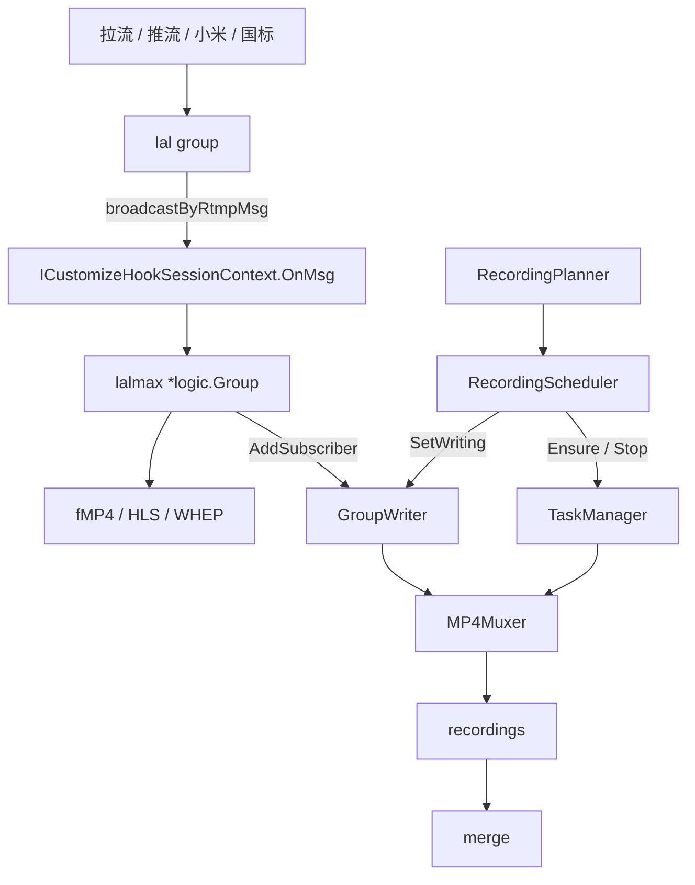
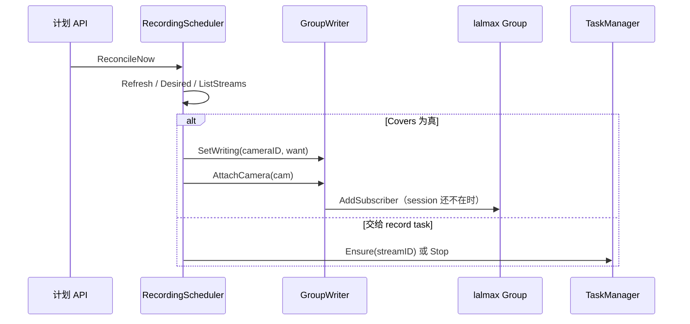

# 录制流程

[English](../en/recording-flow.md) · [录像计划](recording-plans.md)

一条流先进本进程的 lalmax group。嵌入式引擎上，录像模块用 `GroupWriter` 订阅这个 group，录像计划只拨写盘开关。拉流、推流和设备会话继续跑，不受开关影响。

`media.mode: http` 时 group 在另一个进程里，本进程没有 `AddSubscriber`。那种部署，以及 `adaptive` 计划，仍由 `TaskManager` 建 record task。MJPEG、HTTP JPEG、延时摄影由各自的采集器写盘。

## 模块

| 模块 | 代码 | 对录像做什么 |
|------|------|----------------|
| 设备接入 | `internal/camera`、`internal/onvif`、`internal/gb28181`、`internal/xiaomi` | 把流送进引擎。国标走 SIP/INVITE，小米走 `AddCustomizePubSession` |
| 媒体引擎 | `internal/media`，嵌入式实现是 `*media.EmbeddedLalmax` | 暴露 group、流事件、`ListStreams`、`SubscribeFrames` |
| lal group | `third/lal/pkg/logic` | 持有发布会话，把媒体转成 `RtmpMsg` |
| lalmax group | `third/lalmax/logic/group.go` 的 `*logic.Group` | 直播订阅者所在的 group。录像只订这里 |
| 录像计划 | `recording_plans`、`RecordingPlanner` | 回答「这条 `stream_id` 此刻该不该写盘」 |
| 调度器 | `recorder.RecordingScheduler` | 对账计划和仍在 lalmax 里的流 |
| 组写入器 | `recorder.GroupWriter` | 嵌入式 H.264/H.265 的订阅和写盘 |
| record task | `recorder.TaskManager` | `adaptive`，以及组写入器不覆盖的 H.264/H.265 |
| 封装 | `internal/muxer.MP4Muxer` | 把样本写成短 MP4，带 `stts` / `ctts` / `stss` |
| 存储 | `storage.Manager`、`storage.DB` | 落文件，插入 `recordings` |
| 合并 | `internal/merge` | 听 `segment.completed`，把短片段拼进小时文件 |


```mermaid
flowchart TB
  ingest["拉流 / 推流 / 小米 / 国标"] --> lal["lal group"]
  lal -->|"broadcastByRtmpMsg"| hook["ICustomizeHookSessionContext.OnMsg"]
  hook --> group["lalmax *logic.Group"]
  group --> live["fMP4 / HLS / WHEP"]
  group -->|"AddSubscriber"| writer["GroupWriter"]
  plans["RecordingPlanner"] --> sched["RecordingScheduler"]
  sched -->|"SetWriting"| writer
  sched -->|"Ensure / Stop"| task["TaskManager"]
  writer --> mp4["MP4Muxer"]
  task --> mp4
  mp4 --> disk["recordings"]
  disk --> merge["merge"]
```

## 帧怎么进 lalmax group

NVR 不再注册一次 `WithOnHookSession`。这个回调已经由 lalmax 占用，录像复用它返回的 group。

`third/lalmax/server/server.go` 的 `LalMaxServer.initHookSession` 调用 `lalsvr.WithOnHookSession`。回调里 `GetOrCreateGroupByStreamName`，返回值就是 `*logic.Group`，同时实现 lal 的 `ICustomizeHookSessionContext`。

lal 的 group 在 `broadcastByRtmpMsg` 之后调用 `customizeHookSessionContext.OnMsg`。这一下就是 lalmax group 的 `OnMsg`。fMP4、HLS、WHEP 和录像都从这里拿 `base.RtmpMsg`。

lal 传给 hook 的 `streamName` 是路径最后一段。NVR 的组是 `live/{camera_id}`，所以查找键是 `camera_id`。子码流 `{camera_id}_sub` 不订、不录。

查找和订阅用的接口：

| 调用 | 作用 |
|------|------|
| `logic.GetGroupManagerInstance().GetGroupByStreamName(cameraID)` | 组写入器按相机 ID 找 group。找不到就先不订，等事件或下一轮 `Sync` |
| `group.AddSubscriber(info, subscriber)` | 默认 `replayCache=true`，先回放缓存 GOP，再送实时帧 |
| `group.RemoveSubscriber(subscriberID)` | 从 group 摘掉订阅。内部 `stopWithoutNotify`，不会回调 `OnStop` |
| group 自己结束 | `stopWithNotify`，持有写锁调用订阅者的 `OnStop` |

订阅者要实现 `logic.Subscriber`：

```go
type Subscriber interface {
    OnMsg(msg base.RtmpMsg)
    OnStop()
}
```

`OnMsg` 在 group 的 `writeMux` 里被调用，必须马上返回。要留用就 `msg.Clone()`。`OnStop` 里不能再 `RemoveSubscriber`，也不能等待写盘循环结束，否则和 group 的锁互相等待。

各入口到 `OnMsg` 时，时间戳已经由 lal 定好：

| 入口 | `RtmpMsg` |
|------|-----------|
| RTSP 拉流、ONVIF、国标、RTSP 推流 | CTS 为 0，`Pts() == Dts()` |
| RTMP 推流 | 视频 tag 里的 composition time 还在，`Cts()` 可以非 0 |
| SRT、小米，以及其他 `FeedAvPacket` | remuxer 未把 `AvPacket.Pts` 写进 CTS，`Pts() == Dts()` |

写入器读 `Dts()`（`Header.TimestampAbs`，毫秒）和 `Cts()`。视频 PTS 用 `Dts + Cts`，这样增强 HEVC 的 CTS 位置也对。音频只用 `Dts()`。

## 进程怎么把模块接上

`App.wireRecordTasks`（`cmd/lalmax-nvr/main.go`）在媒体引擎已经建好之后调用。

引擎是 `*media.EmbeddedLalmax` 时：

1. `recorder.NewGroupWriter(store, db, eventBus, engine, segmentDuration)`
2. `CameraManager.SetGroupWriter(writer)`

`SetGroupWriter` 把三件事交给写入器：

| 回调 | 实现 | 含义 |
|------|------|------|
| `SetLookup` | `GetCameraConfig(id)` | 流名要能对上已有相机才订 |
| `SetShouldWrite` | `shouldRecordCamera(id)` | 还没人调过 `SetWriting` 时的默认开关 |
| `SetAccept` | `CameraUsesGroupRecording` 且计划模式不是 `adaptive` | 这一路归组写入器 |

`CameraUsesGroupRecording`（`internal/recorder/group_cover.go`）为真的协议：`xiaomi`、`gb28181`、`rtmp-pull`、`http-flv-pull`、`udp-ts-pull`。`rtsp` / `onvif` 还要求编码是 H.264 或 H.265。`http`、`timelapse`、MJPEG、HTTP JPEG 为假。

同时总会建一个 `TaskManager`。`SetSkip` 在这些情况返回 true，`Ensure` 直接返回，避免同一路写两份：

- 子码流
- 协议是 `xiaomi`、`timelapse`、`http`
- 编码是 MJPEG 或 JPEG
- `groupWriter.Covers(cam)` 为真

`App.Start` 里，计划先 `RecordingPlanner.Refresh`，再交给相机：`SetRecordingDecision(planner.ShouldRecord)`、`SetRecordingModeSource(planner.Mode)`。相机启动之后才建调度器：

| 调度器方法 | 接到 |
|------------|------|
| `SetPlanner` | `RecordingPlanner` |
| `SetTasks` | `TaskManager` |
| `SetEventActive` | `App.eventActive`：`eventMgr.IsActive(streamID)`，再试相机 ID |
| `SetAliveStreams` | `App.aliveRecordingStreams`：`mediaEngine.ListStreams`，丢掉子码流 |
| `SetWriteSwitch` | 见下一节 |
| `Start` | 立刻对一次账，之后每 30 秒，以及 `ReconcileNow` |

计划 API（`internal/api/handlers_recording_plans.go`）改完表之后调用 `refreshRecordingPlans`，再走 `SetRecordingReconciler` 里的 `ReconcileNow`，不必等 30 秒。

有组写入器时，`Start` 还会 `go groupWriter.Run(ctx)`。进程退出时先 `recTasks.StopAll()`，再 `groupWriter.Close()`。

## 订阅跟着流，写盘跟着计划

`GroupWriter.Run` 做三件事：

1. 马上 `Sync`。`groups.Each` 走 `GroupManager.Iterate`，已经在播的组补订上；group 已经没了的订阅 `Detach`。
2. `engine.SubscribeEvents`，类型是 `media.publisher.started` / `media.publisher.stopped`、`media.relay_pull.started` / `media.relay_pull.stopped`、`media.stream.active` / `media.stream.stopped`。停止类事件 `Detach(streamID)`，其余 `Attach(streamID)`。
3. 每 15 秒再 `Sync` 一次，补上漏掉的事件。

`Attach` 用 `SetLookup` 把流名换成 `CameraConfig`，再 `AttachCamera`。

`AttachCamera` 的条件：相机 `Enabled`，`Accepts` 为真，还没有这个 `camera_id` 的 `recSession`，并且 `GetGroupByStreamName(cam.ID)` 已经有 group。然后：

```text
subscriberID = "nvr-record-" + cameraID
protocol     = "nvr-record"
group.AddSubscriber(SubscriberInfo{SubscriberID, Protocol}, recSubscriber)
```

同一路重复 `AttachCamera` 发现 session 已在就返回。`AddSubscriber` 自带 GOP 回放，写盘从关到开时用这份缓存起段。

`recSubscriber.OnMsg` 只做 `Clone` 和入队（缓冲 2048）。队列满了丢掉这一帧，不阻塞 group。`OnStop` 调 `GroupWriter.forget(cameraID, removeSub=false)`：session 收尾，不再 `RemoveSubscriber`。

`recSession.loop` 在自己的 goroutine 里处理队列：

| `writing` | 行为 |
|-----------|------|
| 关 | `remember`：留下 video sequence header、audio sequence header，以及最近最多 300 条 GOP。当前段还开着就 `closeSegment` |
| 开，且本轮还没刷过缓存 | `flushHeld`：先 sequence header，再 GOP，然后写实时帧 |
| 开 | `apply`：解析 SPS/PPS/VPS，关键帧上 `openSegment`，`WriteTimedSample` |

新段要等到关键帧，并且已经有 SPS。片段时长达到 `storage.segment_duration` 后打上 `pendingCut`，下一个关键帧再 `closeSegment`，避免切在 P 帧上。`GroupWriter.Rotate` 把 `rotate` 置位，下一帧先收当前段。

`closeSegment` 的接口顺序：

1. `MP4Muxer.Close` 写 moov（含 `ctts`、`stss`）
2. `storage.Manager.CloseSegment` 把临时文件换成最终路径
3. `DB.InsertRecordingWithRetry`。`CameraID` 和 `StreamID` 都是 `camera_id`
4. `EventBus.Publish(TopicSegmentCompleted, SegmentCompleted)`，topic 是 `segment.completed`

`SetWriting(cameraID, false)` 只改 `recSession.writing`。订阅留着，直播不受影响。`Detach` 才 `RemoveSubscriber` 并停循环。发生 `Detach` 的地方：流停止事件、`StopCamera`、`Sync` 发现 group 消失、`Close`。

## 调度器怎么拨开关

`RecordingScheduler.check`：

1. `planner.Refresh`
2. `planner.Desired()`：`continuous` 且启用为真；`scheduled` 看当前是否落在周窗口；`event`、`off`、未启用、没有计划为假
3. `aliveRecordingStreams`
4. 对每条仍在的流：`want = desired[id] || eventActive(id)`

有 `SetWriteSwitch` 时，先走这个函数。`App.Start` 里的实现：

```text
cam = CameraManager.CameraByStream(streamID)
cam 为空，或 groupWriter.Covers(cam) 为假 → 返回 false，交给 TaskManager
否则 groupWriter.SetWriting(cam.ID, want)
     groupWriter.AttachCamera(cam)
     返回 true
```

返回 true 表示这一路已经由组写入器处理，`check` 不再 `tasks.Ensure`。返回 false 且 `want` 为真才 `Ensure`。

已经在跑的 record task 另有一段：流不在了就 `Stop(id, stream_down)`；`want` 为假就 `Stop(id, plan_inactive)`。组写入器覆盖的流不会出现在 `RunningIDs` 里，所以计划关掉时只拨 `SetWriting(false)`，订阅继续留着。


```mermaid
sequenceDiagram
  participant API as 计划 API
  participant Sched as RecordingScheduler
  participant GW as GroupWriter
  participant Group as lalmax Group
  participant Task as TaskManager

  API->>Sched: ReconcileNow
  Sched->>Sched: Refresh / Desired / ListStreams
  alt Covers 为真
    Sched->>GW: SetWriting(cameraID, want)
    Sched->>GW: AttachCamera(cam)
    GW->>Group: AddSubscriber（session 还不在时）
  else 交给 record task
    Sched->>Task: Ensure(streamID) 或 Stop
  end
```

事件窗口：`eventActive` 为真时 `want` 为真，即使计划行本身是 `event`（期望表给出的是假）。窗口结束之后下一轮对账把开关关掉，或把 record task `Stop(plan_inactive)`。

## 相机启动、暂停、停止

`CameraManager.startRecorderHeld` 先 `startMediaPullLocked`，拉流和写盘分开。

组写入器覆盖这一路时走 `startGroupRecording`：

- 小米：仍 `XiaomiRecorder.Start`。它调用 `MediaEngine.AddCustomizePubSession`，之后 `FeedAvPacket` 把帧送进引擎。`closeCurrentSegment` 是空的，文件由组写入器写。recorder 留在 `CameraManager.recorders` 里，用来保持会话。
- 其他协议：拉流或推流会话已经把 group 建出来，这里不再建 H.264/H.265 录像器，也不再向 lal 拉第二路 RTSP。
- 然后 `SetWriting(shouldRecordCamera)`、`AttachCamera`。当时计划不要录，订阅可以先挂上，开关是关的。

`RecordsViaTask` 为真、组写入器又不覆盖时（典型是 `adaptive`，或 `media.mode: http`），启动路径只在 `shouldRecordCamera` 为真时调用 `TaskManager.OnStreamUp`。`OnStreamUp` 再 `Ensure`。group 还没就绪时这次会失败，流上线事件或下一轮对账再试。

| 操作 | 组写入器覆盖的相机 | record task 的相机 | MJPEG / HTTP JPEG / 延时摄影 |
|------|--------------------|--------------------|------------------------------|
| `PauseRecording` | `SetWriting(false)`，拉流保持，`pausedRecorders` 记一笔 | `TaskManager.Stop(plan_inactive)`，拉流保持 | 录像器 `Pause`，或停掉录像器 |
| `ResumeRecording` | 清掉暂停标记，`SetWriting(true)`，再 `AttachCamera` | `TaskManager.Ensure` | 录像器 `Resume`，或新建录像器 |
| `StopCamera` | 停拉流，`Detach`，再 `stopRecordTask(device_stopped)` | 停拉流，`Stop(device_stopped)` | 停拉流并停录像器 |
| 流停止事件 | `Detach`。拉流若会重试，group 再出现时 `Attach` | `Stop(stream_down)`，流回来且仍要录时再 `Ensure` | 设备侧录像器自己的重连 |
| 进程退出 | `Close`：全部 `RemoveSubscriber`，最多等 5 秒收段 | `StopAll(shutdown)` | 随相机管理器停止 |

`PauseRecording` / `ResumeRecording` 是相机上的手动暂停。计划到点、计划 API 关掉录像，走的是调度器的 `SetWriteSwitch`，不写 `pausedRecorders`。界面上的暂停状态看 `GroupWriter.State`：已订阅且 `writing` 为假，就显示暂停。

## record task 仍负责的路径

`TaskManager.Ensure`：

1. `SetSkip` 为真则返回。
2. 同一 `stream_id` 已有 task 则返回。
3. `newRecorder`：`engine.GetStream` 取实际编码，只接受 H.264 / H.265。
4. 计划模式是 `adaptive` 时挂 `AdaptiveGate`。平静时按设备的 `adaptive.timelapse_interval` 抽关键帧，活动时全速。
5. `Recorder.Start`。帧来自 `engine.SubscribeFrames`。

嵌入式引擎的 `SubscribeFrames`（`internal/media/frames_subscribe.go`）也是 `group.AddSubscriber`，订阅者 ID 形如 `nvr-record-{streamID}-{纳秒}`，协议名 `NVR-RECORD`。它把 `RtmpMsg` 转成 `MediaFrame`，PTS 取 `msg.Pts()`，DTS 不再单独保留。HTTP 模式的 `SubscribeFrames` 返回 `ErrFramesNotSupported`，录像器改拉 `BuildPlayURL` 给出的 RTSP 播放地址。

组写入器和这条订帧路径不要同时挂在同一路 group 上。`SetSkip` 和 `SetWriteSwitch` 的返回值就是为了把两路分开。

## 一个片段里的样本

`recSession.apply` 对每个 VCL NAL 调用：

```text
MP4Muxer.WriteTimedSample(trackID, nalu, dts, pts, duration)
```

视频 `duration` 取本访问单元相对上一帧的 DTS 差；同一访问单元里后面的 NAL 用 1ms。`cts = pts - dts`。CTS 全是 0，或音轨，就不写 `ctts`。`stss` 记录 H.264 NAL type 5 和 H.265 IRAP（type 16–21）。一个都没有，或者每一帧都是同步样本时，省略 `stss`（规范里没有 `stss` 表示全部都是同步样本）。

小时合并 `internal/merge` 读的是已经关闭的片段。`merge.Manager` 订阅 `segment.completed`。`merge.rolling_enabled` 时，同一路在 `rolling_debounce`（默认 5s）内不再来新片段，就把本 UTC 小时窗口里的短片段追加进小时文件并改写 moov。`merge.enabled` 的周期扫描补更早的 pending 片段，片段要老于 `min_segment_age`，且同一窗口至少 `min_segments_to_merge` 段。合并按事件上的 `camera_id` 分组。组写入器发出的这个字段就是相机 ID。
