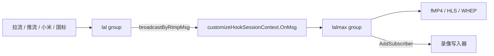
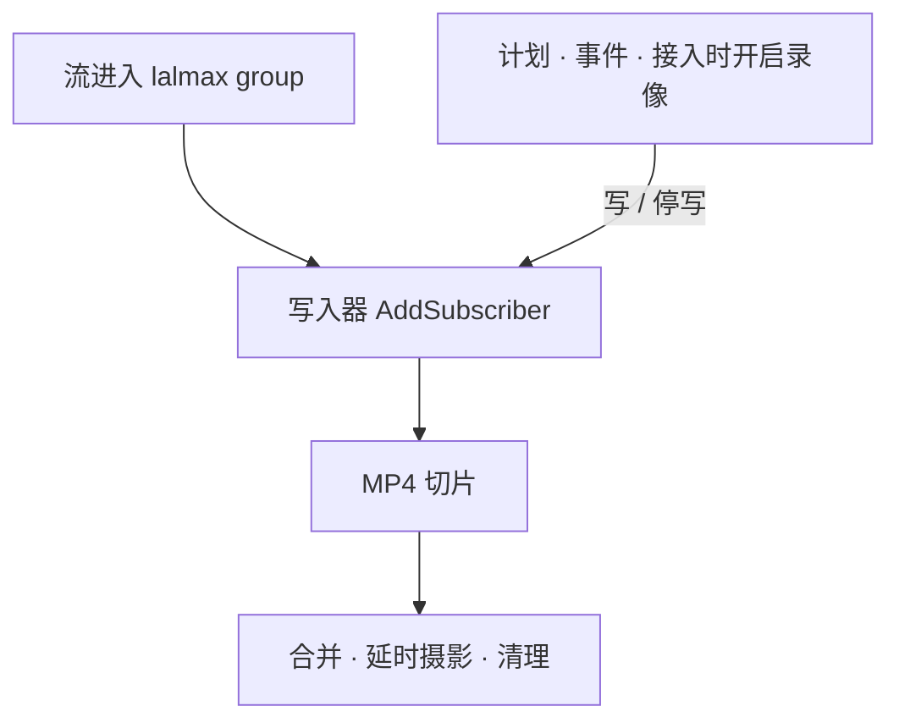

# 录像模块设计

本文把连续录像收成录像模块里的一个写入器。流一旦进入本进程的 lalmax group，录像模块就 `AddSubscriber`。开不开录、计划、事件、接入过程中勾选录像，都由这个模块在已经挂上的订阅上决定写不写盘。不改 lal，也不改 lalmax。

## 结论

录像仍叠在相机之上，不是内核。相机和各接入只负责把流送进引擎。录像模块看到 group 出现就订阅，用现有的 `RtmpMsg` 落盘。

订阅和写盘是两件事：

- 订阅跟着流。group 在就挂着，流停或相机被删除才 `RemoveSubscriber`。
- 写盘跟着录像管理。计划、事件窗口、接入时是否开启录像，只改变「这条订阅现在写不写文件」。

不要再注册一次 `WithOnHookSession`。这个回调位已经由 lalmax 占用。也不要为了录像去改 `AvPacket2RtmpRemuxer` 或 lalmax 的 group。写入器吃 hook 里已经送出来的 `RtmpMsg`。

## 两个 group

一条流先进 **lal 的 group**（`third/lal/pkg/logic`），再交给 **lalmax 的 group**（`third/lalmax/logic/group.go`）。录像只订阅后者。

lal 的 group 持有发布会话。`FeedAvPacket` 在这里被 `AvPacket2RtmpRemuxer` 转成 `RtmpMsg`，RTMP 推流的原始消息也在这里。`broadcastByRtmpMsg` 转完 RTSP 之后，调用 `customizeHookSessionContext.OnMsg`。

这个 hook 在 `third/lalmax/server/server.go` 的 `initHookSession` 里用 `WithOnHookSession` 注册。回调里 `GetOrCreateGroupByStreamName`，返回的对象就是 lalmax 的 `*logic.Group`。fMP4、HLS 已经是它的订阅者。

查找用 lalmax 的组管理器：

- `logic.GetGroupManagerInstance().GetGroupByStreamName(cameraID)`
- 挂上：`group.AddSubscriber`
- 卸下：`group.RemoveSubscriber(subscriberID)`

lal 传给 hook 的 `streamName` 是路径最后一段。NVR 的组是 `live/{camera_id}`，所以 `streamName` 就是 `camera_id`。子码流 `{camera_id}_sub` 不录。

`OnMsg` 必须尽快返回。业务方不能持有回调里的那块内存，要留用就 `msg.Clone()`。写盘放在写入器自己的队列里。

这个订阅只在本进程的 embedded 引擎上成立。`media.mode: http` 时 group 在另一个进程里，本进程拿不到 `AddSubscriber`。那种模式不在本方案里。

## 录像模块里有什么

模块还是现在这一层：计划、事件录像、小时合并、延时摄影、过期清理，再加上写入器。录像管理整段留在这里。

接入路径（拉流、推流绑定、小米会话、国标 INVITE、添加相机）不调用开始录像。它们把流送进引擎；若这一路当时已经允许录像，写入器自己开始落盘。事后在设置里打开录像，也是改录像模块里的写盘开关，订阅早就在。

合并、延时摄影、清理读的是已经落盘的切片，不直接碰 group。

## 写入器

一路相机一个订阅者，实现 lalmax 的 `Subscriber`（`OnMsg`、`OnStop`）。流到了就挂，不管当前计不计划录像。

挂上的时机：

- 媒体引擎已经发出的发布开始、拉流开始、流活跃、group 开始。录像模块听这些现成事件，对 `camera_id` 调 `GetGroupByStreamName` 然后 `AddSubscriber`。
- 模块启动时，用组管理器的 `Iterate` 把已经在播的组补订上。引擎先起来、录像模块后起来时不会漏。

子码流 `{camera_id}_sub` 不订。还没有对应相机的临时流不订，等它被收成相机之后，下一次事件或下一轮核对再订。

`OnMsg` 只做 `Clone()` 和入队。回调里不判断计划、不写盘。

队列里每路有一个写盘开关，由录像管理维护：

- 开：缓存 sequence header，下一帧关键帧开新段；之后按 `Dts()` 写样本，到切片时长再切。
- 关：不再开新段。当前段收到尾就关闭。订阅继续收帧，留一个短的预录环，给事件录像用。现有 H.264/H.265 录像器里的 preroll 就是这个用途。

`AddSubscriber` 默认会回放 GOP。写盘从关到开时，用这份缓存（或 group 上的 `GetVideoSeqHeaderMsg`）从关键帧起段，不用等下一个实时关键帧才开始。

`RemoveSubscriber` 只在两处发生：group 回调 `OnStop`（流没了），以及相机被删除。计划到点、事件结束、用户关掉录像，都只关写盘开关。

`CameraManager.MonitorStreamEvents` 不再创建或停掉录像器。流上下线只通知写入器去订或卸。

## 录像管理

计划、事件、接入时开启录像，都只改写盘开关。`RecordingScheduler` 今天每 30 秒读 `GetDesiredRecordingState`，再去调相机的 `PauseRecording` / `ResumeRecording`。改为直接调写入器：该录就开写，不该录就停写。事件窗口仍通过现有的 `SetKeepRecording` 在计划之外保持开写。

接入过程中的几种情况都落在同一次判断上：

- 添加相机或绑定推流时就已经允许录像：流进 group、订阅挂上之后，开关是开的，从 GOP 起段。
- 先接入、当时不录，之后在设置里打开：订阅还在，开关从关到开，用手里的 GOP 起段。接入代码不用再 `startRecorder`。
- 计划离开时间窗，或用户关掉录像：停写并收尾当前段，订阅留着，直播不受影响。

健康检查里的「重启录像」也改为让写入器收尾并重新开段，不去拆掉引擎里的拉流或推流。

## 时间戳

写入器只解释已经送到 lalmax group 的 `RtmpMsg`，不回头改封装：

- `Dts()` 是 `Header.TimestampAbs`
- 视频 `Pts()` 是 `TimestampAbs` 加上负载里的 composition time
- 音频没有单独的 PTS，用 `TimestampAbs`

样本按 DTS 顺序进入 MP4。`stts` 记相邻 DTS 的间隔，`ctts` 记 `Pts - Dts`。`internal/muxer/mp4mux.go` 的 `WriteSample` 现在只有一个 `pts`，写 `stts` 时用的是 `duration`，没有 `ctts`。这一处在 NVR 的封装器里补，不动 lal。

按 lal 今天的实现，各入口到 `OnMsg` 时的时间戳是：

| 入口 | `OnMsg` 里已有的值 |
| --- | --- |
| RTSP 拉流、ONVIF、国标、RTSP 推流 | CTS 为 0，`Pts == Dts` |
| RTMP 推流 | 原始视频 tag 的 composition time 还在，`Pts` 和 `Dts` 可以不同 |
| SRT、小米，以及其他 `FeedAvPacket` | remuxer 没把 `AvPacket.Pts` 写进 CTS，`Pts == Dts` |

RTMP 推流的 B 帧因此能进 `ctts`。SRT 在解 TS 时虽然有单独的 PTS，但现有 remuxer 把它丢了；本方案不改 lal，SRT 录像就按 `Pts == Dts` 写。小米继续 `FeedAvPacket`，不改成 `FeedRtmpMsg`。

## 相机留下的

相机模块继续管生命周期和健康，以及把流送进引擎：

- RTSP、ONVIF、`rtmp-pull`、`http-flv-pull`、`udp-ts-pull`：`StartPull` 进 `live/{camera_id}`
- RTMP、SRT、WHIP、RTSP 推流：发布会话进同一个 group，相机不再为它们二次拉流
- 国标：SIP 和 INVITE 仍是设备接入，PS/RTP 进引擎后成为同一个 group
- 小米：仍是设备接入，和 ONVIF、国标 SIP 同一层。会话连上就 `AddCustomizePubSession` 并 `FeedAvPacket`，断开就 `DelCustomizePubSession`。它不再实现录像器，也不再自己写切片

下面这些从 `CameraManager` 挪进录像模块，接入代码不再碰：

- H.264 / H.265 录像器的创建和启动
- `recordingSourceURL` 再向 lal 拉一路 RTSP 来录
- `MonitorStreamEvents` 里按流上下线启停录像
- `PauseRecording` / `ResumeRecording` 的实现

计划和事件录像今天拿到的是相机的暂停、恢复函数，改为拿到写入器的写盘开关。

## 不进写入器的

MJPEG 和 HTTP JPEG 没有 `RtmpMsg`，仍由各自的采集器直接写。纯延时摄影如果本身不是一路引擎里的流，也留在现有延时路径。小时合并和清理只消费切片，不订阅 group。

没有嵌入式引擎时，本进程没有 lalmax group。那种部署保持现在的直接拉相机录像，不套这个写入器。

## 落地顺序

1. `MP4Muxer` 增加 DTS 和 `ctts`。CTS 为 0 的流写出来与现在一致，RTMP 推流能写下已有的 composition time。
2. 写入器对已有 group `AddSubscriber`。流一出现就订上，写盘开关先接计划里「该录」的那一路，确认切片。
3. 计划、事件、接入时开启录像改成只拨写盘开关。H.264 / H.265 不再为了录像去拉 RTSP，也不再由相机管理器启停。
4. 小米会话退出录像器接口，只保留接入和 `FeedAvPacket`。流进 group 之后与其他相机同一条订阅。
