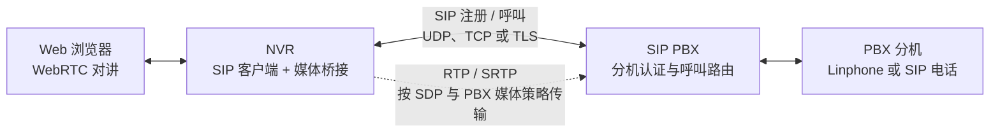
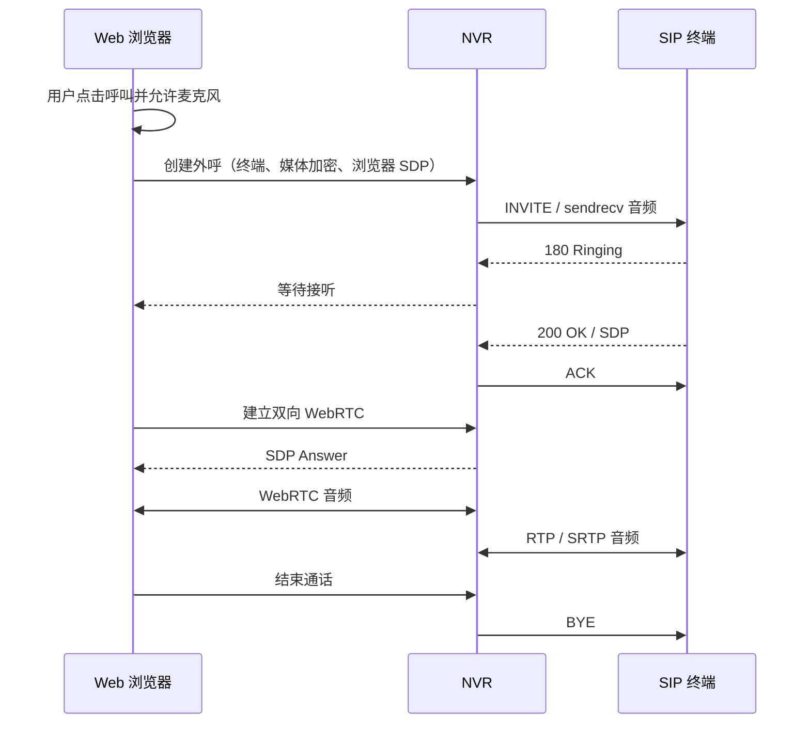
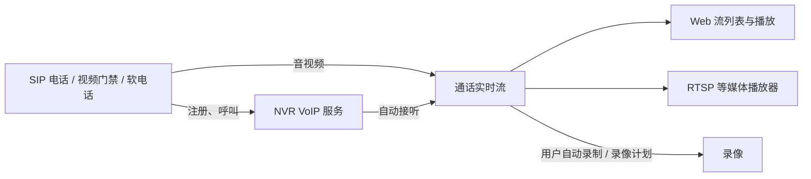

# VoIP 呼叫与对讲

VoIP 支持 SIP 电话、软电话和视频门禁的呼叫接入，也支持从 Web 主动呼叫在线终端或上游 PBX 分机进行双向语音对讲。终端拨打 NVR 后，默认自动接听并发布实时流；也可切换为 Web 人工接听。实时流可在 Web 查看或通过 RTSP 等协议播放。

适用于门禁呼叫视频接入、SIP 终端音视频汇聚，以及使用 Linphone 等软电话向 NVR 发送音视频。VoIP 使用独立的 SIP 服务，默认端口为 **5070**，可与 GB28181 的 **5060** 同时使用。

## 功能概览

| 功能 | 说明 |
|------|------|
| Web 双向对讲 | 对已接通的终端呼入通话加入浏览器麦克风，也可从 Web 呼叫终端；支持静音、DTMF 键盘、离开对讲和挂断 |
| 呼入接听 | 默认自动接听；可启用 Web 响铃，由操作员接听或拒绝，并设置超时 |
| SIP PBX | NVR 可通过 UDP、TCP 或 TLS 注册到上游 PBX，并从 Web 呼叫 PBX 分机 |
| Web 配置 | 在设置页开启服务、配置地址、管理 SIP 用户；保存后立即生效 |
| 用户认证 | 支持 SIP Digest 认证，使用独立的 SIP 用户名和密码 |
| 通话管理 | 查看注册终端、当前通话、时长和编码，支持单路挂断 |
| 自动录制 | 按 SIP 用户开启，每次呼叫独立保存音频或音视频 |
| 媒体调整 | 支持保持/恢复、通话中增加视频，以及带 SDP 的 re-INVITE/UPDATE |
| 实时播放 | 每次呼叫生成一条流，进入 NVR 的流列表和媒体分发链路 |
| 多种传输 | 支持 UDP、TCP、TLS、WS、WSS，另提供实验性的 DTLS 信令 |
| 媒体加密 | 支持 SDES-SRTP、DTLS-SRTP，可要求终端仅发送加密媒体 |

VoIP 需要使用内嵌媒体模式（`media.mode: embedded`，默认模式）。入站呼叫提供音视频接收，接通后可从 Web 加入双向语音；Web 主动外呼也提供双向语音。浏览器与 NVR 之间使用 WebRTC。

## PBX 是什么

PBX（Private Branch Exchange，用户交换机）是企业电话系统中的呼叫控制服务。SIP PBX 通常负责分机账号与注册认证、接收呼叫、按分机号码路由呼叫，并可提供拨号规则、语音菜单和分机组等功能。Asterisk、FreePBX 等是常见的自建 PBX 方案；Linphone 则是 SIP 软电话，可以作为 PBX 下的分机终端，本身不是 PBX。

在这里，NVR 是 PBX 的一个 SIP 客户端：NVR 使用 PBX 分配的账号注册，Web 操作员输入分机号后，NVR 通过 PBX 发起 SIP 呼叫；PBX 再把呼叫路由到对应分机。浏览器不直接注册到 PBX，而是通过 WebRTC 与 NVR 建立对讲连接。语音媒体从 NVR 发往 SDP 协商出的媒体地址，具体由 PBX 中继还是由终端直连取决于 PBX 的媒体路由配置。



## 人工接听 SIP 呼入

默认配置会自动接听终端呼叫。若要先由操作员判断是否接听，在 VoIP 页面打开 **呼入时由 Web 操作员手动接听**，并设置响铃超时。呼入后终端收到 `180 Ringing`，Web 通话列表出现 **接听** 和 **拒绝** 操作；接听后 NVR 才建立媒体并发布实时流，拒绝会返回 SIP `603 Decline`。操作员未处理时，超时返回 `480 Temporarily Unavailable`；主叫提前取消时，NVR 以 `487 Request Terminated` 结束呼叫。

## 注册到上游 SIP PBX

在 VoIP 页的 **注册到上游 SIP PBX** 中填写 PBX 地址（`主机:端口`）、选择 PBX 使用的 UDP、TCP 或 TLS 传输，并填写账号和密码。NVR 支持 Digest `401/407` 认证，注册成功后按有效期续租；TCP/TLS 连接断开时会重连并重新注册。页面显示注册状态、传输方式和到期时间；更改 PBX 账号或清空服务器地址可切换或关闭注册。PBX 密码不会回显，留空表示保留当前密码。

注册状态为 **已注册** 后，在状态面板输入分机号并点击呼叫，NVR 会通过所选传输向 PBX 发起 `INVITE`；浏览器与 NVR 仍使用 WebRTC 双向语音。TLS 会验证 PBX 证书：默认使用系统信任的 CA；使用私有 CA 时填写 CA 证书文件路径。如果 PBX 地址使用 IP、证书签给域名，可填写 TLS Server Name。PBX 上游传输设置与 NVR 接收终端呼入的监听配置相互独立；后者仍需单独配置 UDP、TCP、TLS、WS 或 WSS 监听。

TCP 和 TLS 只说明 NVR 到 PBX 的 SIP 信令连接使用什么传输。它们不会自动加密 RTP 音频；TLS 保护信令，媒体是否加密由 SIP/SDP 中协商的 SRTP 配置决定。部署时还要确认 PBX 的呼叫路由、NAT/媒体地址和 RTP 防火墙端口允许 NVR 与媒体对端互通。

### 真实 PBX 联调

本机使用 Asterisk 22（PJSIP）搭建了临时 PBX，注册认证和 NVR 主动外呼已完成真实协议栈联调：NVR 通过 UDP、TCP、TLS 注册成功；TLS 外呼通过 Digest 认证后，Asterisk 将呼叫送入测试分机并进入 Echo 应用，NVR 收到 200 OK、完成 ACK，挂断后 Asterisk 通道正常释放。测试发现并修复了 TLS 外呼构造 Via/From 地址时未正确处理 `sips:` 的问题。该测试验证了注册、认证、呼叫建立和释放；浏览器麦克风到 Asterisk Echo 的完整 WebRTC/RTP 双向媒体仍需在有浏览器音频输入的环境中单独验收。实际部署时，仍应按 PBX 版本与证书配置验证 UDP、TCP 和 TLS；Asterisk 的 [PJSIP transport 配置文档](https://docs.asterisk.org/Asterisk_20_Documentation/API_Documentation/Module_Configuration/res_pjsip/)说明了相应传输选项。

## 从 Web 呼叫终端或 PBX 分机

1. 在 **VoIP语音对讲** 页面启用服务，让 SIP 终端注册到 NVR。
2. 在在线终端列表中选择媒体加密方式，点击对应终端的 **呼叫**。
3. 浏览器首次使用时允许麦克风权限；终端响铃后，在终端上接听。
4. 页面显示语音已连接后，双方即可交谈。可以静音浏览器麦克风；若浏览器拦截声音播放，点击 **播放对方声音**。
5. 点击 **挂断** 结束通话，或在响铃期间取消呼叫。终端挂断也会自动释放浏览器麦克风。

页面需要通过 HTTPS 或 localhost 打开才能使用麦克风。终端媒体加密选项应与终端配置一致：“按服务器设置”在强制 SRTP 时使用 DTLS-SRTP，其他情况下使用 RTP；也可显式选择 SDES-SRTP 或 DTLS-SRTP。

浏览器通过一个 WebRTC 连接收发声音；NVR 将其与终端的 RTP/SRTP 桥接。对讲支持 **Opus、G.711 A-law（PCMA）和 G.711 μ-law（PCMU）**，使用双方共同支持的编码，不进行音频转码。入站支持的 AAC 编码不用于 Web 双向对讲。



同一终端同时允许一路 Web 外呼，每路外呼只允许一个浏览器接入。关闭页面或切换离开时会主动挂断；页面意外断开后，服务端最多等待 45 秒的对讲心跳再自动结束。浏览器侧复用 lalmax 的 WebRTC 公告地址和 ICE 监听端口（默认 4888）；终端侧继续使用 VoIP 媒体端口范围。跨网部署需要分别配置这两侧的地址和端口。

外呼中终端发送的音频会进入流列表；开启该 SIP 用户的自动录制后，可以录制对方音频。当前不混录浏览器麦克风。对讲期间建议关闭另一个播放器的声音，避免同一终端的声音重复播放。

## 加入终端呼入通话

终端呼入后，NVR 会自动接听并发布实时流。用户可以在 **VoIP语音对讲 → 终端与通话** 的呼入通话行中点击 **加入对讲**，允许浏览器使用麦克风后即可与终端双向通话。每路 SIP 通话只允许一个浏览器加入。

点击 **离开对讲** 或关闭页面只释放浏览器麦克风和 WebRTC 会话，SIP 通话及实时流会继续；点击该行的 **挂断** 才会结束 SIP 通话。页面意外断开后，NVR 在 45 秒未收到对讲心跳时自动释放浏览器会话，SIP 通话仍保持接通。终端挂断或 SIP 媒体重新协商时，浏览器对讲会断开，可在通话仍有效时重新加入。

Web 对讲建立后会显示拨号键盘。点击按键会向 SIP 终端发送 RFC 4733 `telephone-event`，适用于门禁菜单和语音 IVR；只有终端在 SDP 中协商了 `telephone-event` 时才可用。外呼时 NVR 会在 INVITE 中提供该能力，呼入时由终端的 SDP 决定是否支持。

## 呼叫如何进入 NVR

1. 终端使用 NVR 中配置的 SIP 用户注册。
2. 终端向 NVR 发起音频或视频呼叫。
3. NVR 自动接听，与终端协商编码和媒体传输方式。
4. 终端发送音视频，NVR 的流列表中出现一条 **VoIP 呼叫**流。
5. 用户打开流进行播放。终端挂断后，该流离线，通话占用的媒体端口释放。



注册与呼叫是两个独立操作：注册成功后，还需要拨号才能产生音视频流。挂断通话不会注销账号，终端可以继续发起下一次呼叫。

## 通过 Web 开启

以 NVR 地址 `192.168.1.20`、SIP 用户 `door01` 为例：

1. 打开 **VoIP语音对讲** 页面，勾选 **启用 VoIP**。
2. 设置监听地址、SIP 公告 IP、媒体公告 IP 和媒体端口范围。
3. 勾选 **启用用户认证**，添加用户 `door01` 并设置密码。
4. 点击页面底部的 **保存**。

局域网接入可使用以下配置：

| 表单项 | 示例 | 用途 |
|--------|------|------|
| SIP UDP 监听地址 | `0.0.0.0:5070` | 接收终端的 UDP 注册和呼叫 |
| SIP TCP 监听地址（可选） | `0.0.0.0:5070` | 需要 TCP 时填写；留空不启用 |
| SIP 公告 IP | `192.168.1.20` | 告诉终端如何访问 NVR 的 SIP 服务 |
| 媒体公告 IP | `192.168.1.20` | 告诉终端向哪个地址发送音视频 |
| 媒体 UDP 起始 / 结束端口 | `41000` / `42000` | 为并发通话分配媒体端口 |
| SIP 认证域 | `lalmax-nvr` | Digest 认证使用的域，通常保留默认值 |

**监听地址**可以使用 `0.0.0.0`，表示监听本机所有接口。**公告 IP**必须是终端可访问的 IPv4 地址，不能使用 `0.0.0.0`；远程终端也不能使用 `127.0.0.1`。

保存后立即生效，无需重启 NVR。修改配置或关闭服务会结束当前 VoIP 通话；新配置启动或保存失败时，NVR 会恢复原配置。用户密码不会回显，已有用户的密码留空表示保留；新增或更名用户时需要填写密码。

## 接入 SIP 终端

在电话、门禁或软电话中配置以下信息，字段名称可能因终端而不同：

| 终端配置 | 示例 |
|----------|------|
| SIP 服务器 / 域 | `192.168.1.20` |
| SIP 端口 | `5070` |
| 用户名 / 认证用户名 | `door01` |
| 密码 | 在 NVR 中为 `door01` 设置的密码 |
| 传输协议 | UDP，与 NVR 启用的监听对应 |
| 呼叫目标 | `sip:1@192.168.1.20:5070;transport=udp` |

呼叫目标中的 `1` 可以替换为其他号码。当前 NVR 对入站呼叫统一自动接听，不按被叫号码进行分机路由。SIP 用户与 NVR Web 登录账号分别配置。

### Linphone 示例

1. 添加第三方 SIP 账号，填写上述服务器、用户名和密码。
2. 将 Registrar URI 设为 `sip:192.168.1.20:5070;transport=udp`。
3. 音频选择 Opus 或 G.711；视频选择 H.264。
4. 拨打 `sip:1@192.168.1.20:5070;transport=udp`。只发送音频时选择普通呼叫，发送音视频时选择 **视频呼叫**。
5. 在 NVR 的流列表中打开对应的 VoIP 流。

使用 TCP 时，先在 VoIP语音对讲页面开启 TCP 监听，再将 Registrar URI 和呼叫目标中的 `transport=udp` 改为 `transport=tcp`。使用 DTLS-SRTP 时，需要在该页面的高级选项中启用 SRTP，并在终端选择对应的媒体加密方式。

支持终端通过 SDP 调整保持、恢复或打开摄像头，NVR 通过 re-INVITE/UPDATE 更新媒体接收。呼叫的流名保持不变；增加或更换媒体轨后，可重新打开播放器获取新的音视频信息。终端需要在重新协商请求中携带 SDP；不支持无 SDP 的延迟 offer。

## 查看和管理通话

在 **VoIP语音对讲** 页面的 **终端与通话** 区域，可查看注册终端的账号、客户端、来源地址、传输协议和注册到期时间，以及当前通话的主被叫、状态、时长和编码。状态每 5 秒刷新，也可手动刷新。

点击通话中的主被叫可打开对应的流；点击 **挂断** 可结束指定通话，不会影响其他通话或注销终端账号。挂断操作需要操作权限。当前每个 SIP 用户保留一条注册记录，同账号再次注册会更新原记录。

通话结束后会写入本地 SQLite 通话记录，包含呼入/呼出方向、主被叫、结束结果、开始和接通时间、通话时长、传输协议、媒体编码及失败原因。结果包括已接通、未接听、已拒绝、已取消和失败。网页按结束时间倒序显示，每页 20 条；记录保留在 NVR 数据库中，服务重启后仍可查看。具有关联实时流的记录可直接打开该流。

## 播放与录像

呼叫接通后，流列表会显示来源为 **VoIP 呼叫** 的实时流。流名格式为：

```text
voip_<主叫用户名>_<呼叫标识>
```

例如 `voip_door01_abc123def456`。每次呼叫按 Call-ID 生成流名，同一用户的不同呼叫通常会产生不同的流。

打开流详情可查看媒体信息和播放地址。也可使用 RTSP 播放，例如：

```text
rtsp://192.168.1.20:15544/live/voip_door01_abc123def456
```

播放端口随部署配置变化，请以流详情生成的地址为准。仅音频呼叫也会产生实时流；浏览器能否播放取决于输出协议和浏览器对编码的支持，可使用支持对应编码的 RTSP 播放器。

在 SIP 用户旁勾选 **自动录制此用户的通话** 并保存后，该用户后续呼叫会自动录制，无需为每次呼叫创建计划。自动录制需要开启用户认证；未勾选时，开启 VoIP 或接通呼叫不会自动录制。

每次呼叫独立保存为 MP4，挂断时完成当前片段，可在录像回放中按对应流查看。支持音视频录制及 AAC、G.711、Opus 纯音频录制；保持期间没有新媒体时不写入新的内容，恢复或调整媒体后继续录制。浏览器播放取决于编码支持，G.711 文件可下载后使用兼容播放器。

未启用用户自动录制时，也可使用 NVR 的[录像计划](recording-plans.md)。计划仍绑定具体 `stream_id`，不自动覆盖该用户的新呼叫。

## 编码与传输

支持的媒体编码：

| 类型 | 编码 |
|------|------|
| 音频 | Opus、MPEG4-GENERIC AAC、PCMA/8000、PCMU/8000 |
| 视频 | H.264、H.265 |
| 按键事件 | telephone-event DTMF，可解析并记录日志 |

AAC 终端需要在 SDP 中提供 AudioSpecificConfig（`fmtp` 的 `config` 参数）。NVR 按协商的编码接收和分发媒体，不进行自动转码；选择编码时需同时考虑终端、播放器和录像需求。

### 高级传输与媒体安全

Web 中展开 **高级传输与媒体安全**，可配置其他信令监听及媒体加密：

| 信令 | 配置字段 | 连接示例 |
|------|----------|----------|
| UDP | `sip_listen_addr` | `sip:192.168.1.20:5070;transport=udp` |
| TCP | `sip_tcp_listen_addr` | `sip:192.168.1.20:5070;transport=tcp` |
| TLS | `sip_tls_listen_addr` | `sip:192.168.1.20:5061;transport=tls` |
| WS | `sip_ws_listen_addr` | `ws://192.168.1.20:8088/` |
| WSS | `sip_wss_listen_addr` | `wss://192.168.1.20:8443/` |
| DTLS（实验性） | `sip_dtls_listen_addr` | 需要支持 DTLS-UDP 信令的终端 |

只有 UDP 默认使用 `5070`；其他监听需要显式填写，表中端口为示例。TLS、WSS 和信令 DTLS 需要配置服务器上的证书及私钥路径，终端需信任证书。WS/WSS 使用 `sip` 子协议，监听端口独立于 Web 管理页面。

**信令传输与媒体传输分别配置。** 使用 TCP、TLS 或 WebSocket 时，音视频仍通过 UDP 传输；TLS/WSS 保护 SIP 信令，SRTP 保护音视频。

- **支持 SRTP 加密媒体**：允许终端协商 SDES-SRTP 或 DTLS-SRTP。
- **仅允许 SRTP 加密媒体**：拒绝明文媒体，需要同时启用 SRTP。
- **音视频 BUNDLE 复用**：允许支持该能力的 DTLS-SRTP 终端复用音视频端口。

### 网络与端口

终端需要同时访问 SIP 监听端口和媒体 UDP 端口范围。部署在 NAT 后时，公告 IP 填写终端可访问的地址，并映射相应的 SIP 端口及完整媒体端口范围。

未协商 RTCP 端口复用时，每路媒体使用一对 RTP/RTCP 端口，因此音视频呼叫可能使用多对端口。端口范围大小决定可容纳的并发呼叫数。NVR 支持 RTCP 接收报告，并可在终端支持 PLI 时请求视频关键帧。

## YAML 配置

需要通过配置文件部署时，可添加以下配置；直接修改 YAML 后重启 NVR 生效：

```yaml
media:
  mode: embedded
voip:
  enabled: true
  manual_answer: false
  ring_timeout_ms: 30000
  sip_listen_addr: "0.0.0.0:5070"
  sip_tcp_listen_addr: "0.0.0.0:5070"
  sip_ip: "192.168.1.20"
  media_ip: "192.168.1.20"
  media_port_min: 41000
  media_port_max: 42000
  realm: "lalmax-nvr"
  auth_enable: true
  users:
    - username: "door01"
      password: "replace-with-your-password"
      record_calls: true
  # Optional upstream PBX registration. PBX account can call Web extensions.
  pbx_server: "pbx.example.com:5060"
  pbx_transport: udp          # udp | tcp | tls
  pbx_domain: "example.com"
  pbx_tls_server_name: ""    # optional TLS certificate name override
  pbx_tls_ca_file: ""        # optional private CA PEM; empty uses system roots
  pbx_username: "nvr-account"
  pbx_password: "replace-with-pbx-password"
  pbx_register_expires: 3600
```

其他常用选项：

| 配置项 | 默认值 | 说明 |
|--------|--------|------|
| `enabled` | `false` | 开启 VoIP 服务 |
| `manual_answer` | `false` | 呼入由 Web 操作员接听；默认自动接听 |
| `ring_timeout_ms` | `30000` | 人工接听模式下等待操作员的时长 |
| `pbx_server` | 空 | 上游 SIP PBX 地址，格式为 `主机:端口` |
| `pbx_transport` | `udp` | PBX 上游信令传输：`udp`、`tcp` 或 `tls` |
| `pbx_domain` | PBX 主机 | SIP 注册域和分机地址使用的域 |
| `pbx_tls_server_name` | PBX 地址主机名 | TLS 证书域名覆盖项；仅 TLS 传输使用 |
| `pbx_tls_ca_file` | 系统 CA | 私有 CA 的 PEM 文件路径；仅 TLS 传输使用 |
| `pbx_username` / `pbx_password` | 空 | 上游 PBX 账号凭据 |
| `pbx_register_expires` | `3600` | PBX 注册有效期，单位秒 |
| `rtp_timeout_ms` | `15000` | 已建立通话多久未收到有效媒体后结束通话 |
| `ack_timeout_ms` | `32000` | 接听后等待终端确认的时限，单位毫秒 |
| `srtp_enable` | `false` | 允许 SRTP 加密媒体 |
| `srtp_mandatory` | `false` | 仅接收 SRTP 加密媒体 |
| `bundle_enable` | `false` | 允许 DTLS-SRTP 音视频端口复用 |
| `sip_tls_cert_file` / `sip_tls_key_file` | 空 | 加密信令监听使用的证书和私钥路径 |

完整部署配置见[配置示例](../../config/config.example.yaml)。

## API 集成

- `GET /api/settings/voip`：读取配置，用户密码不回显。
- `PUT /api/settings/voip`：保存并应用配置；用户项的 `record_calls` 控制自动录制。
- `GET /api/voip/status`：查看注册终端和当前通话。
- `GET /api/voip/calls/history?limit=20&offset=0`：分页查询已结束通话，返回 `items`、`total`、`limit` 和 `offset`；`limit` 范围为 1–100。
- `POST /api/voip/calls`：以 `{ "user": "1001", "security": "dtls", "sdp": "浏览器 SDP Offer" }` 创建外呼；返回 `call_id`、`state` 和私有 `talk_token`。`security` 可省略或选择 `rtp`、`sdes`、`dtls`。
- `POST /api/voip/calls/{call_id}/talk`：终端接听后，提交 `{ "talk_token": "创建时返回的令牌", "sdp": "浏览器 SDP Offer" }`，获取 WebRTC SDP Answer。
- `POST /api/voip/calls/{call_id}/talk-token`：为接通的入站音频通话申请一个 30 秒有效的 Web 对讲令牌；需要操作权限。
- `POST /api/voip/calls/{call_id}/talk/detach`：提交 `{ "talk_token": "对讲令牌" }` 离开浏览器对讲，SIP 通话继续。
- `POST /api/voip/calls/{call_id}/keepalive`：每 10 秒提交 `{ "talk_token": "创建时返回的令牌" }` 延续浏览器会话。
- `POST /api/voip/calls/{call_id}/dtmf`：发送 `{ "digit": "5" }`，允许 `0`–`9`、`*` 和 `#`；SIP 对端需协商 RFC 4733 `telephone-event`。
- `POST /api/voip/calls/{call_id}/hangup`：响铃时取消外呼，接通后挂断通话。
- `POST /api/voip/calls/{call_id}/answer`：人工接听等待中的 SIP 呼入；需要操作权限。
- `POST /api/voip/calls/{call_id}/reject`：拒绝等待中的 SIP 呼入；需要操作权限。

接口沿用 NVR 的身份认证和权限控制，写操作需要操作权限。

## 使用范围与常见问题

当前支持标准 SIP 入站呼叫及自动接听，以及向已注册终端主动外呼进行 Web 双向语音。外呼暂不提供视频发送、保持/恢复与媒体重协商、呼叫转接、任意 SIP URI 拨号或 PBX 账号注册管理；终端对外呼提出媒体修改时，服务端会拒绝修改并保留原通话。暂不支持 Session-Timer、AV1、ZRTP 和 IPv6。WS/WSS 提供 SIP 信令承载，媒体端没有 ICE/STUN/TURN 协商，浏览器通过 NVR 的对讲 API 使用 WebRTC，不直接注册到 SIP WS/WSS 服务。

| 现象 | 检查方式 |
|------|----------|
| 注册失败 | 检查服务器地址、监听端口、传输协议及 SIP 用户密码；首次收到 `401` 是正常认证流程 |
| 注册成功，流列表没有流 | 注册不会创建流，需要发起呼叫；随后检查编码、公告 IP 和媒体端口是否可达 |
| 通话接通后很快结束 | 检查终端确认消息及媒体是否到达，或是否有人修改了 VoIP 配置 |
| 有流但无法播放音视频 | 检查播放器支持的编码，尝试流详情中的 RTSP 地址；NVR 不会自动转码 |
| 加密连接失败 | 检查证书路径、有效期、终端信任，以及两端的媒体加密选项是否匹配 |
| 无法接入更多呼叫 | 检查媒体端口范围及可用端口，扩大范围时同步更新防火墙或 NAT 映射 |
