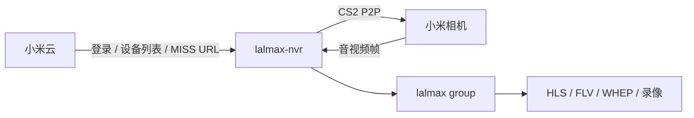
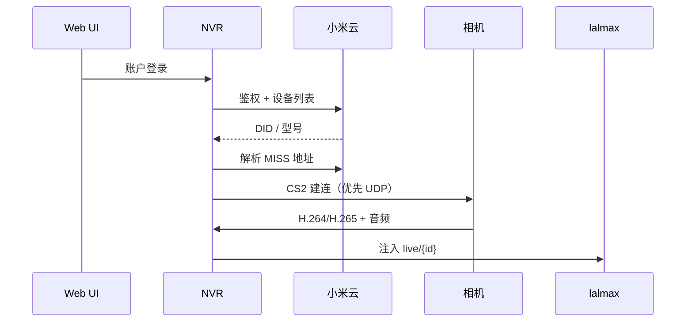

# 小米摄像头设置指南

## 概述

lalmax-nvr 支持通过 CS2 P2P 协议连接小米摄像头。摄像头的视频和音频帧注入 lalmax 后，与其它相机一样走 WebRTC、HLS、HTTP-FLV 等播放。





这是 **P2P 取帧再注入**，不是 RTSP 拉流，也不是 GB28181 推流。总图见 [架构](architecture.md)。

## 前置要求

- 已注册摄像头的小米账户
- 摄像头已绑定到您的小米账户
- 可以访问小米云服务的网络连接

## 支持的型号

| 型号 | 标识符 | 编码 | 音频 | 说明 |
|------|--------|------|------|------|
| 小米 C200 | `chuangmi.camera.046c04` | H264 | PCMA | 1080p 室内摄像头 |
| 小米 C300 | `chuangmi.camera.72ac1` | H265 | Opus | 2K 室内摄像头 |
| 小方摄像头 | `isa.camera.isc5c1` | H264 | PCM | 云台摄像头 |
| 小米 HLC8 | `isa.camera.hlc8` | H265 | PCMA | 双摄摄像头 |
| Loock V2 | `loock.cateye.v02` | H264 | PCMA | 智能门铃 |
| 大方摄像头 | `isa.camera.df3` | - | - | **不支持** - TUTK 协议 |

**注意**：仅支持 CS2 协议的摄像头。大方摄像头使用 TUTK 协议，当前版本未实现。

## 功能特性

- **实时预览**：支持 WebRTC、HLS、HTTP-FLV 播放
- **录制**：自动 MP4 分段录制
- **音频**：支持 G.711 (PCMA/PCMU) 和 Opus 音频编码
- **对讲**：支持通过 WebSocket 向摄像头扬声器发送音频
- **双摄支持**：支持主/副镜头切换
- **自动回退**：HD 画质无数据时自动切换到 SD

## 设置步骤

### Web UI 方法（推荐）

1. 打开 NVR Web UI → 摄像头页面
2. 展开"小米设备发现"部分
3. 输入小米账户凭据
4. 点击"登录"（如需验证码，按提示操作）
5. 从设备列表中选择摄像头
6. 为每个摄像头点击"添加到 NVR"
7. 配置保留策略等设置
8. 保存配置

### 手动配置

```yaml
xiaomi:
  user_id: "123456789"
  token: "your_passToken_here"
  region: "cn"

cameras:
  - id: "xiaomi_c200"
    name: "小米 C200"
    protocol: "xiaomi"
    encoding: "h264"
    did: "device_id_here"
    vendor: "cs2"
    enabled: true
    audio_enabled: true
```

**配置字段**：

| 字段 | 必填 | 说明 |
|------|------|------|
| `user_id` | 是 | 小米用户 ID（首次登录后自动获取） |
| `token` | 是 | 小米 passToken（通过登录获取） |
| `region` | 否 | 区域代码，默认 "cn"，支持 "sg"、"de"、"us" 等 |
| `did` | 是 | 设备 ID（从设备发现中获取） |
| `encoding` | 是 | 视频编码，"h264" 或 "h265" |
| `audio_enabled` | 否 | 启用音频录制，默认 false |

## 对讲功能

小米摄像头支持对讲功能（向摄像头扬声器发送音频）。

### 使用方法

1. 在实时预览页面，点击麦克风按钮
2. 浏览器会请求麦克风权限
3. 授权后即可开始对讲
4. 再次点击停止对讲

### 支持的音频编码

| 摄像头型号 | 对讲编码 |
|-----------|---------|
| 大方、小方 | PCM (16bit) |
| C300 | Opus |
| 其他型号 | PCMA (G.711) |

### API 端点

```
GET /api/xiaomi/talk/ws?camera_id={camera_id}
```

通过 WebSocket 连接，发送二进制 PCMA 音频数据。

## 网络传输

### 传输协议

小米摄像头使用 CS2 P2P 协议进行通信。系统默认使用 **UDP 传输**，因为 CS2 over TCP 存在已知的 6 秒断开问题。

### 网络要求

- NVR 需要能访问摄像头的局域网 IP
- UDP 端口 32108 需要可达
- 防火墙需要允许 UDP 流量

## 故障排除

### 常见问题

#### "不支持的厂商"错误
- **原因**：摄像头使用 TUTK 协议
- **解决方案**：确保您的摄像头型号在支持列表中

#### "认证失败"错误
- **原因**：无效的凭据或账户需要验证码/双因素认证
- **解决方案**：
  - 验证小米账户凭据
  - 按提示完成验证码或手机验证
  - 检查账户是否启用了双因素认证

#### 摄像头未列出
- **原因**：摄像头未绑定到小米账户或离线
- **解决方案**：
  - 确保摄像头在线并连接到小米云
  - 在米家应用中验证摄像头已绑定
  - 检查网络连接

#### 连接后立即断开
- **原因**：CS2 连接问题
- **解决方案**：
  - 确保 NVR 和摄像头在同一局域网
  - 检查 UDP 端口是否被防火墙阻止
  - 查看日志中的具体错误信息

#### WebRTC 无法播放
- **原因**：浏览器不支持 H265 或网络问题
- **解决方案**：
  - 尝试使用 Safari 浏览器（对 H265 支持更好）
  - 检查浏览器控制台是否有错误
  - 尝试切换到 HLS 或 HTTP-FLV 协议

### 日志查看

```bash
# 查看小米相关日志
grep "xiaomi" logs/lalmax-nvr.log

# 查看连接错误
grep "cs2:" logs/lalmax-nvr.log
```

## 技术细节

### 流处理架构

```
小米摄像头 → MISS协议 → H264/H265 + PCMA/Opus
    ↓
CS2 P2P (UDP) → lal 媒体服务器
    ↓
WebRTC / HLS / HTTP-FLV → 浏览器播放
    ↓
RTSP Pull → MP4 录制
```

### 支持的编码

| 类型 | 编码 | 说明 |
|------|------|------|
| 视频 | H.264 | 大部分型号 |
| 视频 | H.265 | C300、HLC8 等新型号 |
| 音频 | G.711 PCMA | 大部分型号 |
| 音频 | G.711 PCMU | 部分型号 |
| 音频 | Opus | C300 等新型号 |

## 有关其他支持

请查看 [lalmax-nvr 文档](../getting-started.md) 或在 GitHub 仓库中创建问题。
